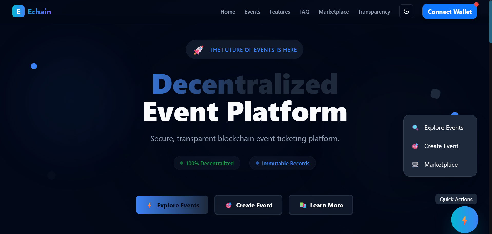

# 🔗 Echain - Blockchain Events Platform

**A Web3-native event management platform built on Base using Curvegrid MultiBaas**

Echain is a blockchain-enabled events platform that combines the convenience of traditional event management with the transparency, security, and incentive mechanisms of Web3 technology. Built on Base (Ethereum L2) with Curvegrid MultiBaas for seamless blockchain integration, it features NFT tickets, POAP attendance certificates, and gamified participation to create engaging experiences for organizers and attendees.

<!-- Screenshot placeholder - Add actual project screenshot here -->
<!--  -->

## 🛠️ Tech Stack & Tools

### Blockchain Layer
🔷 **Base** (Ethereum L2) • 💎 **Solidity** • 🛡️ **OpenZeppelin** • ⚡ **Hardhat**

### Frontend Layer
⚛️ **Next.js 14** • ⚛️ **React** • 🎨 **Tailwind CSS** • 🔐 **RainbowKit**

### Infrastructure & APIs
🌐 **Curvegrid MultiBaas** • 📡 **REST APIs** • 🔗 **Web3.js** • 📦 **IPFS**

### Development & Testing
📝 **TypeScript** • 🧪 **Hardhat Testing** • 🔍 **Sourcify** • 📊 **BaseScan**

## 🎟 Core Platform Features

### 1. Event Creation & NFT Ticketing
- Organizers mint **NFT tickets** (unique, verifiable, transferable)
- Smart contracts handle sales, refunds, and secondary trading
- Transparent pricing and fraud prevention

### 2. Attendance Verification
- On-chain **Proof-of-Attendance (POAP)** NFTs for verified attendees
- Digital certificates that unlock future discounts and special access
- Building attendee reputation and on-chain event history

### 3. Incentive Mechanisms
- **Early Bird Rewards**: First 10 attendees receive exclusive NFT badges
- **Loyalty System**: Multiple event attendance earns layered NFT collectibles
- **Gamified Participation**: Token rewards for referrals, check-ins, and engagement

## 💡 Value Beyond Traditional Platforms

- **🔒 Transparency**: On-chain tickets reduce fraud & scalping
- **🔄 Engagement Loop**: NFTs + incentives create ongoing community interaction
- **💰 New Revenue**: Organizers earn from secondary market royalties
- **🏆 Gamified Exclusivity**: "First 10" or "Top 1%" status drives participation
- **📜 Digital Identity**: Permanent on-chain record of event participation

---

## 🏗 Current Implementation Status

### ✅ Smart Contracts (Deployed & Verified)
All core contracts are deployed on **Base Sepolia** and verified on both Sourcify and BaseScan:

- **EventFactory** (`0xbE36039Bfe7f48604F73daD61411459B17fd2e85`): Main event creation and management
- **EventTicket** (`0x127b53D8f29DcDe4DDfcCb24ad8b88B515D08180`): NFT ticket implementation
- **POAPAttendance** (`0x405061e2ef1F748fA95A1e7725fc1a008e8c2196`): Proof-of-attendance certificates
- **IncentiveManager** (`0x8290c12f874DF9D03FDadAbE10C7c6321B69Ded9`): Rewards and gamification system

### ✅ Security & Testing
- **Comprehensive Security Audit**: Complete with critical vulnerability fixes
- **Automated Testing**: Full test suite with security validations
- **OpenZeppelin Standards**: Industry-standard security patterns

---

## 🚀 Quick Start

### Prerequisites
1. **MultiBaas Account**: Sign up at [console.curvegrid.com](https://console.curvegrid.com)
2. **Wallet**: MetaMask or compatible Web3 wallet
3. **Reown Project**: Create project at [cloud.reown.com](https://cloud.reown.com)

### Installation
```bash
git clone https://github.com/polymathuniversata/Echain.git
cd Echain
npm install
```

### Development
```bash
# Start blockchain development environment
cd blockchain
npm run deploy:dev

# Start frontend development server
cd frontend
npm run dev
```

Visit `http://localhost:3000` to interact with the platform.

---

## 📖 Documentation

- **[📖 Full Documentation](./docs/README.md)**: Complete platform overview and guides
- **[🚀 Deployment Guide](./docs/deployment/README.md)**: Step-by-step deployment instructions
- **[🏗️ Smart Contracts](./docs/contracts/README.md)**: Technical contract documentation
- **[🔒 Security](./docs/security/README.md)**: Security audit reports and implementations

---

## 🔗 Links & Resources

- **📖 Documentation**: [docs/README.md](./docs/README.md)
- **🔗 BaseScan**: [View Contracts](https://sepolia-explorer.base.org)
- **🔗 Sourcify**: [Contract Verification](https://sourcify.dev)
- **🛠️ MultiBaas**: [API Documentation](https://docs.curvegrid.com/multibaas/)

---

## 📄 License

MIT License - see [LICENSE](./LICENSE) for details.

**Ready to revolutionize event management with blockchain?** Check out our [comprehensive documentation](./docs/README.md) to start building with Echain!

## 📋 Development Task Breakdown

### Phase 1: Core Smart Contracts (Base Layer)
- [ ] **Event Management Contract**
  - Create/update/cancel events
  - Set ticket prices and limits
  - Handle event metadata (IPFS integration)
  
- [ ] **NFT Ticketing System**
  - ERC-721 based ticket NFTs
  - Implement OpenZeppelin standards
  - Metadata for seat assignments and event details
  - Transfer restrictions and refund logic
  
- [ ] **POAP (Proof of Attendance) Contract**
  - ERC-721 attendance certificates
  - Organizer verification system
  - Batch minting for events
  - Soulbound token implementation

### Phase 2: Incentive & Gamification Layer
- [ ] **Early Bird Rewards System**
  - Track first N purchasers per event
  - Mint exclusive "Founder" badges
  - Rarity tiers based on position
  
- [ ] **Loyalty Points Contract**
  - ERC-20 token for platform rewards
  - Points for event attendance, referrals
  - Redemption system for perks
  
- [ ] **Badge Collection System**
  - Multiple badge types (Early Bird, Loyal Attendee, VIP)
  - Achievement unlocking logic
  - Metadata for badge progression

### Phase 3: Platform Features
- [ ] **Secondary Market Integration**
  - Royalty system for organizers
  - Safe transfer mechanisms
  - Price discovery and bidding
  
- [ ] **Reputation System**
  - On-chain attendee profiles
  - Event history tracking
  - Organizer rating system

### Phase 4: Frontend Development
- [ ] **Event Discovery Interface**
  - Browse upcoming events
  - Filter by category, location, date
  - Featured events and recommendations
  
- [ ] **Organizer Dashboard**
  - Create/manage events
  - View ticket sales analytics
  - Manage attendee check-ins
  - NFT badge distribution tools
  
- [ ] **Attendee Profile**
  - View owned tickets and POAPs
  - Display badge collection
  - Event history and achievements
  - Loyalty points balance
  
- [ ] **Ticketing Flow**
  - Purchase tickets with crypto
  - Early bird detection and rewards
  - QR code generation for check-in

### Phase 5: Advanced Features
- [ ] **Multi-signature Event Management**
  - Co-organizer permissions
  - Shared revenue distribution
  
- [ ] **Dynamic Pricing**
  - Time-based price adjustments
  - Demand-based pricing algorithms
  
- [ ] **Cross-chain Compatibility**
  - Bridge POAPs across networks
  - Multi-chain event support

### Phase 6: Integration & Deployment
- [ ] **IPFS Integration**
  - Store event metadata off-chain
  - Image and video content for NFTs
  
- [ ] **The Graph Protocol**
  - Index event data for fast queries
  - Analytics and reporting
  
- [ ] **Base Mainnet Deployment**
  - Production smart contract deployment
  - Gas optimization
  - Security audits

---

## 🏗 Current Project Structure

This repository currently contains a foundational voting dApp that serves as the starting point for the full events platform. The existing structure includes:

### Blockchain Layer (`/blockchain`)
- **SimpleVoting.sol**: Basic voting smart contract (foundation for event voting/feedback)
- **Hardhat Configuration**: Development environment with MultiBaas plugin
- **OpenZeppelin Contracts**: Recently added for secure smart contract development
- **Deployment Scripts**: Automated deployment to Base network via MultiBaas

### Frontend Layer (`/frontend`)
- **Next.js Application**: Modern React-based frontend
- **MultiBaas SDK Integration**: Seamless blockchain interaction
- **RainbowKit**: Multi-wallet connectivity
- **Responsive UI**: Mobile-friendly interface ready for events platform

### Integration Features
- **MultiBaas Plugin**: Simplified smart contract deployment and management
- **API Key Management**: Secure frontend-blockchain communication
- **CORS Configuration**: Production-ready security setup
- **Environment Configuration**: Easy setup for different networks

---

## 🔧 Technical Implementation

This project demonstrates how to build a decentralized application using [Curvegrid MultiBaas](https://docs.curvegrid.com/multibaas/) to handle the complexities of interacting with EVM smart contracts on Base blockchain.

### Why MultiBaas for Events Platform?

- **🚀 Rapid Development**: Focus on business logic instead of blockchain infrastructure
- **📡 REST API**: Easy integration with traditional web technologies
- **🔐 Security**: Built-in key management and transaction signing
- **📊 Analytics**: Built-in monitoring and analytics dashboard
- **🌐 Multi-Network**: Deploy across different EVM networks seamlessly
- **⚡ Performance**: Optimized for high-throughput event ticketing

## Quickstart Guide

You will need a few things to get started. Do this *before* running npm install.

1. Go to [console.curvegrid.com](https://console.curvegrid.com), sign up, and create a MultiBaas deployment on your network of choice (use "Curvegrid Testnet" if unsure).
2. Go to Admin > API Keys > New Key and create a key with label "sample_app_admin" and select "Administrators". Copy and save the **API key** and **deployment URL**.

3. Go to [cloud.reown.com](http://cloud.reown.com/), sign up, create a new project with name "Sample App". Copy and save the **Project ID**.


Then run the installation and follow the steps as prompted:

```sh
git clone https://github.com/polymathuniversata/Echain.git
cd Echain
npm install
```

## Overview

The repository consists of two sub-projects:

- The `blockchain` folder contains a [Hardhat](https://hardhat.org/) project that uses the [Hardhat MultiBaas Plugin](https://github.com/curvegrid/hardhat-multibaas-plugin) to compile the `SimpleVoting` smart contract, deploy it to the network, and link it to a MultiBaas deployment so that we can interact with it via the REST API.
- The `frontend` folder contains a Next.js web application that provides a UI for interacting with the smart contract using the [MultiBaas SDK](https://github.com/curvegrid/multibaas-sdk-typescript).

## MultiBaas Deployment Setup

Using the [Curvegrid Console](https://console.curvegrid.com/), create a MultiBaas deployment on the Curvegrid Testnet. We recommend using this network for smart contract development due to its near-instant block finality and easily accessible faucet for account funding. It is also possible to use this demo app on any of our other supported networks but you will need tokens to deploy and interact with the smart contract.

### Connecting to the Curvegrid Testnet

Once you have created and logged into your MultiBaas Deployment, you may automatically configure your MetaMask to connect to the Curvegrid Test Network by clicking the `Select Signer` button in the top navbar and then clicking `Switch Network` button. Click the `Continue` button in `Add Network` modal. MetaMask will prompt you that MultiBaas is adding a network on your behalf. Review the details, click the `Approve` button, and then finally click the `Switch network` button.

### Requesting Ether from the Faucet

Via the top navbar, go to the `Blockchain > Faucet` page and request 1 ETH to your deployer account address.

### Creating API Keys

There are three API keys that **MUST** be created and used within this project. If you follow the installation script, you only need to provision an `Administrators` key and the others will be provisioned for you.

Otherwise, navigate to the `Admin > API Keys` page and create new keys with the following parameters:

1. Label `sample_app_admin`, Group `Administrators`. This API key has admin permission over the MultiBaas deployment, so copy it somewhere safe.

2. Label `nextjs_frontend`, Group `DApp User`. This API key only has permission to read existing data on the blockchain, such as the state variables of a smart contract deployment, and to request MultiBaas to format and return an unsigned transaction for a specific interaction.

3. For Curvegrid Testnet Only: Label `web3_proxy`, Option: `Use this key as a public Web3 key`. This API key will be used to construct an RPC URL for interacting with the Curvegrid Testnet. The UI will automatically construct and display the URL in the form of `https://<DEPLOYMENT ID>.multibaas.com/web3/<API KEY IN WEB3 GROUP>`, but copy and save just the API key part at the end.

Please make sure not to mix up these API keys.

### CORS

For security reasons, your front end application needs permissions from the server to allow requests. If you follow the installation script, this will be done for you.

Navigate to `Admin > CORS Origins` and add `http://localhost:3000` to the list of allowed origins. By default, MultiBaas does not allow unknown remote clients to make API requests, so by adding the URL above, you are giving permission to your local Next.js app to query MultiBaas. By default the frontend will run on port 3000, but if you are running another server it will increment to 3001 etc. so you may need to adjust your CORS settings accordingly.

## Install dependencies

You can run the installation and configure things manually by skipping the postinstall script. Otherwise, feel free to use the Quickstart Guide at the beginning of this document.

```sh
npm install
```

## Contract Deployment via Hardhat

If you have not yet deployed the `SimpleVoting.sol` smart contract to your MultiBaas deployment, we will now do so using the Hardhat project.

```sh
cd blockchain
```

The configuration is saved in `deployment-config.development.js`.

If you did not run the installation, you can copy the template file to the configuration and fill in the fields manually:

```sh
cp deployment-config.template.js deployment-config.development.js
```

- `deployerPrivateKey`: The private key of your account with ETH on your target network, starting with `0x`. This key may be exported from MetaMask by clicking the `Account details` button in the menu of the account selector list, but please be sure only do this on a development-only account. It is strongly advised not to check it into source control.
- `deploymentEndpoint`: Your MultiBaas Deployment URL, beginning with `https://` and ending with `.com`.
- `ethChainID`: `2017072401` for Curvegrid Testnet otherwise find your chain ID on [chainlist.org](https://chainlist.org/).
- `web3Key`: The Web3 Proxy API Key you previously created. Be sure to only include the API key and not the rest of the URL.
- `rpcUrl`: The rpc URL to be used instead of the `web3Key` for networks other than Curvegrid Testnet. You should omit this field (leave it blank) if you are using the Curvegrid Testnet. If you are instead using another network, omit the `web3Key` and use an RPC URL from [ChainList](https://chainlist.org/).
- `adminApiKey`: The API Key you previously created with label `sample_app_admin`.

Finally, deploy the smart-contract:

```sh
npm run deploy:voting:dev
```

Navigate to your MultiBaas deployment and confirm that you can see the contract on the `Contracts > On-Chain` page.

## Next.js Frontend

Now, we will setup the frontend application to interact with MultiBaas. This application uses [RainbowKit](https://www.rainbowkit.com/docs/installation) to support interaction with a variety of wallets.

```sh
cd frontend
```

The configuration is saved in `.env.development`.

If you did not run the installation, you can copy the template file to the configuration and fill in the fields manually:

```sh
cp .env.template .env.development
```

You will need to fill in the following fields:
- `NEXT_PUBLIC_RAINBOWKIT_PROJECT_ID`: Project ID of a WalletKit project on [reown](https://cloud.reown.com/).
- `NEXT_PUBLIC_MULTIBAAS_DEPLOYMENT_URL`: Your MultiBaas deployment URL, beginning with `https://` and ending with `.com`.
- `NEXT_PUBLIC_MULTIBAAS_DAPP_USER_API_KEY`: The Dapp User API Key.
- `NEXT_PUBLIC_MULTIBAAS_WEB3_API_KEY` (For Curvegrid Testnet): The Web3 Proxy API Key.
- `NEXT_PUBLIC_MULTIBAAS_VOTING_CONTRACT_LABEL`: 'simple_voting'
- `NEXT_PUBLIC_MULTIBAAS_VOTING_ADDRESS_ALIAS`: 'simple_voting'
- `NEXT_PUBLIC_MULTIBAAS_CHAIN_ID`: '2017072401' for Curvegrid Testnet otherwise the relevant [chain ID](https://chainlist.org/).

Now, you should be able to run:

```sh
npm run dev
```

and load the dApp in your browser at http://localhost:3000.

To interact with the smart contract, first connect your wallet using the RainbowKit button located in the top-right corner.

In the center of the page, you should see the different voting options as well as the number of votes for each option.

Hover over a voting option. If it turns green, clicking it will prompt you to sign a transaction to cast or change your vote to that option. If it turns red, clicking it will prompt you to sign a transaction to clear your existing vote.

You can experiment with the smart contract by switching to different accounts in RainbowKit and casting additional votes. If you’re working on the project as a team, each member can configure their own `.env.development` to point to the same MultiBaas deployment URL.

Since the `nextjs_frontend` and `web3_proxy` API keys have restricted permissions, they are safe to use directly in the frontend code even in production use cases. For these two API keys, the same values may be shared and used among team members.

However, since the `hardhat_admin` API key has admin-level permissions over the deployment, it is best practice for each team member to generate and securely store their own API key. It is strongly advised not to check it into source control.
