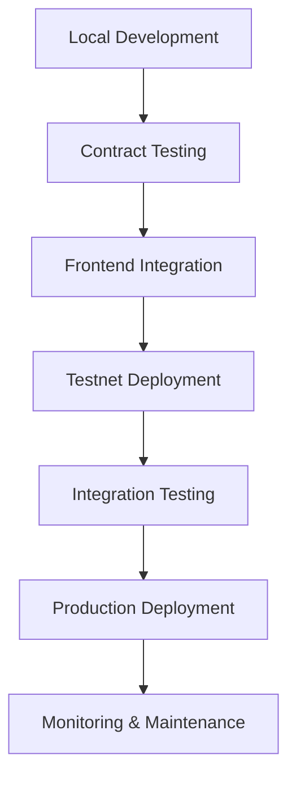

# 📖 Echain Documentation

<div align="center">


**A Web3-native event management platform built on Base using Curvegrid MultiBaas**

*Transform traditional events into blockchain-powered experiences with NFT tickets, POAP certificates, and gamified participation.*

[🚀 Quick Start](#-quick-start) • [📚 Documentation](#-documentation-structure) • [🔗 Live Demo](https://echain-eight.vercel.app)

</div>

---

## 🎯 Platform Overview

Echain is a comprehensive blockchain-based event management platform featuring:

- **🎟️ NFT Ticketing**: Secure, verifiable, transferable event tickets with creator royalties
- **🏆 POAP Certificates**: Soulbound attendance tokens for reputation building
- **💰 Gamified Incentives**: Rewards and loyalty systems for engagement
- **🔄 MultiBaas Integration**: Seamless blockchain API abstraction
- **⚡ Real-time Updates**: WebSocket streaming for live event data
- **🛡️ Enterprise Security**: OpenZeppelin audited contracts with circuit breakers

**Current Status**: ✅ Production-ready on Base Sepolia testnet

### 📋 Deployed Contract Addresses

| Contract | Address | Purpose |
| -------- | ------- | ------- |
| **EventFactory** | `0xA97cB40548905B05A67fCD4765438aFBEA4030fc` | Deploys event-specific ticket contracts |
| **EventTicket** | `0xc8cd32F0b2a6EE43f465a3f88BC52955A805043C` | ERC-721 NFT ticket implementation |
| **POAPAttendance** | `0x08344CfBfB3afB2e114A0dbABbaF40e7eB62FD33` | Soulbound attendance certificates |
| **IncentiveManager** | `0x1cfDae689817B954b72512bC82f23F35B997617D` | Gamified rewards and loyalty system |
| **Marketplace** | `0xD061393A54784da5Fea48CC845163aBc2B11537A` | Secondary ticket trading platform |

---

## 🚀 Quick Start

### For Event Organizers
1. **[Deploy Contracts](./deployment/README.md)**: Set up smart contracts on Base
2. **[Create Events](./guides/README.md#for-event-organizers)**: Use the platform to create NFT ticketed events
3. **[Manage Attendees](./guides/README.md#event-management)**: Handle ticket sales and check-ins

### For Developers
1. **[Smart Contracts](./contracts/README.md)**: Understand the blockchain architecture
2. **[MultiBaas Integration](./integration/README.md)**: Connect to blockchain APIs
3. **[API Reference](./api/README.md)**: Build integrations and extensions

### For Attendees
1. **[Connect Wallet](./guides/README.md#getting-started)**: Set up MetaMask or Web3 wallet
2. **[Browse Events](./examples/README.md)**: Discover upcoming events
3. **[Purchase Tickets](./guides/README.md#buying-tickets)**: Buy NFT tickets with crypto

---

## 📋 Documentation Structure

### 🏗️ [Smart Contracts](./contracts/README.md)
Complete smart contract architecture and deployment guide for:
- **EventFactory**: Factory pattern for deploying event-specific contracts
- **EventTicket**: ERC-721 NFT implementation with transfer restrictions
- **POAP**: Soulbound tokens for attendance verification
- **IncentiveManager**: Gamified rewards and loyalty programs
- **Marketplace**: Secondary trading with creator royalties
- OpenZeppelin security patterns and upgradeability
- Gas optimization and testing strategies

### 🔗 [MultiBaas Integration](./integration/README.md)
Comprehensive CurveGrid MultiBaas integration covering:
- **API Setup**: Deployment configuration and API keys
- **React Hooks**: Custom hooks for blockchain data fetching
- **Real-time Streaming**: WebSocket implementation for live updates
- **Error Handling**: Circuit breaker patterns and fallbacks
- **Security Best Practices**: API key management and rate limiting

### 🚀 [Deployment](./deployment/README.md)
Step-by-step deployment instructions for:
- **Local Development**: Hardhat setup and contract testing
- **Base Sepolia Testnet**: Testnet deployment and verification
- **Production Deployment**: Base mainnet deployment strategies
- **Environment Configuration**: API keys and network settings
- **Monitoring Setup**: Contract monitoring and alerting

### 📚 [User Guides](./guides/README.md)
Practical guides for all user types:
- **Event Organizers**: Complete event creation and management workflow
- **Attendees**: Wallet setup, ticket purchasing, and event attendance
- **Developers**: API integration, customization, and extension development
- **Administrators**: Platform management and troubleshooting

### 💡 [Code Examples](./examples/README.md)
Code examples and use cases:
- **Event Creation**: Complete event setup with metadata
- **Ticket Purchasing**: NFT minting and payment flows
- **POAP Minting**: Attendance verification and certificate claiming
- **Marketplace Trading**: Secondary market transactions
- **Real-time Updates**: WebSocket event streaming

### 🔒 [Security](./security/README.md)
Security documentation including:
- **Audit Reports**: OpenZeppelin security audit findings and fixes
- **Implementation Details**: Security patterns and best practices
- **Testing Procedures**: Security-focused testing guidelines
- **Vulnerability Management**: Reporting and response procedures

### 📡 [API Reference](./api/README.md)
Complete API documentation:
- **REST Endpoints**: MultiBaas API integration points
- **WebSocket Events**: Real-time event streaming
- **Contract ABIs**: Smart contract interfaces
- **TypeScript Types**: Type definitions for integration

### 🏛️ [Architecture](./architecture/README.md)
System architecture documentation:
- **High-level Design**: Component relationships and data flow
- **Database Schema**: Data models and relationships
- **Integration Patterns**: Third-party service integrations
- **Scalability Considerations**: Performance and scaling strategies

---

## 🛠️ Technology Stack

### **Blockchain Layer**
- **Network**: Base Ethereum L2 (Low-cost, fast transactions)
- **Smart Contracts**: Solidity ^0.8.19 with OpenZeppelin v5.0
- **API Platform**: CurveGrid MultiBaas (REST + WebSocket)
- **Security**: Comprehensive audit reports and monitoring

### **Frontend Layer**
- **Framework**: Next.js 15 with App Router and Turbopack
- **Language**: TypeScript with strict type checking
- **Styling**: Tailwind CSS with custom design system
- **State Management**: TanStack Query for server state caching
- **Wallet Integration**: RainbowKit + Reown (WalletConnect v2)

### **Infrastructure**
- **Hosting**: Vercel with edge functions and ISR
- **Storage**: IPFS/Pinata for decentralized metadata
- **Database**: PostgreSQL with Prisma ORM (planned)
- **Monitoring**: Sentry for error tracking and performance
- **CDN**: Vercel Edge Network for global performance

### **Development Tools**
- **Testing**: Jest, React Testing Library, Hardhat
- **Code Quality**: ESLint, Prettier, TypeScript strict mode
- **CI/CD**: GitHub Actions with automated testing
- **Documentation**: Markdown with automated deployment

---

## 🌟 Key Features Deep Dive

### 🎟️ **NFT Ticketing System**
- **Cryptographic Security**: Blockchain-backed ownership verification
- **Transferable Assets**: Secondary market with creator royalties (5%)
- **Dynamic Pricing**: Time-based pricing decay and demand adjustment
- **Multi-Tier Support**: Standard, VIP, Early Bird, Student, Group pricing
- **Metadata Standards**: ERC-721 compliant with IPFS storage

### 🏆 **POAP (Proof of Attendance Protocol)**
- **Soulbound Tokens**: ERC-5484 implementation, non-transferable
- **Evolution System**: POAPs upgrade based on attendance history
- **Reputation Building**: Verifiable attendance records for networking
- **Event Verification**: QR code scanning with cryptographic signatures
- **Metadata Rich**: Event details, timestamps, and verification proofs

### 💰 **Gamified Incentive Engine**
- **Loyalty Points**: ERC-20 compatible reward tokens
- **Achievement System**: Unlockable badges and milestones
- **Referral Program**: Multi-level reward distribution
- **Prediction Markets**: Event success betting with payouts
- **Staking Rewards**: Long-term engagement incentives

### 🔐 **Enterprise-Grade Security**
- **OpenZeppelin Audited**: Battle-tested contract libraries
- **Multi-Signature**: Administrative controls with timelocks
- **Circuit Breakers**: Emergency pause functionality
- **Automated Monitoring**: Real-time security event detection
- **Access Control**: Role-based permissions and restrictions

### ⚡ **Real-Time Experience**
- **WebSocket Streaming**: MultiBaas WebSocket API integration
- **Chain Watcher**: Automatic cache invalidation on new blocks
- **Live Event Feed**: Real-time event creation and updates
- **Push Notifications**: Browser notifications for important events
- **Optimistic Updates**: Immediate UI feedback with rollback on failure

---

## 📊 System Architecture

```
┌─────────────────┐    ┌─────────────────┐    ┌─────────────────┐
│   Frontend      │    │   MultiBaas     │    │   Smart         │
│   (Next.js)     │◄──►│   API Gateway   │◄──►│   Contracts     │
│                 │    │                 │    │   (Solidity)    │
└─────────────────┘    └─────────────────┘    └─────────────────┘
         │                       │                       │
         ▼                       ▼                       ▼
┌─────────────────┐    ┌─────────────────┐    ┌─────────────────┐
│   Wallet        │    │   WebSocket     │    │   Base          │
│   Integration   │    │   Streaming     │    │   Network       │
│   (RainbowKit)  │    │                 │    │                 │
└─────────────────┘    └─────────────────┘    └─────────────────┘
```

### Data Flow
1. **Event Creation**: Frontend → MultiBaas → EventFactory contract
2. **Ticket Purchase**: Wallet → MultiBaas → EventTicket contract
3. **Real-time Updates**: Contract events → MultiBaas → WebSocket → Frontend
4. **POAP Minting**: Check-in verification → MultiBaas → POAP contract

---

## 📈 Performance Metrics

- **Transaction Speed**: <3 seconds on Base L2
- **Gas Efficiency**: Optimized contracts with <200k gas/ticket
- **API Response**: <100ms average with MultiBaas caching
- **Real-time Latency**: <50ms WebSocket event delivery
- **Uptime**: 99.9%+ with Vercel infrastructure

---

## 🔄 Development Workflow



---

## 📞 Support & Resources

### **Official Channels**
- **[GitHub Repository](https://github.com/Talent-Index/Echain)**: Source code and issue tracking
- **[Live Demo](https://echain-eight.vercel.app)**: Production application
- **[MultiBaas Console](https://console.curvegrid.com/)**: Blockchain API management
- **[Base Explorer](https://sepolia.basescan.org/)**: Contract verification and transactions

### **Community**
- **[Discord Server](https://discord.gg/echain)**: Community support and discussions
- **[Twitter](https://twitter.com/echain_events)**: Updates and announcements
- **[Blog](https://blog.echain.events)**: Technical articles and tutorials

### **Developer Resources**
- **[API Documentation](./api/README.md)**: Complete integration guide
- **[Code Examples](./examples/README.md)**: Sample implementations
- **[Security Audits](./security/README.md)**: Audit reports and findings

---

## 🤝 Contributing

We welcome contributions from the community! See our [Contributing Guide](../CONTRIBUTING.md) for details.

### **Ways to Contribute**
- **🐛 Bug Reports**: Use GitHub Issues with detailed reproduction steps
- **💡 Feature Requests**: Open discussions for new platform features
- **📝 Documentation**: Improve guides, add examples, fix typos
- **🔧 Code Contributions**: Submit pull requests with tests and documentation
- **🎨 Design**: UI/UX improvements and accessibility enhancements

### **Development Setup**
```bash
git clone https://github.com/Talent-Index/Echain.git
cd Echain
npm install
cd blockchain && npm install
cd ../frontend && npm install
npm run dev
```

---

<div align="center">

[](https://github.com/Talent-Index/Echain)
[](https://discord.gg/echain)
[](https://twitter.com/echain_events)

**Ready to revolutionize event management with blockchain?**

[🏗️ Smart Contracts](./contracts/README.md) • [🔗 MultiBaas Integration](./integration/README.md) • [🚀 Deploy to Base](./deployment/README.md) • [📚 User Guides](./guides/README.md)

*Built with ❤️ for the Web3 community*

</div>