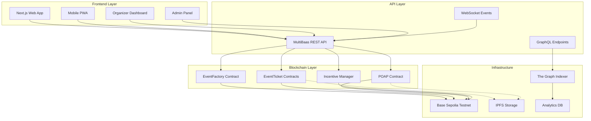

# 🏛️ Echain Platform Architecture

## Overview

Echain is a comprehensive blockchain events platform that combines the convenience of traditional event management with the transparency, security, and incentive mechanisms of Web3 technology. This document outlines the complete system architecture.

**Current Status**: ✅ Fully implemented and operational on Base Sepolia testnet with real-time blockchain data integration, wallet connectivity, and marketplace functionality.

## 🎯 System Goals

- **Transparency**: All ticket sales and event data on-chain
- **Security**: Fraud prevention through blockchain verification
- **Incentives**: Gamified participation through NFTs and rewards
- **Scalability**: Support for events from 10 to 10,000+ attendees
- **User Experience**: Seamless Web2-like interface with Web3 benefits

## 🏗️ High-Level Architecture



## 📱 Frontend Architecture

### Web Application (Next.js)
- **Framework**: Next.js 14 with App Router
- **Styling**: Tailwind CSS with custom design system
- **State Management**: Zustand for global state
- **Wallet Integration**: RainbowKit + Reown (WalletConnect) for multi-wallet support
- **Real-time Updates**: WebSocket connections for live data

### Key Components
```typescript
/frontend
  /app
    /components
      /events
        EventCard.tsx
        EventDetails.tsx
        TicketPurchase.tsx
      /tickets
        TicketNFT.tsx
        QRScanner.tsx
        TicketTransfer.tsx
      /profile
        AttendeeProfile.tsx
        POAPCollection.tsx
        LoyaltyDashboard.tsx
      /organizer
        EventCreation.tsx
        CheckInManager.tsx
        Analytics.tsx
    /hooks
      useEvents.ts
      useTickets.ts
      usePOAPs.ts
      useIncentives.ts
    /providers
      Web3Provider.tsx
      MultiBaasProvider.tsx
```

### Mobile Experience
- **Progressive Web App** (PWA) for mobile users
- **Offline Capability** for ticket display and QR codes
- **Push Notifications** for event updates and rewards
- **Camera Integration** for QR code scanning

## 🔗 API & Integration Layer

### MultiBaas Integration
MultiBaas serves as the primary blockchain abstraction layer:

```typescript
// MultiBaas Configuration
const multiBaasConfig = {
  baseURL: 'https://kwp44rxeifggriyd4hmbjq7dey.multibaas.com',
  apiKey: process.env.NEXT_PUBLIC_MULTIBAAS_DAPP_USER_API_KEY,
  contracts: {
    eventFactory: 'event_factory',
    eventTicket: 'event_ticket_1',
    poap: 'poap_1',
    incentives: 'incentive_manager'
  }
};
```

### API Endpoints
- **Events API**: CRUD operations for events with real blockchain data
- **Tickets API**: Purchase, transfer, verify NFT tickets
- **POAP API**: Check-in and attendance verification
- **Incentives API**: Rewards and achievement tracking
- **Marketplace API**: Secondary ticket trading

### Real-time Features
- **WebSocket Events**: Live ticket sales, check-ins
- **Push Notifications**: Event reminders, reward notifications
- **Live Updates**: Real-time attendee counts, reward distributions

## ⛓️ Blockchain Architecture

### Network: Base Sepolia
- **Why Base Sepolia**: Low fees, Ethereum compatibility, testnet for development
- **Block Time**: ~2 seconds for fast confirmations
- **Gas Costs**: Optimized for high-frequency transactions
- **Explorer**: https://sepolia.basescan.org/

### Smart Contract Deployment Strategy


### Gas Optimization Strategies
- **Minimal Proxy Pattern**: Deploy ticket contracts as clones
- **Batch Operations**: Multiple tickets in single transaction
- **Event Emission**: Use events for off-chain indexing
- **Storage Optimization**: Pack structs to minimize storage slots

## 💾 Data Architecture

### On-Chain Data
- **Event Metadata**: Name, date, venue, organizer (Base Sepolia)
- **Ticket Ownership**: NFT ownership records
- **Attendance Records**: POAP ownership
- **Incentive Data**: Rewards, achievements, loyalty points

### Off-Chain Data (IPFS)
- **Rich Metadata**: Event images, descriptions, venue details
- **NFT Assets**: Ticket artwork, POAP designs
- **Large Files**: Event videos, promotional materials

### Indexed Data (The Graph)
- **Event Discovery**: Searchable event database
- **User Profiles**: Attendance history, achievements
- **Analytics**: Sales data, attendance patterns
- **Leaderboards**: Top attendees, organizers

## 🔐 Security Architecture

### Smart Contract Security
- **OpenZeppelin Standards**: Battle-tested contract libraries
- **Access Controls**: Role-based permissions system
- **Reentrancy Guards**: Protection against common attacks
- **Pause Mechanisms**: Emergency stop functionality

### API Security
- **API Key Management**: Separate keys for different access levels
- **Rate Limiting**: Prevent abuse and spam
- **CORS Configuration**: Secure cross-origin requests
- **Input Validation**: Sanitize all user inputs

### Frontend Security
- **Wallet Security**: Secure connection handling with fallback project IDs
- **XSS Protection**: Content sanitization
- **HTTPS Enforcement**: Encrypted communications
- **CSP Headers**: Content Security Policy implementation

## 🚀 Deployment Architecture

### Development Environment
```yaml
# docker-compose.dev.yml
version: '3.8'
services:
  frontend:
    build: ./frontend
    ports: ["3000:3000"]
    environment:
      - NODE_ENV=development
      - NEXT_PUBLIC_MULTIBAAS_URL=https://kwp44rxeifggriyd4hmbjq7dey.multibaas.com

  hardhat:
    build: ./blockchain
    ports: ["8545:8545"]
    command: npx hardhat node

  ipfs:
    image: ipfs/go-ipfs
    ports: ["5001:5001", "8080:8080"]
```

### Production Deployment
- **Frontend**: Vercel deployment with CDN
- **Contracts**: Base Sepolia via MultiBaas
- **IPFS**: Pinata or Infura for reliable storage
- **Analytics**: PostHog for user behavior tracking

## 📊 Monitoring & Analytics

### Blockchain Monitoring
- **Transaction Tracking**: Success rates, gas usage
- **Contract Metrics**: Function call frequency, errors
- **Network Health**: Block confirmations, congestion

### Business Metrics
- **Event Success**: Ticket sales, attendance rates
- **User Engagement**: Return visitors, POAP collections
- **Revenue Tracking**: Primary and secondary sales
- **Growth Metrics**: New users, organizers, events

### Performance Monitoring
- **Frontend Performance**: Core Web Vitals, load times
- **API Response Times**: MultiBaas endpoint performance
- **Error Tracking**: Sentry for error monitoring
- **Uptime Monitoring**: Service availability tracking

## 🔄 Data Flow Examples

### Ticket Purchase Flow


### Event Check-in Flow


## 🔮 Future Architecture Considerations

### Scalability Improvements
- **Layer 2 Integration**: Polygon, Arbitrum support
- **Cross-chain Events**: Multi-network event support
- **Sharding Strategy**: Distribute load across contracts

### Feature Enhancements
- **AI Integration**: Smart recommendations, fraud detection
- **Social Features**: Event networking, attendee matching
- **DeFi Integration**: Yield farming for loyalty tokens
- **DAO Governance**: Community-driven platform decisions

### Performance Optimizations
- **Caching Layer**: Redis for frequently accessed data
- **CDN Integration**: Global content delivery
- **Database Optimization**: Efficient query patterns
- **Microservices**: Service decomposition for scalability

## ⚠️ Implementation Notes

### Wallet Connection Setup
For proper wallet connectivity without 403 errors:
- Use `NEXT_PUBLIC_RAINBOWKIT_PROJECT_ID=demo-project-id-for-development` for development
- Get a valid Reown project ID from https://cloud.reown.com/ for production
- The app automatically falls back to safe defaults if the project ID is invalid

### Base Sepolia Configuration
- **Network Name**: Base Sepolia
- **RPC URL**: https://sepolia.base.org
- **Chain ID**: 84532
- **Block Explorer**: https://sepolia.basescan.org/
- **Faucet**: https://sepoliafaucet.com/ or https://faucet.quicknode.com/base/sepolia

This architecture provides a solid foundation for building a scalable, secure, and user-friendly blockchain events platform while maintaining the flexibility to evolve with changing requirements and technologies.
