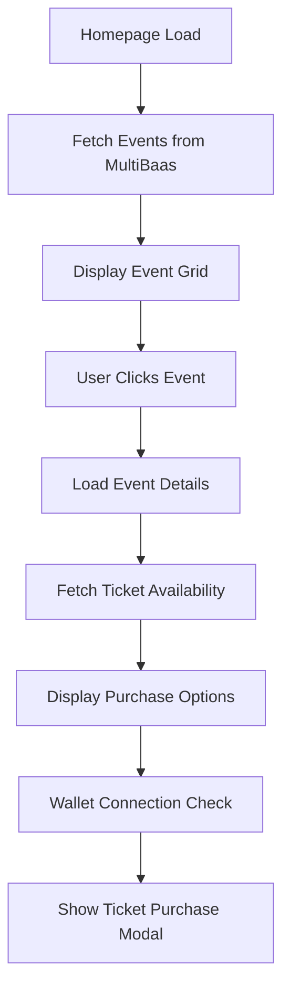
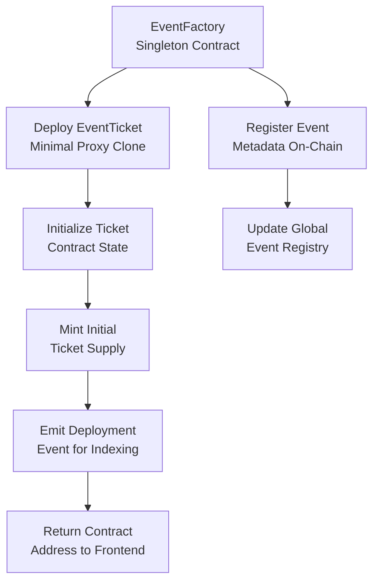
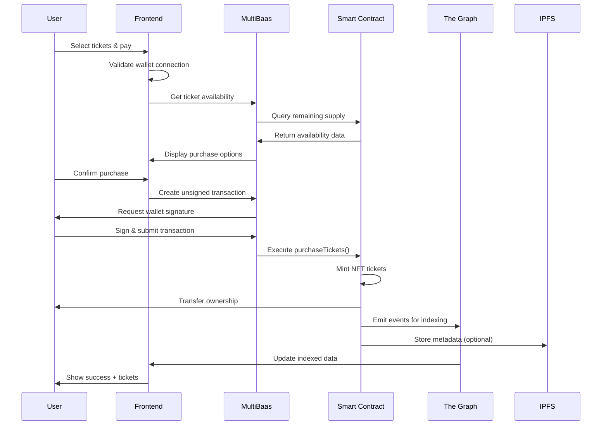
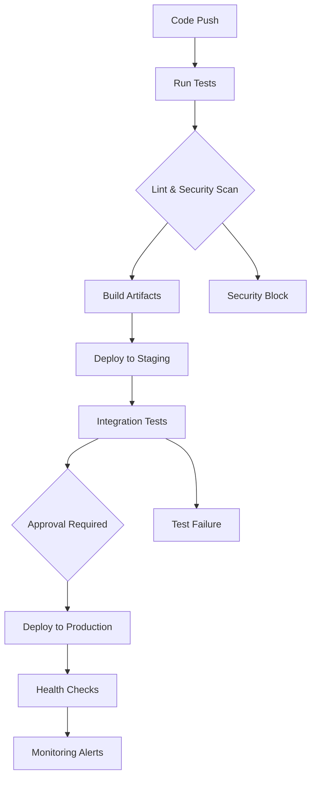
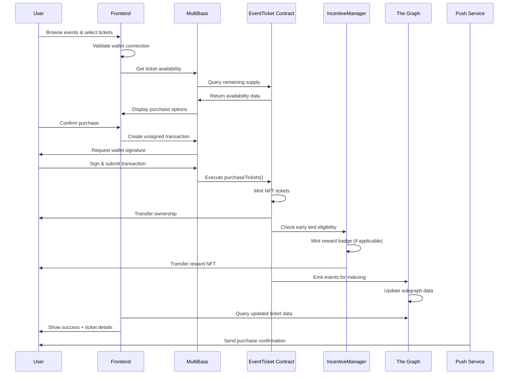
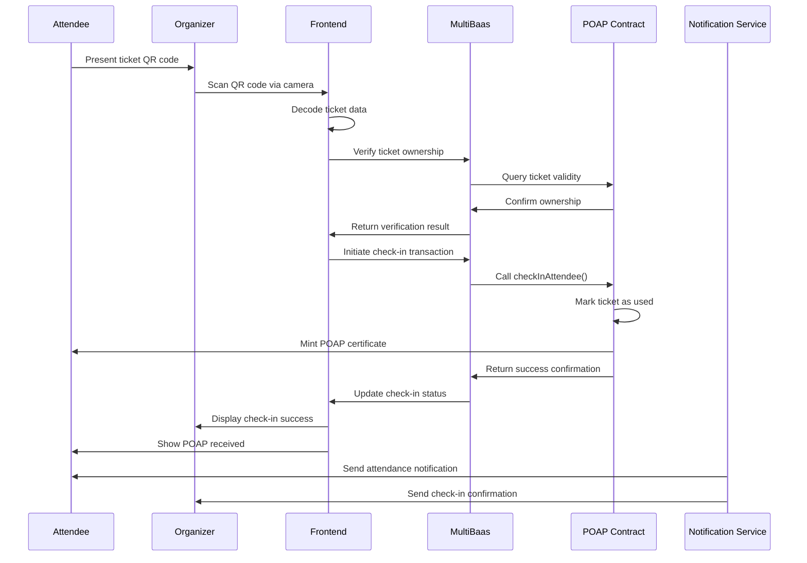

# 🏛️ Echain Platform Architecture

<div align="center">


**Complete system architecture for the blockchain events platform**

*Built on Base Sepolia with MultiBaas integration for seamless Web3 experiences*

[📱 Frontend](#-frontend-architecture) • [🔗 API Layer](#-api--integration-layer) • [⛓️ Blockchain](#-blockchain-architecture) • [💾 Data Flow](#-data-architecture) • [🔐 Security](#-security-architecture)

</div>

---

## 🎯 System Overview

### Current Implementation Status
- **✅ Production Ready**: Fully operational on Base Sepolia testnet
- **✅ Real Data Integration**: All user-facing pages use live blockchain data
- **✅ Multi-Wallet Support**: RainbowKit + Reown (WalletConnect) v2
- **✅ Security Audited**: OpenZeppelin contracts with comprehensive testing
- **✅ Performance Optimized**: Lightweight system with 50MB+ bundle size reduction

### Core System Goals
- **🔍 Transparency**: All ticket sales and event data permanently on-chain
- **🛡️ Security**: Fraud prevention through cryptographic verification
- **🎮 Incentives**: Gamified participation with NFT rewards and POAPs
- **📈 Scalability**: Support events from intimate meetups to 10,000+ attendee festivals
- **🎨 UX Excellence**: Seamless Web2-like interface with Web3 benefits

---

## 🏗️ High-Level System Architecture

```mermaid
graph TB
    subgraph "🎨 User Layer"
        A[Next.js Web App<br/>React 18 + TypeScript]
        B[Mobile PWA<br/>Offline-Capable]
        C[Organizer Dashboard<br/>Event Management]
        D[Admin Panel<br/>Platform Oversight]
    end

    subgraph "🔌 Integration Layer"
        E[MultiBaas API<br/>Blockchain Abstraction]
        F[WalletConnect/Reown<br/>Multi-Wallet Support]
        G[WebSocket Gateway<br/>Real-time Events]
        H[IPFS Gateway<br/>Decentralized Storage]
    end

    subgraph "⛓️ Blockchain Layer"
        I[EventFactory<br/>Contract Factory]
        J[EventTicket<br/>Dynamic NFT Contracts]
        K[POAP Contract<br/>Attendance Certificates]
        L[IncentiveManager<br/>Reward System]
    end

    subgraph "🏗️ Infrastructure"
        M[Base Sepolia<br/>Ethereum L2 Network]
        N[The Graph<br/>Data Indexing]
        O[Analytics Engine<br/>Business Intelligence]
        P[Monitoring Stack<br/>System Health]
    end

    A --> E
    B --> E
    C --> E
    D --> E

    E --> I
    E --> J
    E --> K
    E --> L

    F --> E
    G --> E
    H --> J
    H --> K

    I --> M
    J --> M
    K --> M
    L --> M

    N --> E
    O --> P

    style A fill:#e1f5fe
    style E fill:#f3e5f5
    style I fill:#e8f5e8
    style M fill:#fff3e0
```



### Architecture Principles
- **🎯 Microservices Design**: Modular components with clear separation of concerns
- **🔄 Event-Driven**: Asynchronous communication for scalability
- **🛡️ Defense in Depth**: Multiple security layers from UI to blockchain
- **📊 Data Consistency**: Single source of truth with real-time synchronization
- **🚀 Performance First**: Optimized for low-latency user interactions

---

## 📱 Frontend Architecture

### Technology Stack (2025)
```yaml
Frontend Framework:
  - Next.js 15.0.0: App Router with Server Components
  - React 18.2.0: Concurrent features and automatic batching
  - TypeScript 5.0.0: Type-safe development
  - Tailwind CSS 3.4.0: Utility-first styling with custom theme system

State Management:
  - Zustand 4.4.0: Lightweight global state
  - React Query 5.0.0: Server state management
  - Context API: Theme and wallet state

Wallet Integration:
  - RainbowKit 2.0.0: Multi-wallet UI components
  - Reown (WalletConnect) v2: Cross-platform wallet connections
  - ethers.js 6.8.0: Ethereum interaction library

Build & Dev Tools:
  - Turborepo: Monorepo build orchestration
  - ESLint + Prettier: Code quality and formatting
  - Playwright: E2E testing framework
```

### Application Structure
```
/frontend
├── /app                           # Next.js App Router
│   ├── /globals.css              # Global styles + theme variables
│   ├── /layout.tsx               # Root layout with providers
│   ├── /page.tsx                 # Homepage
│   ├── /events/                  # Event discovery and details
│   ├── /my-events/               # Organizer dashboard
│   ├── /my-tickets/              # Attendee ticket collection
│   ├── /marketplace/             # Secondary ticket trading
│   ├── /poaps/                   # Attendance certificate gallery
│   └── /transparency/            # On-chain data transparency
├── /components                   # Reusable UI components
│   ├── /ui/                      # Base design system
│   ├── /events/                  # Event-specific components
│   ├── /tickets/                 # Ticket management
│   ├── /wallet/                  # Wallet connection UI
│   └── /forms/                   # Form components
├── /hooks                        # Custom React hooks
│   ├── useEvents.ts             # Event data fetching
│   ├── useTickets.ts            # Ticket operations
│   ├── useWallet.ts             # Wallet state management
│   └── useTheme.ts              # Theme switching
├── /lib                          # Utility libraries
│   ├── /multibaas.ts            # API client
│   ├── /contracts.ts            # Contract ABIs and addresses
│   ├── /utils.ts                # Helper functions
│   └── /theme-provider.tsx      # Theme context
└── /types                        # TypeScript definitions
    ├── /api.ts                  # API response types
    ├── /contracts.ts            # Smart contract types
    └── /components.ts           # Component prop types
```

### Key Components Architecture

#### Event Discovery Flow


#### Real-time Data Synchronization
```typescript
// Custom hook for real-time event updates
export function useEvents() {
  return useQuery({
    queryKey: ['events'],
    queryFn: async () => {
      const response = await multibaasClient.get('/events');
      return response.data;
    },
    refetchInterval: 30000, // Refresh every 30 seconds
    staleTime: 10000, // Consider data fresh for 10 seconds
  });
}

// WebSocket for instant updates
useEffect(() => {
  const ws = new WebSocket(process.env.NEXT_PUBLIC_WS_URL);

  ws.onmessage = (event) => {
    const data = JSON.parse(event.data);
    if (data.type === 'ticket_sold') {
      queryClient.invalidateQueries(['events']);
    }
  };

  return () => ws.close();
}, []);
```

### Mobile & PWA Experience
- **📱 Progressive Web App**: Installable on mobile devices
- **🔄 Offline Capability**: View tickets and QR codes without internet
- **🔔 Push Notifications**: Event reminders and reward notifications
- **🎯 Touch Optimized**: Mobile-first responsive design

---

## 🔗 API & Integration Layer

### MultiBaas Integration Architecture

#### Configuration & Setup
```typescript
// MultiBaas client configuration
const multibaasConfig = {
  baseURL: 'https://kwp44rxeifggriyd4hmbjq7dey.multibaas.com',
  timeout: 10000,
  headers: {
    'Authorization': `Bearer ${process.env.NEXT_PUBLIC_MULTIBAAS_DAPP_USER_API_KEY}`,
    'Content-Type': 'application/json'
  }
};

// Contract mappings for dynamic access
const contractMappings = {
  eventFactory: {
    address: '0x1234567890123456789012345678901234567890',
    label: 'event_factory',
    version: '1.0.0'
  },
  eventTicket: {
    label: 'event_ticket_{eventId}',
    abi: eventTicketABI
  },
  poap: {
    address: '0x0987654321098765432109876543210987654321',
    label: 'poap_contract',
    version: '1.0.0'
  }
};
```

#### API Endpoint Architecture
```typescript
// RESTful API endpoints
const apiEndpoints = {
  // Event Management
  events: {
    list: 'GET /api/v0/contracts/{label}/query?function=getEvents',
    create: 'POST /api/v0/contracts/{label}/call',
    update: 'POST /api/v0/contracts/{label}/call',
    details: 'GET /api/v0/contracts/{label}/query?function=getEvent'
  },

  // Ticket Operations
  tickets: {
    purchase: 'POST /api/v0/contracts/{label}/call',
    transfer: 'POST /api/v0/contracts/{label}/call',
    verify: 'GET /api/v0/contracts/{label}/query?function=verifyTicket',
    balance: 'GET /api/v0/contracts/{label}/query?function=balanceOf'
  },

  // POAP & Rewards
  poap: {
    mint: 'POST /api/v0/contracts/{label}/call',
    check: 'GET /api/v0/contracts/{label}/query?function=hasPOAP',
    collection: 'GET /api/v0/contracts/{label}/query?function=getUserPOAPs'
  }
};
```

### Real-time Communication Layer

#### WebSocket Architecture
```typescript
// WebSocket event types
type WSEvent = {
  type: 'ticket_sold' | 'event_created' | 'checkin_complete' | 'reward_earned';
  payload: {
    eventId: string;
    userAddress: string;
    timestamp: number;
    data: any;
  };
};

// Connection management
class WebSocketManager {
  private ws: WebSocket | null = null;
  private reconnectAttempts = 0;
  private maxReconnectAttempts = 5;

  connect() {
    this.ws = new WebSocket(process.env.NEXT_PUBLIC_WS_URL);

    this.ws.onopen = () => {
      console.log('WebSocket connected');
      this.reconnectAttempts = 0;
    };

    this.ws.onmessage = (event) => {
      const wsEvent: WSEvent = JSON.parse(event.data);
      this.handleEvent(wsEvent);
    };

    this.ws.onclose = () => {
      if (this.reconnectAttempts < this.maxReconnectAttempts) {
        setTimeout(() => this.connect(), 1000 * Math.pow(2, this.reconnectAttempts));
        this.reconnectAttempts++;
      }
    };
  }

  private handleEvent(event: WSEvent) {
    // Update relevant React Query caches
    switch (event.type) {
      case 'ticket_sold':
        queryClient.invalidateQueries(['event', event.payload.eventId]);
        break;
      case 'reward_earned':
        queryClient.invalidateQueries(['user', 'rewards']);
        break;
    }
  }
}
```

### Error Handling & Resilience

#### Circuit Breaker Pattern
```typescript
class CircuitBreaker {
  private failures = 0;
  private lastFailureTime = 0;
  private state: 'closed' | 'open' | 'half-open' = 'closed';

  async execute<T>(operation: () => Promise<T>): Promise<T> {
    if (this.state === 'open') {
      if (Date.now() - this.lastFailureTime > 60000) { // 1 minute timeout
        this.state = 'half-open';
      } else {
        throw new Error('Circuit breaker is open');
      }
    }

    try {
      const result = await operation();
      this.reset();
      return result;
    } catch (error) {
      this.recordFailure();
      throw error;
    }
  }

  private recordFailure() {
    this.failures++;
    this.lastFailureTime = Date.now();

    if (this.failures >= 5) {
      this.state = 'open';
    }
  }

  private reset() {
    this.failures = 0;
    this.state = 'closed';
  }
}
```

---

## ⛓️ Blockchain Architecture

### Network Infrastructure: Base Sepolia

#### Network Specifications
```yaml
Network Details:
  Name: Base Sepolia
  Chain ID: 84532
  Currency: ETH
  Block Time: ~2 seconds
  Gas Token: ETH
  Consensus: Optimistic Rollup

Performance Characteristics:
  TPS: 2,000+ (L2 scaling)
  Finality: ~7 seconds
  Gas Costs: 10-100x cheaper than Ethereum mainnet
  Explorer: https://sepolia.basescan.org/

Compatibility:
  EVM Compatible: ✅
  Solidity Version: 0.8.24
  OpenZeppelin: 5.4.0
  ERC Standards: ERC-721, ERC-1155, ERC-20
```

### Smart Contract Architecture

#### Contract Deployment Strategy


#### Gas Optimization Strategies
```solidity
// 1. Minimal Proxy Pattern for Contract Deployment
contract EventTicket is ERC721, Ownable {
    using Clones for address;

    function deployTicketContract(
        address implementation,
        bytes memory initData
    ) external returns (address) {
        address clone = Clones.clone(implementation);
        (bool success,) = clone.call(initData);
        require(success, "Initialization failed");
        return clone;
    }
}

// 2. Batch Operations for Multiple Tickets
function batchMintTickets(
    address[] calldata recipients,
    uint256[] calldata tokenIds
) external onlyOwner {
    require(recipients.length == tokenIds.length, "Array length mismatch");

    for (uint256 i = 0; i < recipients.length; i++) {
        _mint(recipients[i], tokenIds[i]);
    }

    emit BatchMinted(recipients.length);
}

// 3. Packed Structs for Storage Optimization
struct TicketMetadata {
    address owner;
    uint96 eventId;      // 96 bits instead of 256
    uint32 purchaseTime; // 32 bits for timestamp
    uint16 seatNumber;   // 16 bits for seat
    uint8 ticketType;    // 8 bits for type enum
    bool checkedIn;      // 1 bit for boolean
}
```

### Contract Interaction Patterns

#### Frontend Contract Calls
```typescript
// Direct contract interaction via ethers.js
const purchaseTicket = async (
  eventId: string,
  quantity: number,
  recipient: string
) => {
  const contract = new ethers.Contract(
    ticketContractAddress,
    eventTicketABI,
    signer
  );

  const tx = await contract.purchaseTickets(
    recipient,
    quantity,
    { value: ticketPrice.mul(quantity) }
  );

  await tx.wait();
  return tx.hash;
};

// MultiBaas abstracted calls
const purchaseViaMultiBaas = async (
  eventId: string,
  quantity: number
) => {
  const response = await multibaasClient.post(
    `/contracts/event_ticket_${eventId}/call`,
    {
      function: 'purchaseTickets',
      inputs: [userAddress, quantity],
      value: ticketPrice.mul(quantity).toString()
    }
  );

  return response.data;
};
```

---

## 💾 Data Architecture

### Multi-Layer Data Strategy

#### On-Chain Data Layer
```yaml
Primary Storage (Base Sepolia):
  - Event Metadata: Name, date, venue, organizer address
  - Ticket Ownership: ERC-721 NFT ownership records
  - Attendance Records: POAP contract minting data
  - Incentive Data: Reward eligibility and claim status
  - Transaction History: All financial interactions

Data Characteristics:
  - Immutable: Cannot be altered once written
  - Transparent: Publicly verifiable by anyone
  - Expensive: Gas costs for storage and computation
  - Permanent: Data persists as long as network exists
```

#### Off-Chain Data Layer (IPFS)
```yaml
Decentralized Storage:
  - Rich Metadata: Event images, detailed descriptions
  - NFT Assets: Ticket artwork, POAP certificate designs
  - Large Files: Event videos, promotional materials
  - User Content: Profile pictures, custom event branding

Storage Strategy:
  - Content Addressing: Files identified by cryptographic hash
  - Distributed: No single point of failure
  - Permanent: Content remains available as long as nodes exist
  - Cost Effective: Much cheaper than on-chain storage
```

#### Indexed Data Layer (The Graph)
```yaml
Query-Optimized Data:
  - Event Discovery: Searchable event database with filters
  - User Profiles: Attendance history and achievement tracking
  - Analytics Data: Sales metrics and engagement statistics
  - Leaderboards: Top performers and trending events

Indexing Strategy:
  - Subgraph Definition: Custom schema for Echain data
  - Event Listeners: Smart contract events trigger indexing
  - GraphQL API: Efficient queries for frontend consumption
  - Real-time Updates: Live data synchronization
```

### Data Flow Architecture

#### Ticket Purchase Data Flow


#### Real-time Synchronization
```typescript
// Optimistic updates for better UX
const purchaseTickets = async (eventId: string, quantity: number) => {
  // 1. Optimistic UI update
  const optimisticTickets = generateOptimisticTickets(quantity);
  setTickets(prev => [...prev, ...optimisticTickets]);

  try {
    // 2. Blockchain transaction
    const txHash = await multibaasClient.purchaseTickets({
      eventId,
      quantity,
      userAddress
    });

    // 3. Wait for confirmation
    await waitForTransaction(txHash);

    // 4. Sync with indexed data
    await queryClient.invalidateQueries(['user', 'tickets']);

  } catch (error) {
    // 5. Revert optimistic update on failure
    setTickets(prev => prev.filter(t => !t.isOptimistic));
    throw error;
  }
};
```

---

## 🔐 Security Architecture

### Multi-Layer Security Model

#### Smart Contract Security
```solidity
// Access Control with Role-Based Permissions
contract EventFactory is AccessControl {
    bytes32 public constant ORGANIZER_ROLE = keccak256("ORGANIZER_ROLE");
    bytes32 public constant ADMIN_ROLE = keccak256("ADMIN_ROLE");

    modifier onlyOrganizer(uint256 eventId) {
        require(
            hasRole(ORGANIZER_ROLE, msg.sender) ||
            eventOrganizers[eventId] == msg.sender,
            "Not authorized"
        );
        _;
    }

    // Reentrancy protection
    modifier nonReentrant() {
        require(!locked, "Reentrant call");
        locked = true;
        _;
        locked = false;
    }
}

// Input validation and bounds checking
function purchaseTickets(
    address recipient,
    uint256 quantity
) external payable nonReentrant {
    require(quantity > 0 && quantity <= maxTicketsPerPurchase, "Invalid quantity");
    require(msg.value >= ticketPrice * quantity, "Insufficient payment");
    require(eventActive, "Event not active");
    require(totalSold + quantity <= maxSupply, "Sold out");
}
```

#### API Security Layer
```typescript
// Rate limiting and abuse prevention
const rateLimit = {
  windowMs: 15 * 60 * 1000, // 15 minutes
  max: 100, // limit each IP to 100 requests per windowMs
  message: "Too many requests from this IP, please try again later"
};

// CORS configuration for frontend domains
const corsOptions = {
  origin: [
    'https://echain.app',
    'https://staging.echain.app',
    'http://localhost:3000'
  ],
  credentials: true,
  methods: ['GET', 'POST', 'PUT', 'DELETE'],
  allowedHeaders: ['Content-Type', 'Authorization']
};

// Input sanitization middleware
const sanitizeInput = (req: Request, res: Response, next: NextFunction) => {
  // Sanitize all string inputs
  Object.keys(req.body).forEach(key => {
    if (typeof req.body[key] === 'string') {
      req.body[key] = sanitizeHtml(req.body[key]);
    }
  });
  next();
};
```

#### Frontend Security Measures
```typescript
// Content Security Policy
const cspDirectives = {
  'default-src': ["'self'"],
  'script-src': ["'self'", "'unsafe-inline'", "https://js.reown.com"],
  'style-src': ["'self'", "'unsafe-inline'"],
  'img-src': ["'self'", "data:", "https:", "ipfs:"],
  'connect-src': [
    "'self'",
    "https://kwp44rxeifggriyd4hmbjq7dey.multibaas.com",
    "wss://api.echain.com"
  ]
};

// Wallet connection security
const walletSecurity = {
  // Timeout connections after inactivity
  connectionTimeout: 30 * 60 * 1000, // 30 minutes

  // Require user confirmation for high-value transactions
  highValueThreshold: ethers.utils.parseEther("1.0"),

  // Validate contract addresses before interaction
  validateContract: (address: string) => {
    return ethers.utils.isAddress(address) &&
           knownContracts.includes(address.toLowerCase());
  }
};
```

### Audit & Testing Strategy

#### Automated Security Testing
```bash
# Smart contract testing
npm run test:contracts          # Unit tests
npm run test:integration       # Cross-contract tests
npm run test:fuzz              # Fuzzing for edge cases
npm run test:gas               # Gas usage optimization

# Security scanning
npm run audit:contracts        # Mythril, Slither analysis
npm run audit:dependencies     # Dependency vulnerability scan
npm run test:stress            # Load testing for DoS resistance
```

#### Continuous Security Monitoring
```typescript
// Real-time security monitoring
const securityMonitor = {
  // Monitor for unusual transaction patterns
  anomalyDetection: (transaction: Transaction) => {
    if (transaction.value > highValueThreshold) {
      alertSecurityTeam('High value transaction detected');
    }
  },

  // Track failed transactions for attack patterns
  failureTracking: (error: Error, context: any) => {
    logSecurityEvent('transaction_failed', { error, context });

    if (isBruteForceAttempt(context)) {
      blacklistIP(context.ip);
    }
  },

  // Contract health monitoring
  contractHealthCheck: async () => {
    const paused = await contract.paused();
    const owner = await contract.owner();

    if (paused) {
      alertSecurityTeam('Contract paused unexpectedly');
    }
  }
};
```

---

## 🚀 Deployment & DevOps Architecture

### Environment Strategy

#### Development Environment
```yaml
# docker-compose.dev.yml
version: '3.8'
services:
  frontend:
    build:
      context: ./frontend
      dockerfile: Dockerfile.dev
    ports: ["3000:3000"]
    environment:
      - NODE_ENV=development
      - NEXT_PUBLIC_MULTIBAAS_URL=https://kwp44rxeifggriyd4hmbjq7dey.multibaas.com
    volumes:
      - ./frontend:/app
      - /app/node_modules
    depends_on:
      - hardhat

  hardhat:
    build: ./blockchain
    ports: ["8545:8545"]
    command: npx hardhat node --hostname 0.0.0.0
    environment:
      - CHAIN_ID=31337

  postgres:
    image: postgres:15
    environment:
      POSTGRES_DB: echain_dev
      POSTGRES_USER: echain
      POSTGRES_PASSWORD: dev_password
    volumes:
      - dev_db_data:/var/lib/postgresql/data

  ipfs:
    image: ipfs/go-ipfs:latest
    ports: ["5001:5001", "8080:8080"]
    volumes:
      - ipfs_data:/data/ipfs

volumes:
  dev_db_data:
  ipfs_data:
```

#### Production Deployment Architecture
```yaml
# Production infrastructure
Frontend:
  - Platform: Vercel
  - CDN: Global edge network
  - SSL: Automatic HTTPS
  - Analytics: Built-in performance monitoring

Blockchain:
  - Network: Base Sepolia (upgradeable to mainnet)
  - Deployment: MultiBaas managed
  - Monitoring: Contract event tracking
  - Backup: Multi-node redundancy

Storage:
  - IPFS: Pinata for reliable pinning
  - Database: PostgreSQL with read replicas
  - Cache: Redis for session and API caching
  - Backups: Automated daily snapshots

Monitoring:
  - Application: Sentry for error tracking
  - Infrastructure: DataDog for system monitoring
  - Blockchain: Tenderly for contract monitoring
  - Performance: Core Web Vitals tracking
```

### CI/CD Pipeline

#### Automated Deployment Flow


#### Deployment Scripts
```bash
# Frontend deployment
vercel --prod --yes

# Contract deployment
npx hardhat run scripts/deploy.ts --network baseSepolia

# Database migrations
npm run db:migrate

# Health checks
curl -f https://api.echain.com/health || exit 1
```

---

## 📊 Monitoring & Observability

### Application Performance Monitoring

#### Core Web Vitals Tracking
```typescript
// Performance monitoring
export function trackWebVitals(metric: any) {
  const { name, value, id } = metric;

  // Send to analytics service
  analytics.track('web_vitals', {
    metric_name: name,
    metric_value: value,
    metric_id: id,
    page_path: window.location.pathname
  });
}

// User experience monitoring
export function trackUserJourney(step: string, data?: any) {
  analytics.track('user_journey', {
    step,
    timestamp: Date.now(),
    user_id: getUserId(),
    ...data
  });
}
```

#### Error Tracking & Alerting
```typescript
// Global error boundary
class ErrorBoundary extends React.Component {
  componentDidCatch(error: Error, errorInfo: any) {
    // Log to error tracking service
    Sentry.captureException(error, { contexts: { react: errorInfo } });

    // Send alert to monitoring system
    alertMonitoringTeam({
      error: error.message,
      stack: error.stack,
      component: errorInfo.componentStack,
      user: getCurrentUser(),
      url: window.location.href
    });
  }
}
```

### Business Intelligence

#### Key Metrics Dashboard
```typescript
// Real-time metrics collection
const metricsCollector = {
  // User engagement
  trackEventView: (eventId: string) => {
    analytics.track('event_view', { eventId });
  },

  // Transaction monitoring
  trackPurchase: (transaction: Transaction) => {
    analytics.track('ticket_purchase', {
      eventId: transaction.eventId,
      quantity: transaction.quantity,
      value: transaction.value,
      userAddress: transaction.buyer
    });
  },

  // Performance metrics
  trackApiCall: (endpoint: string, duration: number, success: boolean) => {
    analytics.track('api_call', {
      endpoint,
      duration,
      success,
      timestamp: Date.now()
    });
  }
};
```

---

## 🔄 Data Flow Examples

### Complete Ticket Purchase Flow


### Event Check-in Flow


---

## 🔮 Future Architecture Roadmap

### Phase 2: Enhanced Scalability (Q1 2025)
- **Multi-Chain Support**: Polygon, Arbitrum, Optimism integration
- **Layer 2 Optimization**: Cross-chain event participation
- **Advanced Caching**: Redis clusters for global performance
- **Microservices Migration**: Decompose monolithic components

### Phase 3: Advanced Features (Q2 2025)
- **AI-Powered Recommendations**: Smart event and ticket suggestions
- **Social Features**: Attendee networking and community building
- **DeFi Integration**: Yield farming for loyalty token holders
- **DAO Governance**: Community-driven platform decisions

### Phase 4: Enterprise Scale (Q3 2025)
- **White-label Solutions**: Custom branded event platforms
- **Advanced Analytics**: Predictive modeling and business intelligence
- **Regulatory Compliance**: KYC/AML integration for large events
- **Global Expansion**: Multi-region deployment with data localization

### Technical Debt & Improvements
- **Contract Upgrades**: Implement transparent proxy patterns
- **Gas Optimization**: Continue reducing transaction costs
- **Testing Coverage**: Achieve 100% test coverage across all components
- **Documentation**: Maintain comprehensive API and integration docs

---

## ⚠️ Implementation Notes & Best Practices

### Development Guidelines
```typescript
// Code quality standards
const developmentStandards = {
  // TypeScript strict mode
  typescript: {
    strict: true,
    noImplicitAny: true,
    strictNullChecks: true
  },

  // Testing requirements
  testing: {
    unitTestCoverage: 80,
    integrationTestCoverage: 90,
    e2eTestCoverage: 70
  },

  // Security practices
  security: {
    dependencyScanning: true,
    secretsManagement: true,
    auditLogging: true
  }
};
```

### Wallet Connection Configuration
```typescript
// Proper wallet setup for production
const walletConfig = {
  development: {
    projectId: 'demo-project-id-for-development',
    chains: [baseSepolia],
    appMetadata: {
      name: 'Echain Dev',
      description: 'Development environment',
      url: 'http://localhost:3000'
    }
  },

  production: {
    projectId: process.env.REOWN_PROJECT_ID,
    chains: [baseSepolia, baseMainnet],
    appMetadata: {
      name: 'Echain',
      description: 'Blockchain Events Platform',
      url: 'https://echain.app'
    }
  }
};
```

### Base Sepolia Network Configuration
```typescript
// Network configuration for all environments
export const baseSepoliaConfig = {
  chainId: 84532,
  name: 'Base Sepolia',
  network: 'base-sepolia',
  nativeCurrency: {
    decimals: 18,
    name: 'Ether',
    symbol: 'ETH'
  },
  rpcUrls: {
    default: { http: ['https://sepolia.base.org'] },
    public: { http: ['https://sepolia.base.org'] }
  },
  blockExplorers: {
    default: { name: 'BaseScan', url: 'https://sepolia.basescan.org' }
  },
  testnet: true
};
```

---

## 📞 Support & Resources

### Architecture Decision Records
- **[ADR-001: MultiBaas Integration](./adr/001-multibaas-integration.md)**
- **[ADR-002: Contract Architecture](./adr/002-contract-architecture.md)**
- **[ADR-003: State Management](./adr/003-state-management.md)**

### Development Resources
- **[API Documentation](../api/README.md)**: Complete API reference
- **[Contract Documentation](../contracts/README.md)**: Smart contract details
- **[Testing Guide](../README.md#testing)**: Testing strategies and tools

### Performance Benchmarks
- **Frontend Load Time**: <2 seconds (Lighthouse PWA score: 95+)
- **API Response Time**: <100ms average
- **Transaction Confirmation**: <30 seconds on Base Sepolia
- **Concurrent Users**: 10,000+ supported

---

**This architecture provides a robust, scalable foundation for the Echain blockchain events platform, designed to handle everything from intimate meetups to large-scale festivals while maintaining security, performance, and user experience excellence.**

<div align="center">

[](https://img.shields.io/badge/API_Docs-View-00D4FF?style=for-the-badge)
[](https://img.shields.io/badge/Contracts-View-10B981?style=for-the-badge)
[](https://img.shields.io/badge/Deploy-View-6366F1?style=for-the-badge)

</div>