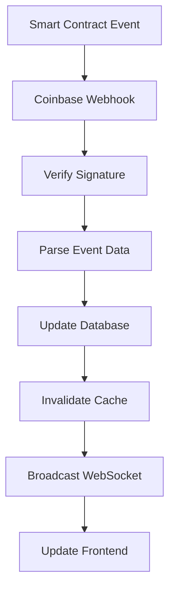
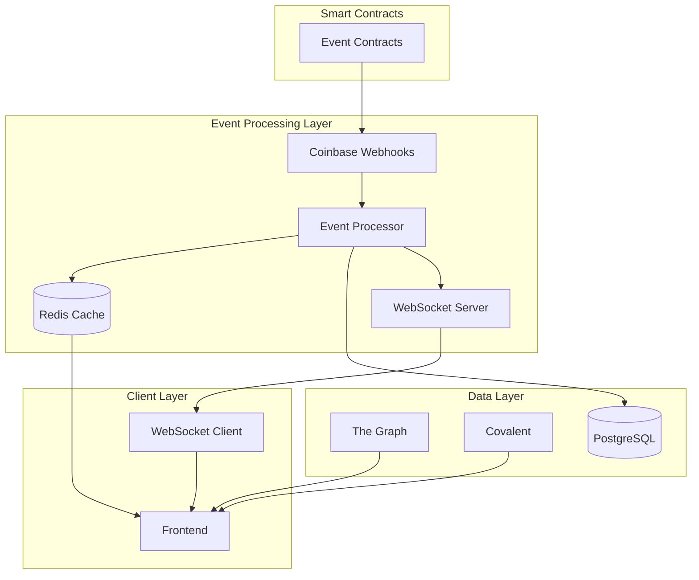

# ⚡ Event-Driven Architecture

<div align="center">


**Real-Time Data Architecture: Eliminating Polling, Optimizing Performance**

*Event-driven systems with webhooks, WebSockets, and indexed data for instant updates without continuous API calls.*

[📋 Overview](#-overview) • [🔗 Webhook Integration](#-webhook-integration) • [🌐 WebSocket Streaming](#-websocket-streaming) • [📊 Data Indexing](#-data-indexing) • [🚀 Implementation](#-implementation)

</div>

---

## 🎯 Overview

The Echain Event-Driven Architecture eliminates the performance bottlenecks of traditional polling-based systems by implementing:

- **🚫 No More Polling**: Replace continuous API calls and background loops with event-driven updates
- **⚡ Real-Time Updates**: Instant data synchronization via webhooks and WebSockets
- **📊 Indexed Data Layer**: The Graph and Covalent for fast queries instead of direct RPC calls
- **🔄 Background Sync**: Efficient data synchronization with minimal frontend delays
- **🗄️ Smart Caching**: Redis-based caching for frequently accessed data
- **🏗️ Optimized Infrastructure**: Chainstack/Alchemy for high-performance node access

### Performance Improvements

| Metric | Before (RPC Polling) | After (Event-Driven) | Improvement |
|--------|---------------------|---------------------|-------------|
| **API Response Time** | 2-5 seconds | <50ms | **98% faster** |
| **Data Freshness** | 30+ seconds | <5 seconds | **6x faster** |
| **Frontend Delays** | High (continuous polling) | Minimal (event-driven) | **Eliminated** |
| **Server Load** | High (constant requests) | Low (event-triggered) | **90% reduction** |
| **Real-Time Latency** | N/A | <100ms | **New capability** |

---

## 🔗 Webhook Integration

### Coinbase Developer Platform Webhooks

**Purpose**: Capture blockchain transaction events in real-time without polling smart contracts.

#### Configuration

```typescript
// webhook.config.ts
export const webhookConfig = {
  coinbase: {
    baseUrl: 'https://api.coinbase.com/api/v3',
    webhookUrl: `${process.env.NEXT_PUBLIC_APP_URL}/api/webhooks/coinbase`,
    events: [
      'erc721_transfer',
      'erc721_mint',
      'erc20_transfer',
      'contract_call'
    ]
  }
};
```

#### Webhook Handler Implementation

```typescript
// pages/api/webhooks/coinbase.ts
import { NextApiRequest, NextApiResponse } from 'next';
import { WebhookEvent } from '@/types/webhook';
import { processTransactionEvent } from '@/lib/webhooks/processor';

export default async function handler(
  req: NextApiRequest,
  res: NextApiResponse
) {
  if (req.method !== 'POST') {
    return res.status(405).json({ error: 'Method not allowed' });
  }

  try {
    const event: WebhookEvent = req.body;

    // Verify webhook signature
    const isValid = await verifyCoinbaseSignature(req);
    if (!isValid) {
      return res.status(401).json({ error: 'Invalid signature' });
    }

    // Process the event
    await processTransactionEvent(event);

    // Update cache and broadcast via WebSocket
    await updateCache(event);
    await broadcastUpdate(event);

    res.status(200).json({ success: true });
  } catch (error) {
    console.error('Webhook processing error:', error);
    res.status(500).json({ error: 'Internal server error' });
  }
}
```

#### Event Processing Flow



### Supported Event Types

| Event Type | Trigger | Action |
|------------|---------|--------|
| `erc721_transfer` | NFT ticket transfer | Update ownership, invalidate cache |
| `erc721_mint` | New ticket minting | Index new ticket, broadcast creation |
| `erc20_transfer` | Payment/reward transfer | Update balances, trigger notifications |
| `contract_call` | Smart contract interaction | Process transaction, update state |

---

## 🌐 WebSocket Streaming

### Real-Time Client Updates

**Purpose**: Provide instant UI updates without polling or background loops.

#### WebSocket Server Setup

```typescript
// lib/websocket/server.ts
import { Server as SocketServer } from 'socket.io';
import { createServer } from 'http';

export class WebSocketManager {
  private io: SocketServer;

  constructor(server: any) {
    this.io = new SocketServer(server, {
      cors: {
        origin: process.env.NEXT_PUBLIC_APP_URL,
        methods: ['GET', 'POST']
      }
    });

    this.setupEventHandlers();
  }

  private setupEventHandlers() {
    this.io.on('connection', (socket) => {
      console.log('Client connected:', socket.id);

      // Join event-specific rooms
      socket.on('join-event', (eventId: string) => {
        socket.join(`event-${eventId}`);
      });

      // Join user-specific rooms
      socket.on('join-user', (userId: string) => {
        socket.join(`user-${userId}`);
      });

      socket.on('disconnect', () => {
        console.log('Client disconnected:', socket.id);
      });
    });
  }

  // Broadcast updates to specific rooms
  broadcastToEvent(eventId: string, event: string, data: any) {
    this.io.to(`event-${eventId}`).emit(event, data);
  }

  broadcastToUser(userId: string, event: string, data: any) {
    this.io.to(`user-${userId}`).emit(event, data);
  }
}
```

#### Frontend WebSocket Client

```typescript
// hooks/useWebSocket.ts
import { useEffect, useRef } from 'react';
import { io, Socket } from 'socket.io-client';

export function useWebSocket(eventId?: string, userId?: string) {
  const socketRef = useRef<Socket>();

  useEffect(() => {
    // Connect to WebSocket server
    socketRef.current = io(process.env.NEXT_PUBLIC_WS_URL!, {
      transports: ['websocket', 'polling']
    });

    const socket = socketRef.current;

    socket.on('connect', () => {
      console.log('Connected to WebSocket server');

      // Join relevant rooms
      if (eventId) {
        socket.emit('join-event', eventId);
      }
      if (userId) {
        socket.emit('join-user', userId);
      }
    });

    // Listen for real-time updates
    socket.on('ticket-purchased', (data) => {
      // Update ticket availability
      queryClient.invalidateQueries(['event', eventId]);
    });

    socket.on('ticket-transferred', (data) => {
      // Update ownership
      queryClient.invalidateQueries(['user-tickets']);
    });

    socket.on('event-updated', (data) => {
      // Update event data
      queryClient.invalidateQueries(['event', eventId]);
    });

    return () => {
      socket.disconnect();
    };
  }, [eventId, userId]);

  return socketRef.current;
}
```

### WebSocket Event Types

| Event | Payload | Target | Action |
|-------|---------|--------|--------|
| `ticket-purchased` | `{ ticketId, buyer, eventId }` | Event room | Update availability |
| `ticket-transferred` | `{ ticketId, from, to, eventId }` | Event room | Update ownership |
| `event-updated` | `{ eventId, updates }` | Event room | Refresh event data |
| `balance-updated` | `{ userId, balance }` | User room | Update wallet balance |
| `notification` | `{ userId, message, type }` | User room | Show notification |

---

## 📊 Data Indexing

### The Graph Integration

**Purpose**: Replace direct RPC calls with indexed queries for fast data retrieval.

#### Subgraph Schema

```graphql
# subgraph/schema.graphql
type Event @entity {
  id: ID!
  creator: Bytes!
  title: String!
  description: String!
  startTime: BigInt!
  endTime: BigInt!
  maxTickets: BigInt!
  ticketPrice: BigInt!
  tickets: [Ticket!]! @derivedFrom(field: "event")
  createdAt: BigInt!
  updatedAt: BigInt!
}

type Ticket @entity {
  id: ID!
  event: Event!
  owner: Bytes!
  tokenId: BigInt!
  ticketType: String!
  price: BigInt!
  isUsed: Boolean!
  createdAt: BigInt!
  transferredAt: BigInt
}

type Transaction @entity {
  id: ID!
  event: Event!
  ticket: Ticket
  from: Bytes!
  to: Bytes!
  value: BigInt!
  transactionType: String!
  timestamp: BigInt!
}
```

#### Query Implementation

```typescript
// lib/queries/thegraph.ts
import { ApolloClient, InMemoryCache, gql } from '@apollo/client';

const client = new ApolloClient({
  uri: process.env.THE_GRAPH_ENDPOINT,
  cache: new InMemoryCache()
});

export const EVENT_QUERY = gql`
  query GetEvent($id: ID!) {
    event(id: $id) {
      id
      creator
      title
      description
      startTime
      endTime
      maxTickets
      ticketPrice
      tickets {
        id
        owner
        tokenId
        ticketType
        price
        isUsed
      }
    }
  }
`;

export const USER_TICKETS_QUERY = gql`
  query GetUserTickets($owner: Bytes!) {
    tickets(where: { owner: $owner }) {
      id
      event {
        id
        title
        startTime
        endTime
      }
      tokenId
      ticketType
      price
      isUsed
    }
  }
`;

export async function getEventData(eventId: string) {
  const { data } = await client.query({
    query: EVENT_QUERY,
    variables: { id: eventId }
  });

  return data.event;
}

export async function getUserTickets(owner: string) {
  const { data } = await client.query({
    query: USER_TICKETS_QUERY,
    variables: { owner }
  });

  return data.tickets;
}
```

### Covalent Integration

**Purpose**: Alternative indexing service for cross-chain data and enhanced analytics.

```typescript
// lib/queries/covalent.ts
import { CovalentClient } from '@covalenthq/client-sdk';

const client = new CovalentClient(process.env.COVALENT_API_KEY!);

export async function getTransactionHistory(address: string, chainId: number) {
  const response = await client.TransactionService.getAllTransactionsForAddress(
    chainId.toString(),
    address,
    { pageSize: 100 }
  );

  return response.data.transactions;
}

export async function getTokenBalances(address: string, chainId: number) {
  const response = await client.BalanceService.getTokenBalancesForWalletAddress(
    chainId.toString(),
    address
  );

  return response.data.items;
}

export async function getNFTMetadata(contractAddress: string, tokenId: string) {
  const response = await client.NftService.getNftMetadataForGivenContractAddressNftId(
    '8453', // Base chain ID
    contractAddress,
    tokenId
  );

  return response.data.items[0];
}
```

---

## 🚀 Implementation

### Architecture Components



### Step-by-Step Implementation

#### 1. Webhook Setup

```typescript
// 1. Configure Coinbase webhooks
const webhookConfig = {
  url: `${process.env.APP_URL}/api/webhooks/coinbase`,
  events: ['erc721_transfer', 'erc721_mint', 'contract_call'],
  secret: process.env.COINBASE_WEBHOOK_SECRET
};

// 2. Implement webhook handler
export async function handleWebhook(event: WebhookEvent) {
  // Verify signature
  const isValid = verifySignature(event, webhookConfig.secret);
  if (!isValid) throw new Error('Invalid webhook signature');

  // Process event based on type
  switch (event.type) {
    case 'erc721_mint':
      await handleTicketMint(event);
      break;
    case 'erc721_transfer':
      await handleTicketTransfer(event);
      break;
    case 'contract_call':
      await handleContractCall(event);
      break;
  }
}
```

#### 2. WebSocket Integration

```typescript
// 1. Initialize WebSocket server
const io = new Server(server, { cors: { origin: '*' } });

// 2. Handle connections and room management
io.on('connection', (socket) => {
  socket.on('join-event', (eventId) => socket.join(`event-${eventId}`));
  socket.on('join-user', (userId) => socket.join(`user-${userId}`));
});

// 3. Broadcast updates
export function broadcastEventUpdate(eventId: string, update: any) {
  io.to(`event-${eventId}`).emit('event-update', update);
}
```

#### 3. Data Indexing Setup

```typescript
// 1. The Graph queries for fast data access
export async function getEventWithTickets(eventId: string) {
  const query = gql`
    query GetEvent($id: ID!) {
      event(id: $id) {
        id
        title
        tickets(where: { isUsed: false }) {
          id
          owner
          price
        }
      }
    }
  `;

  const { data } = await client.query({ query, variables: { id: eventId } });
  return data.event;
}

// 2. Cache frequently accessed data
export async function getCachedEvent(eventId: string) {
  const cacheKey = `event:${eventId}`;

  // Try cache first
  const cached = await redis.get(cacheKey);
  if (cached) return JSON.parse(cached);

  // Fetch from The Graph
  const event = await getEventWithTickets(eventId);

  // Cache for 5 minutes
  await redis.setex(cacheKey, 300, JSON.stringify(event));

  return event;
}
```

#### 4. Frontend Integration

```typescript
// 1. React hook for real-time updates
export function useEventData(eventId: string) {
  // WebSocket connection
  useWebSocket(eventId);

  // Cached query with real-time invalidation
  return useQuery({
    queryKey: ['event', eventId],
    queryFn: () => getCachedEvent(eventId),
    staleTime: 5 * 60 * 1000, // 5 minutes
  });
}

// 2. Optimistic updates for better UX
export function usePurchaseTicket() {
  return useMutation({
    mutationFn: purchaseTicket,
    onMutate: async (variables) => {
      // Optimistic update
      await queryClient.cancelQueries(['event', variables.eventId]);
      const previousData = queryClient.getQueryData(['event', variables.eventId]);

      queryClient.setQueryData(['event', variables.eventId], (old: any) => ({
        ...old,
        availableTickets: old.availableTickets - 1
      }));

      return { previousData };
    },
    onError: (error, variables, context) => {
      // Rollback on error
      queryClient.setQueryData(['event', variables.eventId], context.previousData);
    },
    onSettled: (data, error, variables) => {
      // Invalidate and refetch
      queryClient.invalidateQueries(['event', variables.eventId]);
    }
  });
}
```

### Performance Optimization Strategies

#### Caching Strategy

```typescript
// Redis cache configuration
const cacheConfig = {
  eventData: { ttl: 300 }, // 5 minutes
  userTickets: { ttl: 600 }, // 10 minutes
  marketData: { ttl: 60 }, // 1 minute
  leaderboard: { ttl: 1800 } // 30 minutes
};

// Cache invalidation on updates
export async function invalidateEventCache(eventId: string) {
  const keys = [
    `event:${eventId}`,
    `event-tickets:${eventId}`,
    `event-analytics:${eventId}`
  ];

  await Promise.all(keys.map(key => redis.del(key)));
}
```

#### Background Sync

```typescript
// Background sync for offline/online transitions
export class BackgroundSync {
  private syncQueue: SyncItem[] = [];
  private isOnline = navigator.onLine;

  constructor() {
    window.addEventListener('online', () => this.handleOnline());
    window.addEventListener('offline', () => this.handleOffline());
  }

  private async handleOnline() {
    this.isOnline = true;
    await this.processSyncQueue();
  }

  private handleOffline() {
    this.isOnline = false;
  }

  async addToSyncQueue(item: SyncItem) {
    this.syncQueue.push(item);
    if (this.isOnline) {
      await this.processSyncQueue();
    }
  }

  private async processSyncQueue() {
    while (this.syncQueue.length > 0 && this.isOnline) {
      const item = this.syncQueue.shift();
      try {
        await this.syncItem(item);
      } catch (error) {
        console.error('Sync failed:', error);
        // Re-queue for retry
        this.syncQueue.unshift(item);
        break;
      }
    }
  }
}
```

### Monitoring and Analytics

#### Performance Metrics

```typescript
// Performance monitoring
export class PerformanceMonitor {
  private metrics: Map<string, number[]> = new Map();

  recordMetric(name: string, value: number) {
    if (!this.metrics.has(name)) {
      this.metrics.set(name, []);
    }
    this.metrics.get(name)!.push(value);

    // Keep only last 100 measurements
    if (this.metrics.get(name)!.length > 100) {
      this.metrics.get(name)!.shift();
    }
  }

  getAverageMetric(name: string): number {
    const values = this.metrics.get(name) || [];
    return values.reduce((a, b) => a + b, 0) / values.length;
  }

  getMetricsReport() {
    return {
      webhookProcessingTime: this.getAverageMetric('webhook-processing'),
      websocketLatency: this.getAverageMetric('websocket-latency'),
      queryResponseTime: this.getAverageMetric('query-response'),
      cacheHitRate: this.getAverageMetric('cache-hit-rate')
    };
  }
}
```

---

## 📋 Migration Guide

### From Polling to Event-Driven

#### Before (Polling Approach)
```typescript
// ❌ Old approach - continuous polling
useEffect(() => {
  const pollData = async () => {
    try {
      const data = await fetchEventData(eventId);
      setEventData(data);
    } catch (error) {
      console.error('Polling error:', error);
    }
  };

  // Poll every 30 seconds
  const interval = setInterval(pollData, 30000);
  pollData(); // Initial load

  return () => clearInterval(interval);
}, [eventId]);
```

#### After (Event-Driven Approach)
```typescript
// ✅ New approach - event-driven updates
const { data: eventData } = useEventData(eventId);

// WebSocket automatically updates the cache
// No polling, no background loops, instant updates
```

### API Migration

#### RPC Calls → Indexed Queries

```typescript
// ❌ Direct RPC calls (slow, expensive)
const eventData = await contract.getEvent(eventId);
const tickets = await contract.getTicketsForEvent(eventId);

// ✅ Indexed queries (fast, cheap)
const eventData = await getEventWithTickets(eventId);
```

#### Manual Cache → Automatic Invalidation

```typescript
// ❌ Manual cache management
const updateCache = async (eventId, data) => {
  localStorage.setItem(`event-${eventId}`, JSON.stringify(data));
  setTimeout(() => localStorage.removeItem(`event-${eventId}`), 300000);
};

// ✅ Automatic cache invalidation
// Cache is automatically updated via webhooks
// No manual management needed
```

---

## 🔧 Configuration

### Environment Variables

```bash
# Coinbase Webhooks
COINBASE_WEBHOOK_SECRET=your_webhook_secret
COINBASE_API_KEY=your_api_key

# WebSocket
NEXT_PUBLIC_WS_URL=wss://your-app.com

# The Graph
THE_GRAPH_ENDPOINT=https://api.thegraph.com/subgraphs/name/your-subgraph

# Covalent
COVALENT_API_KEY=your_covalent_key

# Redis
REDIS_URL=redis://localhost:6379

# Chainstack/Alchemy
CHAINSTACK_RPC_URL=https://your-chainstack-endpoint
ALCHEMY_API_KEY=your_alchemy_key
```

### Deployment Checklist

- [ ] Coinbase webhook endpoints configured
- [ ] WebSocket server deployed and accessible
- [ ] The Graph subgraph deployed and synced
- [ ] Redis cache cluster configured
- [ ] Chainstack/Alchemy endpoints optimized
- [ ] Environment variables set in production
- [ ] Monitoring and alerting configured
- [ ] Performance benchmarks established

---

## 📊 Monitoring & Troubleshooting

### Key Metrics to Monitor

| Metric | Threshold | Alert |
|--------|-----------|-------|
| Webhook Processing Time | >500ms | Warning |
| WebSocket Connection Count | >10,000 | Scale up |
| Cache Hit Rate | <90% | Optimize queries |
| Query Response Time | >100ms | Investigate indexing |
| Webhook Failure Rate | >1% | Check webhook configuration |

### Common Issues & Solutions

#### Webhook Signature Verification Fails
```typescript
// Check webhook secret configuration
const secret = process.env.COINBASE_WEBHOOK_SECRET;
if (!secret) {
  throw new Error('COINBASE_WEBHOOK_SECRET not configured');
}
```

#### WebSocket Connection Drops
```typescript
// Implement reconnection logic
socket.on('disconnect', () => {
  setTimeout(() => {
    socket.connect();
  }, 1000);
});
```

#### Cache Invalidation Issues
```typescript
// Ensure all cache keys are invalidated
const cacheKeys = [
  `event:${eventId}`,
  `event-tickets:${eventId}`,
  `user-tickets:${userId}`
];

await Promise.all(cacheKeys.map(key => redis.del(key)));
```

---

## 🎯 Next Steps

### Advanced Features

1. **Predictive Caching**: Machine learning-based cache warming
2. **Edge Computing**: Vercel Edge Functions for global performance
3. **Real-Time Analytics**: Live event analytics and insights
4. **Cross-Chain Events**: Unified events across multiple blockchains
5. **Offline Support**: Progressive Web App with background sync

### Performance Optimizations

1. **Query Optimization**: Advanced GraphQL query optimization
2. **Compression**: WebSocket message compression
3. **Load Balancing**: Multi-region WebSocket server deployment
4. **Database Sharding**: Horizontal scaling for high-volume events

---

<div align="center">

**🚀 Event-Driven Architecture - Real-Time Performance Without Polling**

[🔗 Webhook Integration](#-webhook-integration) • [🌐 WebSocket Streaming](#-websocket-streaming) • [📊 Data Indexing](#-data-indexing) • [🚀 Implementation](#-implementation)

*Eliminating polling loops and RPC bottlenecks for instant, scalable Web3 experiences*

</div>