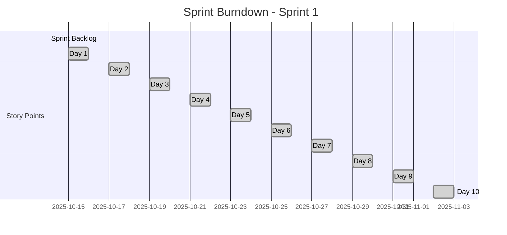

# 🚀 Agile Sprint Framework - Event-Driven Architecture Migration

<div align="center">


**Echain Platform: Event-Driven Architecture Implementation**

*Agile sprint planning with story points for scalable Web3 transformation*

[📋 Overview](#-overview) • [🎯 Sprint Planning](#-sprint-planning) • [📊 Story Points](#-story-points) • [📅 Sprint Backlog](#-sprint-backlog) • [📈 Progress Tracking](#-progress-tracking)

</div>

---

## 🎯 Overview

This agile sprint framework provides a structured approach to implementing the event-driven architecture transformation for the Echain platform. The migration is broken into 8 two-week sprints, with each sprint containing user stories estimated in story points.

### Sprint Framework Goals

- **🚀 Incremental Delivery**: Deliver working features every 2 weeks
- **📊 Measurable Progress**: Story points for velocity tracking
- **🔄 Continuous Improvement**: Sprint retrospectives and adjustments
- **👥 Cross-Functional Teams**: Frontend, backend, blockchain, and DevOps collaboration
- **✅ Quality Assurance**: Testing and validation in each sprint

### Sprint Structure

| Sprint | Duration | Focus | Story Points | Key Deliverables |
|--------|----------|-------|--------------|------------------|
| **Sprint 1** | Week 1-2 | Foundation | 15 | Infrastructure setup, webhook foundation |
| **Sprint 2** | Week 3-4 | Data Layer | 18 | The Graph, Covalent, Chainstack integration |
| **Sprint 3** | Week 5-6 | Frontend Core | 16 | WebSocket client, data access layer |
| **Sprint 4** | Week 7-8 | Optimization | 14 | Caching, background sync |
| **Sprint 5** | Week 9-10 | Testing & QA | 12 | Comprehensive testing suite |
| **Sprint 6** | Week 11-12 | Advanced Features | 15 | Predictive caching, edge computing |
| **Sprint 7** | Week 13-14 | Scale & Performance | 16 | Horizontal scaling, query optimization |
| **Sprint 8** | Week 15-16 | Production Excellence | 14 | Monitoring, security, documentation |

**Total Story Points: 120** | **Total Duration: 16 weeks** | **Team Size: 4-6 developers**

---

## 📊 Story Points Estimation

### Story Point Scale

| Points | Description | Time Estimate | Complexity |
|--------|-------------|---------------|------------|
| **1** | Trivial task | <2 hours | Simple bug fix, configuration change |
| **2** | Small task | 2-4 hours | Single component implementation |
| **3** | Medium task | 4-8 hours | Feature implementation with tests |
| **5** | Large task | 1-2 days | Complex feature with integration |
| **8** | Extra large | 2-3 days | Major feature with multiple components |
| **13** | Epic | 3-5 days | Complex integration, multiple teams |

### Estimation Guidelines

#### Factors Considered
- **Complexity**: Technical difficulty and unknowns
- **Effort**: Amount of work required
- **Risk**: Potential blockers or dependencies
- **Testing**: Time needed for testing and validation
- **Documentation**: Code documentation and user guides

#### Planning Poker Process
1. **Product Owner** presents user story
2. **Team** discusses requirements and assumptions
3. **Individual Estimation** using planning poker cards
4. **Consensus** reached through discussion
5. **Story Refinement** if needed

#### Velocity Calculation
```
Average Velocity = Total Story Points Completed / Number of Sprints
Target Velocity = 15-20 points per sprint (for 4-6 person team)
Sprint Capacity = Team Availability × Individual Capacity
```

---

## 📅 Sprint Backlog

### Sprint 1: Foundation Setup (15 Story Points)

#### Sprint Goal: Establish core event-driven infrastructure

**User Stories:**

**EPIC: Infrastructure Foundation (8 points)**
- **Story 1.1**: Set up WebSocket server with Socket.io (3 points)
  - **Acceptance Criteria**: Server starts successfully, basic connection test passes
  - **Tasks**: Install dependencies, configure server, basic health check
- **Story 1.2**: Configure Redis caching layer (2 points)
  - **Acceptance Criteria**: Redis connection established, basic set/get operations work
  - **Tasks**: Install Redis, configure connection, test basic operations
- **Story 1.3**: Set up Coinbase webhook endpoint (3 points)
  - **Acceptance Criteria**: Webhook endpoint accepts POST requests, basic logging works
  - **Tasks**: Create API route, basic request handling, logging setup

**EPIC: Development Environment (7 points)**
- **Story 1.4**: Configure environment variables and secrets (2 points)
  - **Acceptance Criteria**: All required env vars documented and configured
  - **Tasks**: Create .env template, document all variables, validation
- **Story 1.5**: Set up development tooling and scripts (3 points)
  - **Acceptance Criteria**: npm scripts for dev, build, test work correctly
  - **Tasks**: Configure package.json scripts, development workflow
- **Story 1.6**: Create basic project structure for event-driven features (2 points)
  - **Acceptance Criteria**: Folder structure created, basic files in place
  - **Tasks**: Create directories, stub files, import structure

### Sprint 2: Data Layer Migration (18 Story Points)

#### Sprint Goal: Replace RPC calls with indexed data queries

**User Stories:**

**EPIC: The Graph Integration (8 points)**
- **Story 2.1**: Design and implement subgraph schema (3 points)
  - **Acceptance Criteria**: Schema matches smart contract events, entities defined
  - **Tasks**: Analyze contracts, design schema, create subgraph.yaml
- **Story 2.2**: Implement event handlers for smart contracts (3 points)
  - **Acceptance Criteria**: Event handlers process EventFactory and EventTicket events
  - **Tasks**: Create mapping.ts, handle events, data transformation
- **Story 2.3**: Deploy subgraph to The Graph Studio (2 points)
  - **Acceptance Criteria**: Subgraph deployed and syncing on Base Sepolia
  - **Tasks**: Configure networks, deploy, verify syncing

**EPIC: Covalent Analytics (6 points)**
- **Story 2.4**: Set up Covalent API client integration (2 points)
  - **Acceptance Criteria**: API client configured, basic queries work
  - **Tasks**: Install SDK, configure API key, test connection
- **Story 2.5**: Implement portfolio analytics queries (2 points)
  - **Acceptance Criteria**: User portfolio data retrieved and formatted
  - **Tasks**: Create analytics service, implement queries
- **Story 2.6**: Add transaction history integration (2 points)
  - **Acceptance Criteria**: Historical transactions accessible via API
  - **Tasks**: Implement transaction queries, data formatting

**EPIC: Chainstack Optimization (4 points)**
- **Story 2.7**: Configure Chainstack RPC endpoints (2 points)
  - **Acceptance Criteria**: Optimized RPC URLs configured for Base Sepolia
  - **Tasks**: Set up account, configure endpoints, test connection
- **Story 2.8**: Implement basic contract call optimization (2 points)
  - **Acceptance Criteria**: Contract calls use Chainstack with basic caching
  - **Tasks**: Update viem config, implement caching wrapper

### Sprint 3: Frontend Integration (16 Story Points)

#### Sprint Goal: Connect frontend to real-time data streams

**User Stories:**

**EPIC: WebSocket Client (6 points)**
- **Story 3.1**: Create WebSocket connection management hook (2 points)
  - **Acceptance Criteria**: Hook manages connection state, handles reconnections
  - **Tasks**: Create useWebSocket hook, connection logic, error handling
- **Story 3.2**: Implement event-specific WebSocket hooks (2 points)
  - **Acceptance Criteria**: useEventWebSocket hook broadcasts event updates
  - **Tasks**: Create event hooks, room management, message handling
- **Story 3.3**: Add WebSocket connection status UI (2 points)
  - **Acceptance Criteria**: Connection status displayed in UI components
  - **Tasks**: Create status component, integrate with hooks

**EPIC: Data Access Layer (7 points)**
- **Story 3.4**: Create unified data access layer class (3 points)
  - **Acceptance Criteria**: DataAccessLayer provides consistent API
  - **Tasks**: Create class structure, basic methods, error handling
- **Story 3.5**: Implement multi-source data fallback (2 points)
  - **Acceptance Criteria**: Graph → Covalent → Chainstack → RPC fallback works
  - **Tasks**: Implement fallback logic, error handling
- **Story 3.6**: Update React Query hooks to use new data layer (2 points)
  - **Acceptance Criteria**: Existing hooks use DataAccessLayer
  - **Tasks**: Update useEvent, useTickets hooks

**EPIC: Real-Time UI Updates (3 points)**
- **Story 3.7**: Integrate real-time updates in event pages (3 points)
  - **Acceptance Criteria**: Event details update in real-time
  - **Tasks**: Update EventPage component, integrate WebSocket hooks

### Sprint 4: Performance Optimization (14 Story Points)

#### Sprint Goal: Implement caching and background sync

**User Stories:**

**EPIC: Redis Caching Strategy (8 points)**
- **Story 4.1**: Implement multi-layer caching configuration (2 points)
  - **Acceptance Criteria**: Cache TTL configured for different data types
  - **Tasks**: Define cache policies, configure Redis client
- **Story 4.2**: Add cache warming for frequently accessed data (3 points)
  - **Acceptance Criteria**: Popular events cached on startup
  - **Tasks**: Implement cache warming logic, background job
- **Story 4.3**: Implement intelligent cache invalidation (3 points)
  - **Acceptance Criteria**: Cache invalidated on webhook events
  - **Tasks**: Create invalidation service, integrate with webhooks

**EPIC: Background Sync (6 points)**
- **Story 4.4**: Create background sync queue manager (2 points)
  - **Acceptance Criteria**: Sync queue processes items when online
  - **Tasks**: Implement queue logic, online/offline detection
- **Story 4.5**: Add offline data handling (2 points)
  - **Acceptance Criteria**: App works offline with cached data
  - **Tasks**: Implement offline storage, sync on reconnection
- **Story 4.6**: Configure service worker for caching (2 points)
  - **Acceptance Criteria**: Static assets cached, offline functionality works
  - **Tasks**: Create service worker, configure caching strategies

### Sprint 5: Testing & Quality Assurance (12 Story Points)

#### Sprint Goal: Comprehensive testing and production readiness

**User Stories:**

**EPIC: Unit Testing (4 points)**
- **Story 5.1**: Create unit tests for webhook processing (2 points)
  - **Acceptance Criteria**: Webhook signature verification and processing tested
  - **Tasks**: Write tests, mock dependencies, achieve 90% coverage
- **Story 5.2**: Add unit tests for WebSocket functionality (2 points)
  - **Acceptance Criteria**: Connection management and broadcasting tested
  - **Tasks**: Write WebSocket tests, mock socket connections

**EPIC: Integration Testing (5 points)**
- **Story 5.3**: Implement end-to-end event flow tests (3 points)
  - **Acceptance Criteria**: Complete ticket purchase flow tested
  - **Tasks**: Create integration tests, test webhook → DB → WebSocket → UI
- **Story 5.4**: Add performance benchmark tests (2 points)
  - **Acceptance Criteria**: Response time benchmarks <100ms
  - **Tasks**: Create performance tests, establish baselines

**EPIC: Load Testing (3 points)**
- **Story 5.5**: Set up load testing infrastructure (3 points)
  - **Acceptance Criteria**: 1000 concurrent connections tested successfully
  - **Tasks**: Configure load testing tools, run tests, analyze results

### Sprint 6: Advanced Features (15 Story Points)

#### Sprint Goal: Implement cutting-edge optimizations

**User Stories:**

**EPIC: Predictive Caching (6 points)**
- **Story 6.1**: Implement user behavior analytics (2 points)
  - **Acceptance Criteria**: User interaction patterns tracked
  - **Tasks**: Add analytics tracking, data collection
- **Story 6.2**: Create predictive cache warming (2 points)
  - **Acceptance Criteria**: Frequently accessed data pre-cached
  - **Tasks**: Implement prediction algorithm, cache warming
- **Story 6.3**: Add machine learning-based optimization (2 points)
  - **Acceptance Criteria**: Cache hit rates improved by ML predictions
  - **Tasks**: Integrate simple ML model, performance monitoring

**EPIC: Edge Computing (5 points)**
- **Story 6.4**: Set up Vercel Edge Functions (2 points)
  - **Acceptance Criteria**: Basic edge function deployed and working
  - **Tasks**: Create edge function, configure routing
- **Story 6.5**: Implement global data caching (3 points)
  - **Acceptance Criteria**: Data cached at edge locations
  - **Tasks**: Configure edge caching, test global performance

**EPIC: Real-Time Analytics (4 points)**
- **Story 6.6**: Create live event analytics dashboard (4 points)
  - **Acceptance Criteria**: Real-time metrics displayed in admin dashboard
  - **Tasks**: Build dashboard component, integrate WebSocket metrics

### Sprint 7: Scale & Performance (16 Story Points)

#### Sprint Goal: Enterprise-grade scalability and performance

**User Stories:**

**EPIC: Horizontal Scaling (8 points)**
- **Story 7.1**: Implement WebSocket server clustering (3 points)
  - **Acceptance Criteria**: Multiple WebSocket servers work together
  - **Tasks**: Configure clustering, test load distribution
- **Story 7.2**: Set up database read replicas (3 points)
  - **Acceptance Criteria**: Read queries use replica databases
  - **Tasks**: Configure replicas, update connection logic
- **Story 7.3**: Implement Redis cluster for caching (2 points)
  - **Acceptance Criteria**: Redis cluster handles high load
  - **Tasks**: Set up Redis cluster, update client configuration

**EPIC: Query Optimization (5 points)**
- **Story 7.4**: Optimize GraphQL queries (2 points)
  - **Acceptance Criteria**: Query performance improved by 50%
  - **Tasks**: Analyze queries, implement optimizations
- **Story 7.5**: Add database query optimization (3 points)
  - **Acceptance Criteria**: Slow queries identified and optimized
  - **Tasks**: Add indexes, optimize queries, monitor performance

**EPIC: CDN Integration (3 points)**
- **Story 7.6**: Configure global CDN for assets (3 points)
  - **Acceptance Criteria**: Static assets served via CDN
  - **Tasks**: Set up CDN, configure caching rules

### Sprint 8: Production Excellence (14 Story Points)

#### Sprint Goal: Production-ready system with monitoring and security

**User Stories:**

**EPIC: Monitoring & Alerting (6 points)**
- **Story 8.1**: Implement comprehensive monitoring system (3 points)
  - **Acceptance Criteria**: All system metrics tracked and visualized
  - **Tasks**: Set up monitoring dashboard, configure alerts
- **Story 8.2**: Add performance monitoring and alerting (3 points)
  - **Acceptance Criteria**: Performance issues automatically detected
  - **Tasks**: Configure performance monitoring, set up alerts

**EPIC: Security & Compliance (5 points)**
- **Story 8.3**: Implement security audit and fixes (3 points)
  - **Acceptance Criteria**: Security vulnerabilities addressed
  - **Tasks**: Run security audit, implement fixes
- **Story 8.4**: Add rate limiting and DDoS protection (2 points)
  - **Acceptance Criteria**: API endpoints protected against abuse
  - **Tasks**: Implement rate limiting, configure DDoS protection

**EPIC: Documentation & Training (3 points)**
- **Story 8.5**: Create production deployment documentation (3 points)
  - **Acceptance Criteria**: Complete deployment and maintenance guides
  - **Tasks**: Document deployment process, create runbooks

---

## 📈 Progress Tracking

### Sprint Burndown Chart Template



### Velocity Tracking

| Sprint | Planned Points | Completed Points | Velocity | Notes |
|--------|----------------|------------------|----------|-------|
| Sprint 1 | 15 |  |  | Foundation setup |
| Sprint 2 | 18 |  |  | Data layer migration |
| Sprint 3 | 16 |  |  | Frontend integration |
| Sprint 4 | 14 |  |  | Performance optimization |
| Sprint 5 | 12 |  |  | Testing & QA |
| Sprint 6 | 15 |  |  | Advanced features |
| Sprint 7 | 16 |  |  | Scale & performance |
| Sprint 8 | 14 |  |  | Production excellence |

### Sprint Retrospective Template

#### What Went Well?
- List 3 things that went well during the sprint

#### What Could Be Improved?
- List 3 things that could be improved

#### Action Items for Next Sprint
- List 3 concrete action items

#### Sprint Rating (1-5)
- Team satisfaction rating

---

## 🎯 Sprint Planning Meeting Agenda

### Sprint Planning Structure (4 hours)

#### Part 1: Sprint Goal & Capacity (30 min)
- Review product vision and sprint goals
- Team capacity assessment
- Sprint goal definition

#### Part 2: Story Refinement (1 hour)
- Review and refine product backlog items
- Story point estimation using planning poker
- Acceptance criteria definition

#### Part 3: Sprint Backlog Creation (1.5 hours)
- Select user stories for sprint
- Task breakdown for each story
- Definition of Done establishment

#### Part 4: Sprint Commitment (30 min)
- Team commitment to sprint backlog
- Risk identification and mitigation
- Sprint planning summary

### Daily Standup Format (15 minutes)

#### Three Questions:
1. **What did I accomplish yesterday?**
2. **What will I work on today?**
3. **Are there any blockers?**

#### Format:
- Go around the circle
- Keep it brief (1 minute per person)
- Focus on progress and impediments

---

## 📋 Definition of Ready (DoR)

### Story Must Have:
- [ ] Clear title and description
- [ ] Acceptance criteria defined
- [ ] Story points estimated
- [ ] Sized appropriately (max 8 points)
- [ ] Dependencies identified
- [ ] Test scenarios outlined
- [ ] Design/mockups attached (if UI)
- [ ] Business value explained

### Definition of Done (DoD)

### Code Complete:
- [ ] Code written and unit tests passing
- [ ] Code reviewed and approved
- [ ] Code merged to main branch
- [ ] Documentation updated

### Quality Assurance:
- [ ] Integration tests passing
- [ ] Performance benchmarks met
- [ ] Security scan passed
- [ ] Accessibility requirements met

### Deployment Ready:
- [ ] Environment configuration updated
- [ ] Database migrations ready
- [ ] Rollback plan documented
- [ ] Monitoring and alerting configured

---

## 🚨 Risk Management

### High-Risk Items

| Risk | Probability | Impact | Mitigation |
|------|-------------|--------|------------|
| **The Graph deployment issues** | Medium | High | Have Chainstack fallback ready |
| **Coinbase webhook reliability** | Low | Medium | Implement webhook retry logic |
| **WebSocket connection scaling** | Medium | High | Test with load balancer early |
| **Redis performance at scale** | Low | Medium | Monitor cache hit rates closely |
| **Cross-browser WebSocket support** | Low | Low | Test on target browsers early |

### Risk Monitoring

- **Daily**: Check system health metrics
- **Sprint Review**: Assess sprint risks and adjust backlog
- **Sprint Retrospective**: Identify new risks and mitigation strategies

---

## 📊 Sprint Metrics & KPIs

### Team Metrics
- **Velocity**: Average story points completed per sprint
- **Sprint Goal Success**: Percentage of sprint goals achieved
- **Burndown Chart**: Daily progress tracking
- **Team Satisfaction**: Sprint retrospective ratings

### Product Metrics
- **Lead Time**: Time from story creation to completion
- **Cycle Time**: Time spent actively working on stories
- **Defect Rate**: Bugs found post-deployment
- **Feature Usage**: Adoption rate of new features

### Quality Metrics
- **Test Coverage**: Percentage of code covered by tests
- **Performance Benchmarks**: Response time and throughput targets
- **Uptime**: System availability percentage
- **Error Rate**: Application error frequency

---

## 🎯 Sprint 1 Kickoff - Getting Started

### Immediate Next Steps

1. **Schedule Sprint Planning Meeting** (2 hours)
   - Review sprint backlog
   - Estimate story points
   - Define sprint goal

2. **Set Up Development Environment** (4 hours)
   - Clone repositories
   - Configure local environment
   - Run existing tests

3. **Create Sprint Board** (1 hour)
   - Set up Jira/GitHub Projects board
   - Create swimlanes for team members
   - Configure automation rules

4. **Daily Standup Setup** (30 minutes)
   - Schedule daily standups
   - Set up video conferencing
   - Create standup agenda template

### Sprint 1 Success Criteria

- ✅ Infrastructure foundation established
- ✅ WebSocket server running locally
- ✅ Coinbase webhook endpoint responding
- ✅ Redis caching configured
- ✅ Development environment stable
- ✅ All team members productive

---

<div align="center">

**🚀 Agile Sprint Framework - Ready for Implementation**

*120 Story Points • 8 Sprints • 16 Weeks*

[🎯 Sprint Planning](#-sprint-planning) • [📊 Story Points](#-story-points) • [📅 Sprint Backlog](#-sprint-backlog) • [📈 Progress Tracking](#-progress-tracking)

*Transform Echain with structured, measurable agile delivery*

</div>