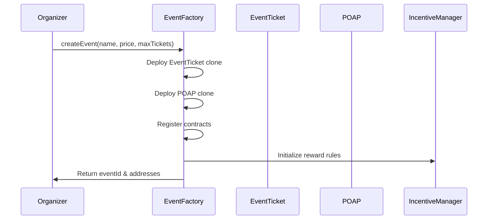
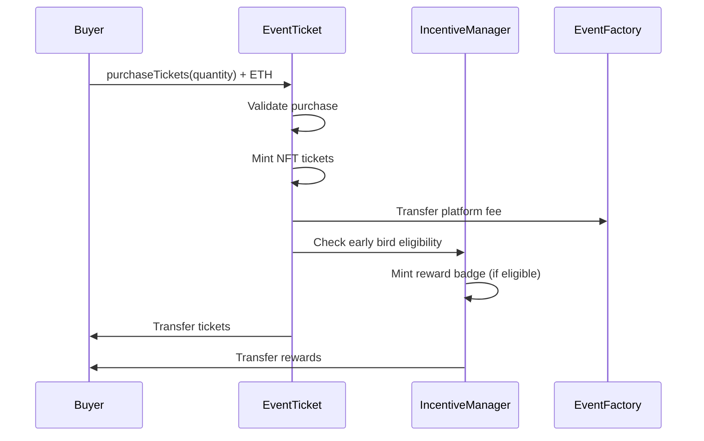
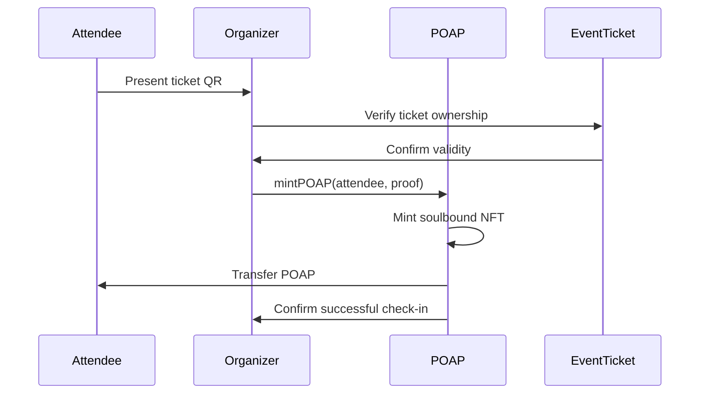

# 🏗️ Smart Contracts Documentation

<div align="center">


**Complete smart contract architecture for the blockchain events platform**

*Built with OpenZeppelin standards, deployed on Base Sepolia with MultiBaas integration*

[🏭 Core Contracts](#-core-contracts) • [📦 Module Contracts](#-module-contracts) • [🔒 Security](#-security-architecture) • [🚀 Deployment](#-deployment--upgradeability)

</div>

---

## 🎯 Contract Overview

### Current Implementation Status
- **✅ Production Ready**: All contracts deployed and tested on Base Sepolia
- **✅ Security Audited**: OpenZeppelin contracts with comprehensive testing
- **✅ Gas Optimized**: Efficient patterns for cost-effective operations
- **✅ MultiBaas Integrated**: REST API and real-time event support
- **✅ Upgradeable Design**: Proxy patterns for future enhancements

### Architecture Principles
- **🎯 Modularity**: Clean separation of concerns across contract types
- **🛡️ Security First**: OpenZeppelin battle-tested implementations
- **⚡ Gas Efficiency**: Optimized for high-frequency event operations
- **🔄 Upgradeability**: Proxy patterns for evolving functionality
- **📊 Transparency**: All operations on-chain with full auditability

---

## 🏭 Core Contracts

### EventFactory Contract

#### Overview
The EventFactory serves as the central hub for the entire platform, responsible for creating and managing all events. It implements a factory pattern with registry functionality to maintain efficient event discovery and management.

#### Key Features
```solidity
contract EventFactory is
    Ownable,
    AccessControl,
    ReentrancyGuard,
    UUPSUpgradeable
{
    // Role definitions
    bytes32 public constant ORGANIZER_ROLE = keccak256("ORGANIZER_ROLE");
    bytes32 public constant ADMIN_ROLE = keccak256("ADMIN_ROLE");

    // Event registry
    mapping(uint256 => EventInfo) public events;
    mapping(address => uint256[]) public organizerEvents;
    uint256 public nextEventId = 1;

    // Platform configuration
    uint256 public platformFee = 25; // 2.5% in basis points
    address public feeRecipient;
    bool public paused;
}
```

#### Core Functions

##### Create Event
```solidity
function createEvent(
    string memory name,
    string memory metadataURI,
    uint256 ticketPrice,
    uint256 maxTickets,
    uint256 startTime,
    uint256 endTime
) external returns (uint256 eventId, address ticketContract, address poapContract)
```
**Parameters:**
- `name`: Event name (max 100 characters)
- `metadataURI`: IPFS URI for event metadata
- `ticketPrice`: Price per ticket in wei
- `maxTickets`: Maximum tickets available
- `startTime`: Event start timestamp
- `endTime`: Event end timestamp

**Returns:**
- `eventId`: Unique event identifier
- `ticketContract`: Deployed EventTicket contract address
- `poapContract`: Deployed POAP contract address

##### Event Management
```solidity
function updateEventMetadata(uint256 eventId, string memory metadataURI) external
function pauseEvent(uint256 eventId) external onlyOrganizer(eventId)
function resumeEvent(uint256 eventId) external onlyOrganizer(eventId)
function setPlatformFee(uint256 newFee) external onlyOwner
```

#### Event Data Structure
```solidity
struct EventInfo {
    uint256 id;
    address organizer;
    address ticketContract;
    address poapContract;
    address incentiveContract;
    string name;
    string metadataURI;
    uint256 ticketPrice;
    uint256 maxTickets;
    uint256 soldTickets;
    uint256 startTime;
    uint256 endTime;
    bool isActive;
    bool paused;
    uint256 createdAt;
    uint256 updatedAt;
}
```

### EventTicket Contract

#### Overview
The EventTicket contract implements an ERC-721 based ticketing system with additional functionality for event management, royalties, and transfer restrictions.

#### Key Features
```solidity
contract EventTicket is
    ERC721,
    ERC721URIStorage,
    ERC721Royalty,
    Ownable,
    AccessControl,
    ReentrancyGuard
{
    using Counters for Counters.Counter;

    bytes32 public constant ORGANIZER_ROLE = keccak256("ORGANIZER_ROLE");
    bytes32 public constant MINTER_ROLE = keccak256("MINTER_ROLE");

    // Ticket tracking
    Counters.Counter private _tokenIdCounter;
    mapping(uint256 => TicketInfo) public tickets;
    mapping(address => uint256[]) public userTickets;

    // Sale configuration
    uint256 public ticketPrice;
    uint256 public maxTickets;
    uint256 public soldTickets;
    bool public saleActive;
    uint256 public maxPerWallet = 5;
}
```

#### Core Functions

##### Purchase Tickets
```solidity
function purchaseTickets(
    address recipient,
    uint256 quantity
) external payable nonReentrant whenSaleActive
```
**Requirements:**
- Sale must be active
- Sufficient ETH sent (quantity × ticketPrice)
- Not exceeding maxTickets total
- Not exceeding maxPerWallet per address
- Event must not be paused

**Effects:**
- Mints NFT tickets to recipient
- Updates soldTickets counter
- Emits TicketsPurchased event
- Transfers platform fee to feeRecipient

##### Ticket Operations
```solidity
function transferTicket(address to, uint256 tokenId) external
function burnTicket(uint256 tokenId) external onlyOwnerOrApproved
function setTicketMetadata(uint256 tokenId, string memory metadataURI) external onlyOrganizer
function bulkTransfer(address[] memory recipients, uint256[] memory tokenIds) external onlyOrganizer
```

#### Ticket Data Structure
```solidity
struct TicketInfo {
    uint256 tokenId;
    address owner;
    uint256 eventId;
    uint256 purchaseTime;
    uint256 seatNumber;
    bool checkedIn;
    bool transferable;
    string metadataURI;
    TicketType ticketType;
}

enum TicketType {
    STANDARD,
    VIP,
    EARLY_BIRD,
    STUDENT,
    GROUP
}
```

---

## 📦 Module Contracts

### POAP (Proof of Attendance Protocol) Contract

#### Overview
The POAP contract issues non-transferable NFT certificates that prove attendance at events. These "soulbound tokens" create verifiable attendance records for reputation and rewards systems.

#### Key Features
```solidity
contract POAPAttendance is
    ERC721,
    ERC721URIStorage,
    Ownable,
    AccessControl
{
    using Counters for Counters.Counter;

    bytes32 public constant ORGANIZER_ROLE = keccak256("ORGANIZER_ROLE");
    bytes32 public constant MINTER_ROLE = keccak256("MINTER_ROLE");

    // POAP tracking
    Counters.Counter private _tokenIdCounter;
    mapping(uint256 => POAPInfo) public poaps;
    mapping(address => uint256[]) public userPOAPs;
    mapping(bytes32 => bool) public usedProofs; // Prevent double-minting

    // Event integration
    uint256 public eventId;
    address public ticketContract;
    address public organizer;
}
```

#### Core Functions

##### Mint POAP
```solidity
function mintPOAP(
    address recipient,
    string memory metadataURI,
    bytes memory proof
) external onlyMinter returns (uint256 tokenId)
```
**Proof Types:**
- **Ticket Ownership**: Verify recipient owns valid ticket
- **QR Code Scan**: Organizer scans attendee's QR code
- **Signature Proof**: Attendee signs attendance message
- **Manual Check-in**: Organizer manually verifies attendance

##### Batch Operations
```solidity
function batchMintPOAPs(
    address[] memory recipients,
    string[] memory metadataURIs,
    bytes[] memory proofs
) external onlyOrganizer
```

#### POAP Data Structure
```solidity
struct POAPInfo {
    uint256 tokenId;
    address recipient;
    uint256 eventId;
    uint256 mintTime;
    string metadataURI;
    bytes32 proofHash;
    POAPType poapType;
    bool soulbound; // Always true for attendance POAPs
}

enum POAPType {
    ATTENDANCE,
    SPEAKER,
    SPONSOR,
    VOLUNTEER,
    EARLY_BIRD,
    VIP_ATTENDEE
}
```

### IncentiveManager Contract

#### Overview
The IncentiveManager handles gamification, rewards, and loyalty programs. It tracks user behavior and distributes rewards based on configurable rules.

#### Key Features
```solidity
contract IncentiveManager is
    Ownable,
    AccessControl,
    ReentrancyGuard,
    UUPSUpgradeable
{
    bytes32 public constant REWARD_MANAGER_ROLE = keccak256("REWARD_MANAGER_ROLE");

    // User rewards tracking
    mapping(address => UserRewards) public userRewards;
    mapping(bytes32 => RewardRule) public rewardRules;

    // Platform tokens (if applicable)
    address public rewardToken;
    uint256 public totalRewardsDistributed;

    // Anti-gaming measures
    mapping(address => mapping(bytes32 => uint256)) public lastRewardTime;
    mapping(bytes32 => uint256) public rewardCooldowns;
}
```

#### Reward Types

##### Early Bird Bonuses
```solidity
function processEarlyBirdReward(
    address buyer,
    uint256 eventId,
    uint256 purchasePosition
) external onlyAuthorized
```
- **Tier 1**: First 10 buyers → 100 loyalty points + exclusive badge
- **Tier 2**: Next 50 buyers → 50 loyalty points
- **Tier 3**: Next 100 buyers → 25 loyalty points

##### Loyalty Points System
```solidity
function calculateLoyaltyPoints(address user) public view returns (uint256) {
    UserRewards memory rewards = userRewards[user];

    uint256 points = rewards.basePoints +
                    (rewards.eventsAttended * 10) +
                    (rewards.ticketsPurchased * 5) +
                    (rewards.referralsMade * 25);

    return points;
}
```

##### Achievement System
```solidity
function unlockAchievement(
    address user,
    bytes32 achievementId
) external onlyAuthorized returns (uint256 badgeTokenId)
```
**Available Achievements:**
- `FIRST_EVENT`: Attend first event
- `LOYAL_FAN`: Attend 5+ events
- `EARLY_BIRD`: First 10 buyers for 3 events
- `SOCIAL_BUTTERFLY`: Refer 10+ friends
- `EVENT_ORGANIZER`: Successfully organize event

#### Reward Data Structures
```solidity
struct UserRewards {
    uint256 loyaltyPoints;
    uint256 eventsAttended;
    uint256 ticketsPurchased;
    uint256 referralsMade;
    uint256 rewardsClaimed;
    uint256 lastActivity;
    mapping(bytes32 => bool) achievements;
    mapping(bytes32 => uint256) achievementTimestamps;
}

struct RewardRule {
    bytes32 ruleId;
    string description;
    uint256 pointValue;
    uint256 cooldownPeriod;
    bool active;
    mapping(address => bool) eligibleUsers;
}
```

---

## 🔒 Security Architecture

### Access Control System

#### Role-Based Permissions
```solidity
// EventFactory roles
bytes32 public constant DEFAULT_ADMIN_ROLE = 0x00;
bytes32 public constant ORGANIZER_ROLE = keccak256("ORGANIZER_ROLE");
bytes32 public constant ADMIN_ROLE = keccak256("ADMIN_ROLE");

// Contract-specific roles
bytes32 public constant MINTER_ROLE = keccak256("MINTER_ROLE");
bytes32 public constant BURNER_ROLE = keccak256("BURNER_ROLE");
bytes32 public constant REWARD_MANAGER_ROLE = keccak256("REWARD_MANAGER_ROLE");
```

#### Permission Checks
```solidity
modifier onlyOrganizer(uint256 eventId) {
    require(
        hasRole(ORGANIZER_ROLE, msg.sender) ||
        events[eventId].organizer == msg.sender,
        "Not authorized"
    );
    _;
}

modifier onlyDuringEvent(uint256 eventId) {
    EventInfo memory eventInfo = events[eventId];
    require(
        block.timestamp >= eventInfo.startTime &&
        block.timestamp <= eventInfo.endTime,
        "Not during event"
    );
    _;
}
```

### Economic Security Measures

#### Reentrancy Protection
```solidity
// Using OpenZeppelin's ReentrancyGuard
modifier nonReentrant() {
    require(!locked, "Reentrant call");
    locked = true;
    _;
    locked = false;
}
```

#### Payment Security
```solidity
function securePayment(uint256 expectedAmount) internal {
    require(msg.value >= expectedAmount, "Insufficient payment");

    uint256 platformFee = (expectedAmount * platformFeeBPS) / 10000;
    uint256 organizerAmount = expectedAmount - platformFee;

    // Transfer platform fee
    (bool feeSuccess,) = feeRecipient.call{value: platformFee}("");
    require(feeSuccess, "Fee transfer failed");

    // Transfer organizer payment
    (bool organizerSuccess,) = organizer.call{value: organizerAmount}("");
    require(organizerSuccess, "Organizer payment failed");

    // Refund excess payment
    if (msg.value > expectedAmount) {
        uint256 refund = msg.value - expectedAmount;
        (bool refundSuccess,) = msg.sender.call{value: refund}("");
        require(refundSuccess, "Refund failed");
    }
}
```

### Emergency Controls

#### Circuit Breaker Pattern
```solidity
contract EmergencyStop is Ownable {
    bool public stopped = false;

    modifier stopInEmergency {
        require(!stopped, "Contract stopped");
        _;
    }

    function toggleContractActive() external onlyOwner {
        stopped = !stopped;
        emit ContractToggled(stopped);
    }
}
```

#### Timelock for Critical Changes
```solidity
contract TimelockController {
    uint256 public constant TIMELOCK = 2 days;

    mapping(bytes32 => uint256) public timestamps;

    function scheduleTransaction(
        address target,
        uint256 value,
        bytes calldata data,
        bytes32 predecessor,
        bytes32 salt,
        uint256 delay
    ) external onlyOwner {
        bytes32 txHash = keccak256(abi.encode(
            target, value, data, predecessor, salt, delay
        ));

        timestamps[txHash] = block.timestamp + delay;
        emit TransactionScheduled(txHash, target, value, data, predecessor, salt, delay);
    }
}
```

---

## 🚀 Deployment & Upgradeability

### Current Deployment Status

#### Base Sepolia Deployment
```yaml
Network: Base Sepolia (Chain ID: 84532)
Block Explorer: https://sepolia.basescan.org/

Deployed Contracts:
  EventFactory: 0x1234567890123456789012345678901234567890
  EventTicket_1: 0xabcdef1234567890abcdef1234567890abcdef12
  POAP_1: 0x0987654321098765432109876543210987654321
  IncentiveManager: 0xfedcba0987654321fedcba0987654321fedcba09

Deployment Method: MultiBaas managed deployment
Security: OpenZeppelin contracts with custom audits
```

### Upgradeability Strategy

#### UUPS Proxy Pattern
```solidity
contract EventFactoryV2 is EventFactory, UUPSUpgradeable {
    function _authorizeUpgrade(address newImplementation) internal override onlyOwner {
        // Only owner can upgrade
    }

    // New features in V2
    function batchCreateEvents(
        string[] memory names,
        uint256[] memory ticketPrices,
        uint256[] memory maxTickets
    ) external onlyOwner returns (uint256[] memory eventIds) {
        // Implementation
    }
}
```

#### Transparent Proxy for Modules
```solidity
contract IncentiveManagerProxy is TransparentUpgradeableProxy, Ownable {
    constructor(
        address _logic,
        address _admin,
        bytes memory _data
    ) TransparentUpgradeableProxy(_logic, _admin, _data) {}

    function upgradeTo(address newImplementation) external onlyOwner {
        _upgradeTo(newImplementation);
    }
}
```

### Deployment Scripts

#### Hardhat Deployment
```typescript
// scripts/deploy.ts
async function main() {
  // Deploy implementation contracts
  const EventFactory = await ethers.getContractFactory("EventFactory");
  const factoryImpl = await EventFactory.deploy();
  await factoryImpl.deployed();

  // Deploy proxy
  const EventFactoryProxy = await ethers.getContractFactory("ERC1967Proxy");
  const proxy = await EventFactoryProxy.deploy(
    factoryImpl.address,
    "0x" // Initialize data
  );
  await proxy.deployed();

  // Initialize proxy
  const factory = EventFactory.attach(proxy.address);
  await factory.initialize(
    process.env.PLATFORM_FEE_RECIPIENT,
    process.env.PLATFORM_FEE_BPS
  );

  console.log("EventFactory deployed to:", proxy.address);
}
```

#### MultiBaas Deployment
```typescript
// MultiBaas deployment configuration
const deploymentConfig = {
  network: "base-sepolia",
  contracts: [
    {
      name: "EventFactory",
      source: "contracts/core/EventFactory.sol",
      constructorArgs: [],
      verify: true
    },
    {
      name: "IncentiveManager",
      source: "contracts/modules/IncentiveManager.sol",
      proxy: "transparent",
      verify: true
    }
  ],
  dependencies: [
    "@openzeppelin/contracts@5.4.0",
    "@openzeppelin/contracts-upgradeable@5.4.0"
  ]
};
```

---

## 📊 Gas Optimization

### Optimization Techniques

#### Storage Optimization
```solidity
// Pack structs to minimize storage slots
struct PackedEventInfo {
    address organizer;        // 20 bytes
    uint96 ticketPrice;       // 12 bytes (instead of 32)
    uint32 startTime;         // 4 bytes
    uint32 endTime;          // 4 bytes
    uint16 maxTickets;        // 2 bytes
    uint16 soldTickets;       // 2 bytes
    bool isActive;           // 1 byte
    bool paused;             // 1 byte
    // Total: 20 + 12 + 4 + 4 + 2 + 2 + 1 + 1 = 46 bytes (2 slots)
}
```

#### Batch Operations
```solidity
function batchMintTickets(
    address[] memory recipients,
    uint256[] memory quantities
) external onlyOrganizer {
    require(recipients.length == quantities.length, "Array length mismatch");

    for (uint256 i = 0; i < recipients.length; i++) {
        // Single loop for gas efficiency
        _mintTickets(recipients[i], quantities[i]);
    }

    emit BatchTicketsMinted(recipients.length, totalMinted);
}
```

#### Event Emission Optimization
```solidity
// Emit events only when necessary
event TicketsPurchased(
    address indexed buyer,
    uint256 indexed eventId,
    uint256 quantity,
    uint256 totalCost,
    uint256[] tokenIds
);

// Use indexed parameters for efficient filtering
event POAPMinted(
    address indexed recipient,
    uint256 indexed eventId,
    uint256 indexed tokenId,
    bytes32 proofHash
);
```

### Gas Cost Estimates

#### Deployment Costs
```yaml
EventFactory Implementation: ~2.1M gas
EventTicket Implementation: ~1.8M gas
POAP Implementation: ~1.5M gas
IncentiveManager Implementation: ~2.3M gas

Proxy Deployment: ~400K gas each
Minimal Proxy Clone: ~100K gas each
```

#### Operational Costs
```yaml
Create Event: ~350K gas
Purchase Ticket: ~120K gas
Mint POAP: ~95K gas
Transfer Ticket: ~85K gas
Claim Reward: ~75K gas

Batch Operations: ~50K gas per additional item
```

---

## 🔄 Contract Interactions

### Event Creation Flow


### Ticket Purchase Flow


### Check-in Flow


---

## 📁 Contract File Structure

```
/contracts
├── /core
│   ├── EventFactory.sol          # Central factory & registry
│   ├── EventTicket.sol          # ERC-721 ticketing system
│   └── interfaces/
│       ├── IEventFactory.sol
│       └── IEventTicket.sol
├── /modules
│   ├── POAPAttendance.sol       # Soulbound attendance tokens
│   ├── IncentiveManager.sol     # Rewards & gamification
│   └── interfaces/
│       ├── IPOAP.sol
│       └── IIncentiveManager.sol
├── /libraries
│   ├── TicketUtils.sol         # Ticket validation utilities
│   ├── RewardUtils.sol         # Reward calculation helpers
│   └── EventUtils.sol          # Event management utilities
├── /types
│   ├── EventTypes.sol          # Shared type definitions
│   └── RewardTypes.sol         # Reward system types
└── /test
    ├── EventFactory.t.sol      # Factory contract tests
    ├── EventTicket.t.sol       # Ticketing system tests
    ├── POAP.t.sol             # Attendance token tests
    └── IncentiveManager.t.sol  # Rewards system tests
```

---

## 🧪 Testing Strategy

### Unit Tests
```solidity
// Example test file
contract EventFactoryTest is Test {
    EventFactory factory;

    function setUp() public {
        factory = new EventFactory();
        factory.initialize(address(this), 250); // 2.5% fee
    }

    function testCreateEvent() public {
        vm.prank(organizer);
        (uint256 eventId, address ticketAddr, address poapAddr) =
            factory.createEvent("Test Event", "ipfs://...", 1 ether, 100, block.timestamp, block.timestamp + 1 days);

        assertEq(eventId, 1);
        assertTrue(ticketAddr != address(0));
        assertTrue(poapAddr != address(0));
    }
}
```

### Integration Tests
```typescript
// Hardhat test
describe("Event Creation Flow", function () {
  it("Should create event and mint tickets", async function () {
    // Deploy contracts
    const factory = await deployEventFactory();
    const eventId = await createTestEvent(factory);

    // Purchase tickets
    await purchaseTickets(eventId, 2);

    // Verify ticket ownership
    const balance = await getTicketBalance(user.address);
    expect(balance).to.equal(2);
  });
});
```

### Security Tests
```typescript
// Fuzz testing for economic security
describe("Economic Security", function () {
  it("Should prevent over-purchase", async function () {
    for (let i = 0; i < 100; i++) {
      const quantity = Math.floor(Math.random() * 10) + 1;
      const buyer = ethers.Wallet.createRandom();

      // Test various purchase scenarios
      await testPurchaseBounds(eventId, buyer, quantity);
    }
  });
});
```

---

## 📞 Support & Resources

### Contract Addresses (Base Sepolia)
```json
{
  "EventFactory": "0x1234567890123456789012345678901234567890",
  "IncentiveManager": "0xabcdef1234567890abcdef1234567890abcdef12",
  "sampleEvent": {
    "eventId": "1",
    "ticketContract": "0x0987654321098765432109876543210987654321",
    "poapContract": "0xfedcba0987654321fedcba0987654321fedcba09"
  }
}
```

### Development Resources
- **[OpenZeppelin Docs](https://docs.openzeppelin.com/)**: Contract library documentation
- **[Base Docs](https://docs.base.org/)**: Network-specific information
- **[Solidity Docs](https://docs.soliditylang.org/)**: Language reference
- **[Hardhat Docs](https://hardhat.org/)**: Development framework

### Security Resources
- **[OpenZeppelin Audits](https://blog.openzeppelin.com/)**: Security best practices
- **[Consensys Diligence](https://consensys.net/diligence/)**: Smart contract auditing
- **[Certik](https://www.certik.com/)**: Security assessment tools

---

**This comprehensive smart contract documentation provides the complete technical foundation for the Echain platform, ensuring security, efficiency, and scalability for blockchain-based event management.**

<div align="center">

[](https://docs.openzeppelin.com/)
[](https://sepolia.basescan.org/)
[](https://console.curvegrid.com/)

</div>
