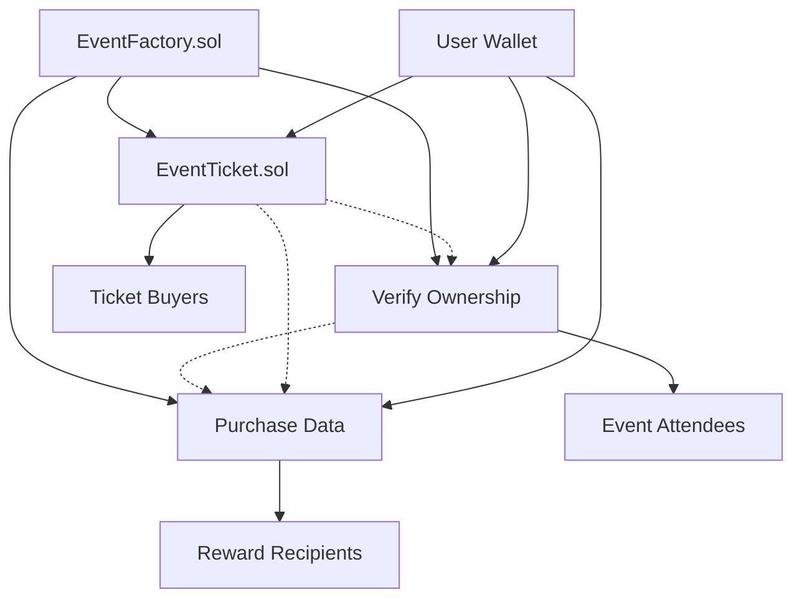

# 🏗️ Contract Structure for Blockchain Event Platform

## Overview

This document outlines the smart contract architecture for the Echain blockchain events platform. The system is designed with modularity, security, and scalability in mind, using proven patterns and OpenZeppelin standards.

## 🧱 Contract Architecture

### Core Contracts (`/contracts/core/`)

#### 1. EventFactory.sol
**Role**: The central hub contract that creates and manages all events on the platform.

**Responsibilities**:
- Deploy new EventTicket contract instances for each event
- Maintain a registry of all events (eventId → contract address mapping)
- Store event metadata and organizer information
- Enforce platform-wide rules and access controls
- Handle event discovery and listing functionality

**Key Features**:
- Factory + Registry pattern for efficient event management
- Event validation and approval system
- Organizer verification and reputation tracking
- Gas-optimized deployment using minimal proxy patterns

```solidity
// Example interface
interface IEventFactory {
    function createEvent(
        string memory name,
        uint256 ticketPrice,
        uint256 maxTickets,
        uint256 eventDate
    ) external returns (address eventContract);
    
    function getEvent(uint256 eventId) external view returns (EventInfo memory);
    function getOrganizerEvents(address organizer) external view returns (uint256[] memory);
}
```

#### 2. EventTicket.sol
**Role**: NFT-based ticketing system for individual events.

**Responsibilities**:
- Mint tickets as ERC-721 or ERC-1155 NFTs
- Handle ticket sales, transfers, and refunds
- Implement royalty system (EIP-2981) for secondary sales
- Manage ticket metadata and seat assignments
- Enforce transfer restrictions and organizer controls

**Key Features**:
- OpenZeppelin ERC721/ERC1155 extensions for security
- Minimal proxy (clone) pattern for cost-efficient deployments
- Built-in royalty system for organizer revenue sharing
- QR code integration for ticket verification
- Batch minting capabilities for large events

```solidity
// Example interface
interface IEventTicket {
    function mintTicket(address to, uint256 seatNumber) external returns (uint256 tokenId);
    function batchMintTickets(address[] memory recipients) external returns (uint256[] memory);
    function setRoyaltyInfo(address receiver, uint96 feeNumerator) external;
    function verifyTicket(uint256 tokenId) external view returns (bool isValid);
}
```

### Module Contracts (`/contracts/modules/`)

#### 3. POAPAttendance.sol
**Role**: Issues proof-of-attendance NFTs (soulbound tokens).

**Responsibilities**:
- Mint non-transferable attendance certificates
- Verify ticket ownership before minting POAPs
- Handle check-in process via QR codes or signatures
- Maintain attendance records for reputation building
- Support batch minting for event organizers

**Key Features**:
- Soulbound token implementation (non-transferable)
- Integration with EventTicket contracts for verification
- Flexible check-in mechanisms (QR, signature, manual)
- Metadata standards for attendance certificates
- Batch operations for large events

```solidity
// Example interface
interface IPOAPAttendance {
    function mintPOAP(
        address attendee,
        uint256 eventId,
        bytes memory proof
    ) external returns (uint256 tokenId);
    
    function batchMintPOAPs(
        address[] memory attendees,
        uint256 eventId
    ) external returns (uint256[] memory);
    
    function hasAttended(address user, uint256 eventId) external view returns (bool);
}
```

#### 4. IncentiveManager.sol
**Role**: Gamification and rewards system.

**Responsibilities**:
- Track early bird purchases and mint exclusive badges
- Calculate loyalty points based on attendance history
- Handle referral rewards and bonus distributions
- Manage achievement unlocks and badge progression
- Distribute platform tokens and special perks

**Key Features**:
- Modular reward system with pluggable modules
- Integration with both Ticketing and POAP contracts
- Configurable reward tiers and achievements
- Anti-gaming mechanisms and fraud prevention
- Gas-efficient batch reward processing

```solidity
// Example interface
interface IIncentiveManager {
    function processEarlyBirdReward(address buyer, uint256 eventId, uint256 position) external;
    function calculateLoyaltyPoints(address user) external view returns (uint256);
    function claimReferralReward(address referrer, address referee) external;
    function unlockAchievement(address user, bytes32 achievementId) external;
}
```

## 🔄 Contract Interactions



## 📁 Suggested Folder Structure

```
/contracts
   /core
      EventFactory.sol          # Central hub and registry
      EventTicket.sol          # NFT ticketing system
   /modules
      POAPAttendance.sol       # Proof of attendance NFTs
      IncentiveManager.sol     # Gamification and rewards
   /interfaces
      IEventFactory.sol        # Factory interface
      IEventTicket.sol         # Ticketing interface
      IPOAP.sol               # POAP interface
      IIncentiveManager.sol    # Incentive interface
   /libraries
      TicketUtils.sol         # Ticket validation utilities
      RewardUtils.sol         # Reward calculation utilities
      EventUtils.sol          # General event utilities
   /mocks
      MockEventFactory.sol    # Testing mocks
      MockERC20.sol          # Token mocks for testing
```

## ⚡ Upgradeability Strategy

### Upgradeable Contracts
- **EventFactory**: UUPS proxy for adding new event types and features
- **IncentiveManager**: Transparent proxy for evolving reward logic
- **POAPAttendance**: Minimal proxy for adding new POAP types

### Immutable Contracts
- **EventTicket**: Ensures ticket authenticity and trust
- **Individual POAPs**: Maintains attendance record integrity

### Upgrade Governance
- Multi-signature wallet for upgrade approvals
- Timelock mechanism for critical changes
- Community voting for major protocol updates

## 🛡️ Security Considerations

### Access Controls
- Role-based permissions using OpenZeppelin AccessControl
- Organizer verification system
- Platform admin controls with multi-sig requirements

### Economic Security
- Reentrancy guards on all state-changing functions
- Proper handling of ETH and token transfers
- Circuit breakers for emergency situations

### Data Integrity
- Event immutability after ticket sales begin
- Attendance record permanence
- Audit trails for all major operations

## 🚀 Deployment Strategy

### Testnet Deployment
1. Deploy factory and core contracts
2. Create sample events for testing
3. Integrate with frontend and MultiBaas
4. Conduct security audits

### Mainnet Deployment
1. Final security audit and optimization
2. Deploy to Base mainnet via MultiBaas
3. Initialize with governance parameters
4. Launch with limited beta events

## 📊 Gas Optimization

### Efficient Patterns
- Minimal proxy clones for EventTicket deployments
- Batch operations for multi-user interactions
- Storage layout optimization
- Event emission for off-chain indexing

### Cost Estimates
- EventFactory deployment: ~2M gas
- EventTicket clone deployment: ~100K gas
- Ticket minting: ~80K gas
- POAP minting: ~70K gas
- Batch operations: ~50K gas per additional item

## 🔗 Integration Points

### MultiBaas Integration
- REST API endpoints for all contract interactions
- Webhook support for real-time event notifications
- Built-in analytics and monitoring
- Simplified key management

### Frontend Integration
- React hooks for contract interactions
- Real-time event updates via WebSocket
- Mobile-responsive ticket verification
- Wallet integration via RainbowKit

### External Services
- IPFS for metadata storage
- The Graph for event indexing
- Oracle integration for dynamic pricing
- Payment gateway integration for fiat purchases
