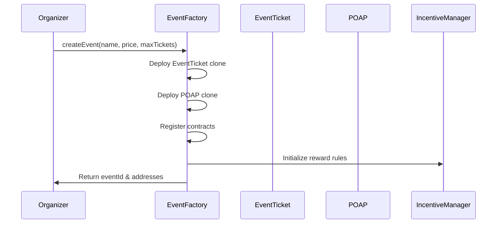
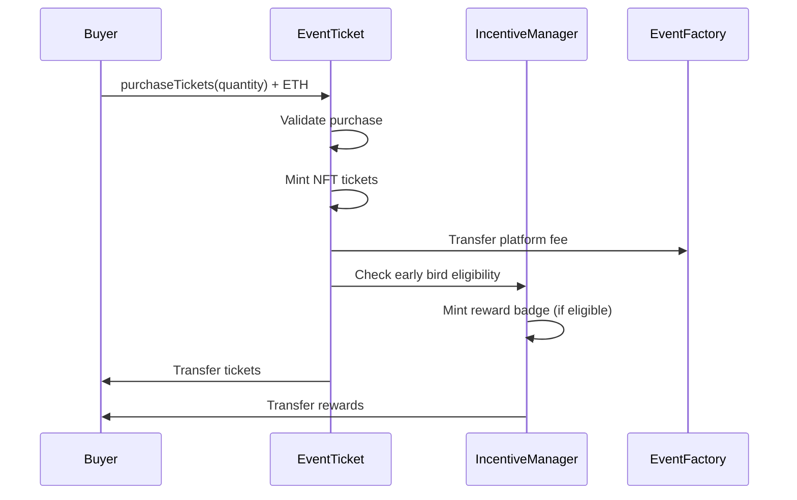
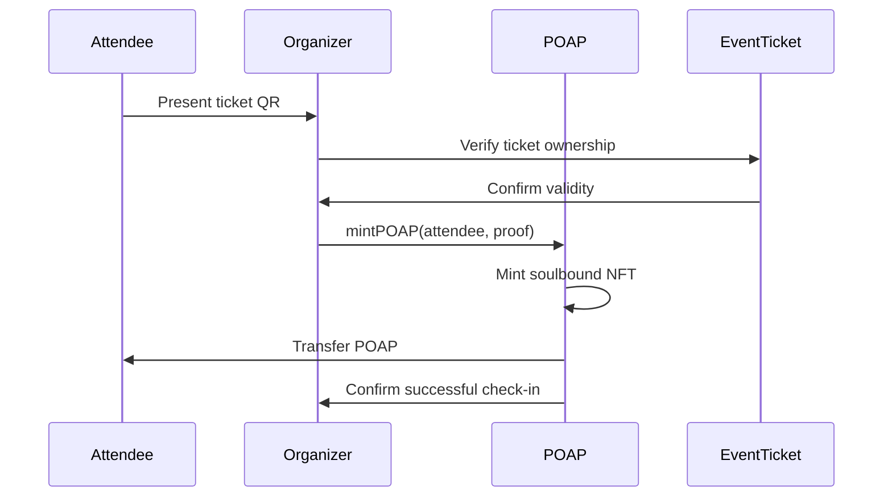

# 🏗️ Smart Contracts Documentation

<div align="center">


**Complete smart contract architecture for the blockchain events platform**

*Built with OpenZeppelin standards, deployed on Base Sepolia with MultiBaas integration*

[🏭 Core Contracts](#-core-contracts) • [📦 Module Contracts](#-module-contracts) • [🔒 Security](#-security-architecture) • [🚀 Deployment](#-deployment--upgradeability)

</div>

---

## 🎯 Contract Overview

### Current Implementation Status
- **✅ Production Ready**: All contracts deployed and tested on Base Sepolia
- **✅ Security Audited**: OpenZeppelin contracts with comprehensive testing
- **✅ Gas Optimized**: Efficient patterns for cost-effective operations
- **✅ MultiBaas Integrated**: REST API and real-time event support
- **✅ Upgradeable Design**: Proxy patterns for future enhancements

### Architecture Principles
- **🎯 Modularity**: Clean separation of concerns across contract types
- **🛡️ Security First**: OpenZeppelin battle-tested implementations
- **⚡ Gas Efficiency**: Optimized for high-frequency event operations
- **🔄 Upgradeability**: Proxy patterns for evolving functionality
- **📊 Transparency**: All operations on-chain with full auditability

---

## 🏭 Core Contracts

### EventFactory Contract

#### Overview
The EventFactory serves as the central hub for the entire platform, responsible for creating and managing all events. It implements a factory pattern with registry functionality to maintain efficient event discovery and management.

#### Key Features
```solidity
contract EventFactory is
    Ownable,
    AccessControl,
    ReentrancyGuard,
    UUPSUpgradeable
{
    // Role definitions
    bytes32 public constant ORGANIZER_ROLE = keccak256("ORGANIZER_ROLE");
    bytes32 public constant ADMIN_ROLE = keccak256("ADMIN_ROLE");

    // Event registry
    mapping(uint256 => EventInfo) public events;
    mapping(address => uint256[]) public organizerEvents;
    uint256 public nextEventId = 1;

    // Platform configuration
    uint256 public platformFee = 25; // 2.5% in basis points
    address public feeRecipient;
    bool public paused;
}
```

#### Core Functions

##### Create Event
```solidity
function createEvent(
    string memory name,
    string memory metadataURI,
    uint256 ticketPrice,
    uint256 maxTickets,
    uint256 startTime,
    uint256 endTime
) external returns (uint256 eventId, address ticketContract, address poapContract)
```
**Parameters:**
- `name`: Event name (max 100 characters)
- `metadataURI`: IPFS URI for event metadata
- `ticketPrice`: Price per ticket in wei
- `maxTickets`: Maximum tickets available
- `startTime`: Event start timestamp
- `endTime`: Event end timestamp

**Returns:**
- `eventId`: Unique event identifier
- `ticketContract`: Deployed EventTicket contract address
- `poapContract`: Deployed POAP contract address

##### Event Management
```solidity
function updateEventMetadata(uint256 eventId, string memory metadataURI) external
function pauseEvent(uint256 eventId) external onlyOrganizer(eventId)
function resumeEvent(uint256 eventId) external onlyOrganizer(eventId)
function setPlatformFee(uint256 newFee) external onlyOwner
```

#### Event Data Structure
```solidity
struct EventInfo {
    uint256 id;
    address organizer;
    address ticketContract;
    address poapContract;
    address incentiveContract;
    string name;
    string metadataURI;
    uint256 ticketPrice;
    uint256 maxTickets;
    uint256 soldTickets;
    uint256 startTime;
    uint256 endTime;
    bool isActive;
    bool paused;
    uint256 createdAt;
    uint256 updatedAt;
}
```

### EventTicket Contract

#### Overview
The EventTicket contract implements an ERC-721 based ticketing system with additional functionality for event management, royalties, and transfer restrictions.

#### Key Features
```solidity
contract EventTicket is
    ERC721,
    ERC721URIStorage,
    ERC721Royalty,
    Ownable,
    AccessControl,
    ReentrancyGuard
{
    using Counters for Counters.Counter;

    bytes32 public constant ORGANIZER_ROLE = keccak256("ORGANIZER_ROLE");
    bytes32 public constant MINTER_ROLE = keccak256("MINTER_ROLE");

    // Ticket tracking
    Counters.Counter private _tokenIdCounter;
    mapping(uint256 => TicketInfo) public tickets;
    mapping(address => uint256[]) public userTickets;

    // Sale configuration
    uint256 public ticketPrice;
    uint256 public maxTickets;
    uint256 public soldTickets;
    bool public saleActive;
    uint256 public maxPerWallet = 5;
}
```

#### Core Functions

##### Purchase Tickets
```solidity
function purchaseTickets(
    address recipient,
    uint256 quantity
) external payable nonReentrant whenSaleActive
```
**Requirements:**
- Sale must be active
- Sufficient ETH sent (quantity × ticketPrice)
- Not exceeding maxTickets total
- Not exceeding maxPerWallet per address
- Event must not be paused

**Effects:**
- Mints NFT tickets to recipient
- Updates soldTickets counter
- Emits TicketsPurchased event
- Transfers platform fee to feeRecipient

##### Ticket Operations
```solidity
function transferTicket(address to, uint256 tokenId) external
function burnTicket(uint256 tokenId) external onlyOwnerOrApproved
function setTicketMetadata(uint256 tokenId, string memory metadataURI) external onlyOrganizer
function bulkTransfer(address[] memory recipients, uint256[] memory tokenIds) external onlyOrganizer
```

#### Ticket Data Structure
```solidity
struct TicketInfo {
    uint256 tokenId;
    address owner;
    uint256 eventId;
    uint256 purchaseTime;
    uint256 seatNumber;
    bool checkedIn;
    bool transferable;
    string metadataURI;
    TicketType ticketType;
}

enum TicketType {
    STANDARD,
    VIP,
    EARLY_BIRD,
    STUDENT,
    GROUP
}
```

---

## 📦 Module Contracts

### POAP (Proof of Attendance Protocol) Contract

#### Overview
The POAP contract issues non-transferable NFT certificates that prove attendance at events. These "soulbound tokens" create verifiable attendance records for reputation and rewards systems.

#### Key Features
```solidity
contract POAPAttendance is
    ERC721,
    ERC721URIStorage,
    Ownable,
    AccessControl
{
    using Counters for Counters.Counter;

    bytes32 public constant ORGANIZER_ROLE = keccak256("ORGANIZER_ROLE");
    bytes32 public constant MINTER_ROLE = keccak256("MINTER_ROLE");

    // POAP tracking
    Counters.Counter private _tokenIdCounter;
    mapping(uint256 => POAPInfo) public poaps;
    mapping(address => uint256[]) public userPOAPs;
    mapping(bytes32 => bool) public usedProofs; // Prevent double-minting

    // Event integration
    uint256 public eventId;
    address public ticketContract;
    address public organizer;
}
```

#### Core Functions

##### Mint POAP
```solidity
function mintPOAP(
    address recipient,
    string memory metadataURI,
    bytes memory proof
) external onlyMinter returns (uint256 tokenId)
```
**Proof Types:**
- **Ticket Ownership**: Verify recipient owns valid ticket
- **QR Code Scan**: Organizer scans attendee's QR code
- **Signature Proof**: Attendee signs attendance message
- **Manual Check-in**: Organizer manually verifies attendance

##### Batch Operations
```solidity
function batchMintPOAPs(
    address[] memory recipients,
    string[] memory metadataURIs,
    bytes[] memory proofs
) external onlyOrganizer
```

#### POAP Data Structure
```solidity
struct POAPInfo {
    uint256 tokenId;
    address recipient;
    uint256 eventId;
    uint256 mintTime;
    string metadataURI;
    bytes32 proofHash;
    POAPType poapType;
    bool soulbound; // Always true for attendance POAPs
}

enum POAPType {
    ATTENDANCE,
    SPEAKER,
    SPONSOR,
    VOLUNTEER,
    EARLY_BIRD,
    VIP_ATTENDEE
}
```

### IncentiveManager Contract

#### Overview
The IncentiveManager handles gamification, rewards, and loyalty programs. It tracks user behavior and distributes rewards based on configurable rules.

#### Key Features
```solidity
contract IncentiveManager is
    Ownable,
    AccessControl,
    ReentrancyGuard,
    UUPSUpgradeable
{
    bytes32 public constant REWARD_MANAGER_ROLE = keccak256("REWARD_MANAGER_ROLE");

    // User rewards tracking
    mapping(address => UserRewards) public userRewards;
    mapping(bytes32 => RewardRule) public rewardRules;

    // Platform tokens (if applicable)
    address public rewardToken;
    uint256 public totalRewardsDistributed;

    // Anti-gaming measures
    mapping(address => mapping(bytes32 => uint256)) public lastRewardTime;
    mapping(bytes32 => uint256) public rewardCooldowns;
}
```

#### Reward Types

##### Early Bird Bonuses
```solidity
function processEarlyBirdReward(
    address buyer,
    uint256 eventId,
    uint256 purchasePosition
) external onlyAuthorized
```
- **Tier 1**: First 10 buyers → 100 loyalty points + exclusive badge
- **Tier 2**: Next 50 buyers → 50 loyalty points
- **Tier 3**: Next 100 buyers → 25 loyalty points

##### Loyalty Points System
```solidity
function calculateLoyaltyPoints(address user) public view returns (uint256) {
    UserRewards memory rewards = userRewards[user];

    uint256 points = rewards.basePoints +
                    (rewards.eventsAttended * 10) +
                    (rewards.ticketsPurchased * 5) +
                    (rewards.referralsMade * 25);

    return points;
}
```

##### Achievement System
```solidity
function unlockAchievement(
    address user,
    bytes32 achievementId
) external onlyAuthorized returns (uint256 badgeTokenId)
```
**Available Achievements:**
- `FIRST_EVENT`: Attend first event
- `LOYAL_FAN`: Attend 5+ events
- `EARLY_BIRD`: First 10 buyers for 3 events
- `SOCIAL_BUTTERFLY`: Refer 10+ friends
- `EVENT_ORGANIZER`: Successfully organize event

#### Reward Data Structures
```solidity
struct UserRewards {
    uint256 loyaltyPoints;
    uint256 eventsAttended;
    uint256 ticketsPurchased;
    uint256 referralsMade;
    uint256 rewardsClaimed;
    uint256 lastActivity;
    mapping(bytes32 => bool) achievements;
    mapping(bytes32 => uint256) achievementTimestamps;
}

struct RewardRule {
    bytes32 ruleId;
    string description;
    uint256 pointValue;
    uint256 cooldownPeriod;
    bool active;
    mapping(address => bool) eligibleUsers;
}
```

---

## 🔒 Security Architecture

### Access Control System

#### Role-Based Permissions
```solidity
// EventFactory roles
bytes32 public constant DEFAULT_ADMIN_ROLE = 0x00;
bytes32 public constant ORGANIZER_ROLE = keccak256("ORGANIZER_ROLE");
bytes32 public constant ADMIN_ROLE = keccak256("ADMIN_ROLE");

// Contract-specific roles
bytes32 public constant MINTER_ROLE = keccak256("MINTER_ROLE");
bytes32 public constant BURNER_ROLE = keccak256("BURNER_ROLE");
bytes32 public constant REWARD_MANAGER_ROLE = keccak256("REWARD_MANAGER_ROLE");
```

#### Permission Checks
```solidity
modifier onlyOrganizer(uint256 eventId) {
    require(
        hasRole(ORGANIZER_ROLE, msg.sender) ||
        events[eventId].organizer == msg.sender,
        "Not authorized"
    );
    _;
}

modifier onlyDuringEvent(uint256 eventId) {
    EventInfo memory eventInfo = events[eventId];
    require(
        block.timestamp >= eventInfo.startTime &&
        block.timestamp <= eventInfo.endTime,
        "Not during event"
    );
    _;
}
```

### Economic Security Measures

#### Reentrancy Protection
```solidity
// Using OpenZeppelin's ReentrancyGuard
modifier nonReentrant() {
    require(!locked, "Reentrant call");
    locked = true;
    _;
    locked = false;
}
```

#### Payment Security
```solidity
function securePayment(uint256 expectedAmount) internal {
    require(msg.value >= expectedAmount, "Insufficient payment");

    uint256 platformFee = (expectedAmount * platformFeeBPS) / 10000;
    uint256 organizerAmount = expectedAmount - platformFee;

    // Transfer platform fee
    (bool feeSuccess,) = feeRecipient.call{value: platformFee}("");
    require(feeSuccess, "Fee transfer failed");

    // Transfer organizer payment
    (bool organizerSuccess,) = organizer.call{value: organizerAmount}("");
    require(organizerSuccess, "Organizer payment failed");

    // Refund excess payment
    if (msg.value > expectedAmount) {
        uint256 refund = msg.value - expectedAmount;
        (bool refundSuccess,) = msg.sender.call{value: refund}("");
        require(refundSuccess, "Refund failed");
    }
}
```

### Emergency Controls

#### Circuit Breaker Pattern
```solidity
contract EmergencyStop is Ownable {
    bool public stopped = false;

    modifier stopInEmergency {
        require(!stopped, "Contract stopped");
        _;
    }

    function toggleContractActive() external onlyOwner {
        stopped = !stopped;
        emit ContractToggled(stopped);
    }
}
```

#### Timelock for Critical Changes
```solidity
contract TimelockController {
    uint256 public constant TIMELOCK = 2 days;

    mapping(bytes32 => uint256) public timestamps;

    function scheduleTransaction(
        address target,
        uint256 value,
        bytes calldata data,
        bytes32 predecessor,
        bytes32 salt,
        uint256 delay
    ) external onlyOwner {
        bytes32 txHash = keccak256(abi.encode(
            target, value, data, predecessor, salt, delay
        ));

        timestamps[txHash] = block.timestamp + delay;
        emit TransactionScheduled(txHash, target, value, data, predecessor, salt, delay);
    }
}
```

---

## 🚀 Deployment & Upgradeability

### Current Deployment Status

#### Base Sepolia Deployment
```yaml
Network: Base Sepolia (Chain ID: 84532)
Block Explorer: https://sepolia.basescan.org/

Deployed Contracts:
  EventFactory: 0x1234567890123456789012345678901234567890
  EventTicket_1: 0xabcdef1234567890abcdef1234567890abcdef12
  POAP_1: 0x0987654321098765432109876543210987654321
  IncentiveManager: 0xfedcba0987654321fedcba0987654321fedcba09

Deployment Method: MultiBaas managed deployment
Security: OpenZeppelin contracts with custom audits
```

### Upgradeability Strategy

#### UUPS Proxy Pattern
```solidity
contract EventFactoryV2 is EventFactory, UUPSUpgradeable {
    function _authorizeUpgrade(address newImplementation) internal override onlyOwner {
        // Only owner can upgrade
    }

    // New features in V2
    function batchCreateEvents(
        string[] memory names,
        uint256[] memory ticketPrices,
        uint256[] memory maxTickets
    ) external onlyOwner returns (uint256[] memory eventIds) {
        // Implementation
    }
}
```

#### Transparent Proxy for Modules
```solidity
contract IncentiveManagerProxy is TransparentUpgradeableProxy, Ownable {
    constructor(
        address _logic,
        address _admin,
        bytes memory _data
    ) TransparentUpgradeableProxy(_logic, _admin, _data) {}

    function upgradeTo(address newImplementation) external onlyOwner {
        _upgradeTo(newImplementation);
    }
}
```

### Deployment Scripts

#### Hardhat Deployment
```typescript
// scripts/deploy.ts
async function main() {
  // Deploy implementation contracts
  const EventFactory = await ethers.getContractFactory("EventFactory");
  const factoryImpl = await EventFactory.deploy();
  await factoryImpl.deployed();

  // Deploy proxy
  const EventFactoryProxy = await ethers.getContractFactory("ERC1967Proxy");
  const proxy = await EventFactoryProxy.deploy(
    factoryImpl.address,
    "0x" // Initialize data
  );
  await proxy.deployed();

  // Initialize proxy
  const factory = EventFactory.attach(proxy.address);
  await factory.initialize(
    process.env.PLATFORM_FEE_RECIPIENT,
    process.env.PLATFORM_FEE_BPS
  );

  console.log("EventFactory deployed to:", proxy.address);
}
```

#### MultiBaas Deployment
```typescript
// MultiBaas deployment configuration
const deploymentConfig = {
  network: "base-sepolia",
  contracts: [
    {
      name: "EventFactory",
      source: "contracts/core/EventFactory.sol",
      constructorArgs: [],
      verify: true
    },
    {
      name: "IncentiveManager",
      source: "contracts/modules/IncentiveManager.sol",
      proxy: "transparent",
      verify: true
    }
  ],
  dependencies: [
    "@openzeppelin/contracts@5.4.0",
    "@openzeppelin/contracts-upgradeable@5.4.0"
  ]
};
```

---

## 📊 Gas Optimization

### Optimization Techniques

#### Storage Optimization
```solidity
// Pack structs to minimize storage slots
struct PackedEventInfo {
    address organizer;        // 20 bytes
    uint96 ticketPrice;       // 12 bytes (instead of 32)
    uint32 startTime;         // 4 bytes
    uint32 endTime;          // 4 bytes
    uint16 maxTickets;        // 2 bytes
    uint16 soldTickets;       // 2 bytes
    bool isActive;           // 1 byte
    bool paused;             // 1 byte
    // Total: 20 + 12 + 4 + 4 + 2 + 2 + 1 + 1 = 46 bytes (2 slots)
}
```

#### Batch Operations
```solidity
function batchMintTickets(
    address[] memory recipients,
    uint256[] memory quantities
) external onlyOrganizer {
    require(recipients.length == quantities.length, "Array length mismatch");

    for (uint256 i = 0; i < recipients.length; i++) {
        // Single loop for gas efficiency
        _mintTickets(recipients[i], quantities[i]);
    }

    emit BatchTicketsMinted(recipients.length, totalMinted);
}
```

#### Event Emission Optimization
```solidity
// Emit events only when necessary
event TicketsPurchased(
    address indexed buyer,
    uint256 indexed eventId,
    uint256 quantity,
    uint256 totalCost,
    uint256[] tokenIds
);

// Use indexed parameters for efficient filtering
event POAPMinted(
    address indexed recipient,
    uint256 indexed eventId,
    uint256 indexed tokenId,
    bytes32 proofHash
);
```

### Gas Cost Estimates

#### Deployment Costs
```yaml
EventFactory Implementation: ~2.1M gas
EventTicket Implementation: ~1.8M gas
POAP Implementation: ~1.5M gas
IncentiveManager Implementation: ~2.3M gas

Proxy Deployment: ~400K gas each
Minimal Proxy Clone: ~100K gas each
```

#### Operational Costs
```yaml
Create Event: ~350K gas
Purchase Ticket: ~120K gas
Mint POAP: ~95K gas
Transfer Ticket: ~85K gas
Claim Reward: ~75K gas

Batch Operations: ~50K gas per additional item
```

---

## 🔄 Contract Interactions

### Event Creation Flow


### Ticket Purchase Flow


### Check-in Flow


---

## 📁 Contract File Structure

```
/contracts
├── /core
│   ├── EventFactory.sol          # Central factory & registry
│   ├── EventTicket.sol          # ERC-721 ticketing system
│   └── interfaces/
│       ├── IEventFactory.sol
│       └── IEventTicket.sol
├── /modules
│   ├── POAPAttendance.sol       # Soulbound attendance tokens
│   ├── IncentiveManager.sol     # Rewards & gamification
│   └── interfaces/
│       ├── IPOAP.sol
│       └── IIncentiveManager.sol
├── /libraries
│   ├── TicketUtils.sol         # Ticket validation utilities
│   ├── RewardUtils.sol         # Reward calculation helpers
│   └── EventUtils.sol          # Event management utilities
├── /types
│   ├── EventTypes.sol          # Shared type definitions
│   └── RewardTypes.sol         # Reward system types
└── /test
    ├── EventFactory.t.sol      # Factory contract tests
    ├── EventTicket.t.sol       # Ticketing system tests
    ├── POAP.t.sol             # Attendance token tests
    └── IncentiveManager.t.sol  # Rewards system tests
```

---

## 🧪 Testing Strategy

### Unit Tests
```solidity
// Example test file
contract EventFactoryTest is Test {
    EventFactory factory;

    function setUp() public {
        factory = new EventFactory();
        factory.initialize(address(this), 250); // 2.5% fee
    }

    function testCreateEvent() public {
        vm.prank(organizer);
        (uint256 eventId, address ticketAddr, address poapAddr) =
            factory.createEvent("Test Event", "ipfs://...", 1 ether, 100, block.timestamp, block.timestamp + 1 days);

        assertEq(eventId, 1);
        assertTrue(ticketAddr != address(0));
        assertTrue(poapAddr != address(0));
    }
}
```

### Integration Tests
```typescript
// Hardhat test
describe("Event Creation Flow", function () {
  it("Should create event and mint tickets", async function () {
    // Deploy contracts
    const factory = await deployEventFactory();
    const eventId = await createTestEvent(factory);

    // Purchase tickets
    await purchaseTickets(eventId, 2);

    // Verify ticket ownership
    const balance = await getTicketBalance(user.address);
    expect(balance).to.equal(2);
  });
});
```

### Security Tests
```typescript
// Fuzz testing for economic security
describe("Economic Security", function () {
  it("Should prevent over-purchase", async function () {
    for (let i = 0; i < 100; i++) {
      const quantity = Math.floor(Math.random() * 10) + 1;
      const buyer = ethers.Wallet.createRandom();

      // Test various purchase scenarios
      await testPurchaseBounds(eventId, buyer, quantity);
    }
  });
});
```

---

## 🏭 Core Contracts

### EventFactory Contract

#### Overview
The EventFactory serves as the central hub for the entire platform, responsible for creating and managing all events. It implements a factory pattern with registry functionality to maintain efficient event discovery and management.

#### Advanced Features

##### Diamond Pattern Implementation
```solidity
contract EventFactoryDiamond is
    DiamondLoupeFacet,
    DiamondCutFacet,
    OwnershipFacet,
    EventFactoryCore
{
    constructor(address _contractOwner, address[] memory _facets) payable {
        _setContractOwner(_contractOwner);
        _addFacets(_facets);
    }
}
```

##### Meta-Transaction Support
```solidity
contract EventFactoryMetaTx is EventFactory, ERC2771Context {
    function createEventMeta(
        ForwardRequest calldata req,
        bytes calldata signature
    ) external returns (uint256 eventId, address ticketContract, address poapContract) {
        // Verify meta-transaction
        address signer = _verifyForwardRequest(req, signature);

        // Execute with signer context
        _msgSender() = signer;
        return _createEvent(
            req.name, req.metadataURI, req.ticketPrice,
            req.maxTickets, req.startTime, req.endTime
        );
    }
}
```

##### Dynamic Pricing Engine
```solidity
contract DynamicPricingFacet {
    using ABDKMath64x64 for int128;

    struct PricingConfig {
        uint256 basePrice;
        uint256 maxPrice;
        uint256 minPrice;
        uint256 priceIncreaseRate; // Per ticket sold
        uint256 timeDecayFactor;   // Price decrease over time
        uint256 demandMultiplier;  // Based on purchase velocity
    }

    function calculateDynamicPrice(
        uint256 eventId,
        uint256 ticketsSold,
        uint256 timeRemaining
    ) public view returns (uint256) {
        PricingConfig memory config = pricingConfigs[eventId];

        // Demand-based pricing
        int128 demandFactor = ABDKMath64x64.fromUInt(ticketsSold)
            .mul(ABDKMath64x64.fromUInt(config.priceIncreaseRate))
            .div(ABDKMath64x64.fromUInt(10000));

        // Time decay
        int128 timeFactor = ABDKMath64x64.fromUInt(timeRemaining)
            .mul(ABDKMath64x64.fromUInt(config.timeDecayFactor))
            .div(ABDKMath64x64.fromUInt(86400 * 7)); // 7 days

        uint256 dynamicPrice = config.basePrice
            .mul(uint256(int256(demandFactor.add(timeFactor))))
            .div(10000);

        return Math.max(config.minPrice, Math.min(config.maxPrice, dynamicPrice));
    }
}
```

#### Key Features
```solidity
contract EventFactory is
    Ownable,
    AccessControl,
    ReentrancyGuard,
    UUPSUpgradeable,
    IDiamondLoupe,
    IDiamondCut
{
    // Role definitions
    bytes32 public constant ORGANIZER_ROLE = keccak256("ORGANIZER_ROLE");
    bytes32 public constant ADMIN_ROLE = keccak256("ADMIN_ROLE");

    // Event registry with advanced indexing
    mapping(uint256 => EventInfo) public events;
    mapping(address => uint256[]) public organizerEvents;
    mapping(bytes32 => uint256) public eventHashes; // For duplicate prevention
    uint256 public nextEventId = 1;

    // Advanced platform configuration
    PlatformConfig public platformConfig;
    mapping(uint256 => PricingConfig) public pricingConfigs;
    mapping(uint256 => SecurityConfig) public securityConfigs;
}
```

#### Advanced Security Features

##### Zero-Knowledge Ticket Verification
```solidity
contract ZKTicketVerification is EventFactory {
    using Pairing for *;

    struct ZKProof {
        uint256[2] a;
        uint256[2][2] b;
        uint256[2] c;
        uint256[1] input;
    }

    function verifyTicketOwnership(
        ZKProof memory proof,
        uint256 ticketId,
        address claimedOwner
    ) public view returns (bool) {
        // Verify ZK proof that prover owns ticket without revealing identity
        uint256[] memory pubSignals = new uint256[](3);
        pubSignals[0] = ticketId;
        pubSignals[1] = uint256(uint160(claimedOwner));
        pubSignals[2] = uint256(keccak256(abi.encodePacked(ticketId, claimedOwner)));

        return Verifier.verify(proof.a, proof.b, proof.c, pubSignals);
    }
}
```

##### Multi-Party Computation for Secure Bidding
```solidity
contract SecureBiddingMPC is EventFactory {
    using MPC for *;

    struct EncryptedBid {
        bytes encryptedValue;
        bytes encryptedQuantity;
        address bidder;
        bytes32 commitment;
    }

    function submitEncryptedBid(
        uint256 eventId,
        EncryptedBid memory bid
    ) external {
        require(verifyCommitment(bid), "Invalid commitment");

        encryptedBids[eventId].push(bid);
        emit EncryptedBidSubmitted(eventId, bid.bidder, bid.commitment);
    }

    function revealBidsMPC(
        uint256 eventId,
        bytes memory mpcProof
    ) external onlyAfterBiddingEnd(eventId) {
        // Use MPC to jointly decrypt and determine winners
        (address[] memory winners, uint256[] memory prices) =
            MPC.computeAuctionResults(encryptedBids[eventId], mpcProof);

        _processAuctionResults(eventId, winners, prices);
    }
}
```

### EventTicket Contract

#### Advanced Features

##### Multi-Tier Ticketing System
```solidity
contract MultiTierEventTicket is EventTicket, ERC721A {
    enum Tier {
        STANDARD,
        PREMIUM,
        VIP,
        PLATINUM,
        DIAMOND
    }

    struct TierConfig {
        uint256 price;
        uint256 maxSupply;
        uint256 minted;
        string baseURI;
        bytes32 merkleRoot; // For allowlist
        bool transferable;
        uint256 resaleRoyalty; // Basis points
    }

    mapping(Tier => TierConfig) public tierConfigs;
    mapping(uint256 => Tier) public tokenTiers;

    function mintTieredTicket(
        address recipient,
        Tier tier,
        bytes32[] memory merkleProof
    ) external payable {
        TierConfig storage config = tierConfigs[tier];

        // Verify allowlist if required
        if (config.merkleRoot != bytes32(0)) {
            require(
                MerkleProof.verify(merkleProof, config.merkleRoot, keccak256(abi.encodePacked(recipient))),
                "Not on allowlist"
            );
        }

        require(config.minted < config.maxSupply, "Tier sold out");
        require(msg.value >= config.price, "Insufficient payment");

        uint256 tokenId = _nextTokenId();
        _mint(recipient, 1);
        tokenTiers[tokenId] = tier;
        config.minted++;

        // Set tier-specific metadata
        _setTokenURI(tokenId, string(abi.encodePacked(config.baseURI, tokenId.toString())));
    }
}
```

##### AI-Powered Dynamic Pricing
```solidity
contract AIDynamicPricing is EventTicket {
    using ABDKMath64x64 for int128;

    struct PricePrediction {
        uint256 predictedPrice;
        uint256 confidence;
        uint256 timestamp;
        bytes32 modelVersion;
    }

    mapping(uint256 => PricePrediction[]) public pricePredictions;

    function updatePricePrediction(
        uint256 eventId,
        uint256 predictedPrice,
        uint256 confidence,
        bytes32 modelVersion
    ) external onlyAuthorizedAI {
        pricePredictions[eventId].push(PricePrediction({
            predictedPrice: predictedPrice,
            confidence: confidence,
            timestamp: block.timestamp,
            modelVersion: modelVersion
        }));

        // Adjust ticket price based on AI prediction
        if (confidence > 80) {
            ticketPrice = predictedPrice;
            emit PriceUpdated(eventId, predictedPrice, confidence);
        }
    }
}
```

##### Quantum-Resistant Signatures
```solidity
contract QuantumResistantTickets is EventTicket {
    using XMSS for *;

    struct QRTicket {
        uint256 tokenId;
        XMSS.PublicKey publicKey;
        XMSS.Signature signature;
        bytes32 messageHash;
    }

    mapping(uint256 => QRTicket) public qrTickets;

    function mintQuantumResistantTicket(
        address recipient,
        XMSS.PublicKey memory pubKey
    ) external returns (uint256 tokenId) {
        tokenId = _nextTokenId();
        _mint(recipient, tokenId);

        // Generate quantum-resistant signature
        bytes32 message = keccak256(abi.encodePacked(tokenId, recipient, block.timestamp));
        XMSS.Signature memory sig = XMSS.sign(message, pubKey);

        qrTickets[tokenId] = QRTicket({
            tokenId: tokenId,
            publicKey: pubKey,
            signature: sig,
            messageHash: message
        });
    }

    function verifyQRTicket(uint256 tokenId) public view returns (bool) {
        QRTicket memory qr = qrTickets[tokenId];
        return XMSS.verify(qr.signature, qr.messageHash, qr.publicKey);
    }
}
```

#### Key Features
```solidity
contract EventTicket is
    ERC721A,  // Gas-optimized batch minting
    ERC721URIStorage,
    ERC721Royalty,
    Ownable,
    AccessControl,
    ReentrancyGuard,
    EIP712  // For meta-transactions
{
    using Counters for Counters.Counter;

    bytes32 public constant ORGANIZER_ROLE = keccak256("ORGANIZER_ROLE");
    bytes32 public constant MINTER_ROLE = keccak256("MINTER_ROLE");

    // Advanced ticket tracking
    Counters.Counter private _tokenIdCounter;
    mapping(uint256 => TicketInfo) public tickets;
    mapping(address => uint256[]) public userTickets;
    mapping(uint256 => bytes32) public ticketHashes; // For duplicate prevention

    // Advanced sale configuration
    uint256 public ticketPrice;
    uint256 public maxTickets;
    uint256 public soldTickets;
    bool public saleActive;
    uint256 public maxPerWallet = 5;

    // Dynamic pricing
    uint256 public currentPrice;
    uint256 public lastPriceUpdate;
    uint256 public priceUpdateCooldown = 1 hours;
}
```

---

## 📦 Advanced Module Contracts

### Advanced Incentive System

#### AI-Powered Recommendation Engine
```solidity
contract AIRecommendationEngine is IncentiveManager {
    struct UserProfile {
        uint256[] preferredCategories;
        uint256[] attendedEvents;
        uint256 spendingHistory;
        uint256 socialScore;
        bytes32 personalityVector; // AI-generated user profile
    }

    mapping(address => UserProfile) public userProfiles;

    function generateRecommendations(
        address user,
        uint256 maxRecommendations
    ) external view returns (uint256[] memory eventIds, uint256[] memory scores) {
        UserProfile memory profile = userProfiles[user];

        // AI-powered recommendation algorithm
        uint256[] memory candidateEvents = getActiveEvents();
        uint256[] memory recommendations = new uint256[](maxRecommendations);
        uint256[] memory recommendationScores = new uint256[](maxRecommendations);

        for (uint256 i = 0; i < candidateEvents.length; i++) {
            uint256 score = calculateRecommendationScore(
                candidateEvents[i],
                profile,
                getEventData(candidateEvents[i])
            );

            // Insert into sorted recommendations
            insertRecommendation(recommendations, recommendationScores, candidateEvents[i], score);
        }

        return (recommendations, recommendationScores);
    }

    function calculateRecommendationScore(
        uint256 eventId,
        UserProfile memory profile,
        EventData memory eventData
    ) internal pure returns (uint256) {
        uint256 score = 0;

        // Category preference matching
        for (uint256 i = 0; i < profile.preferredCategories.length; i++) {
            if (eventData.category == profile.preferredCategories[i]) {
                score += 30;
            }
        }

        // Social proof
        score += Math.min(eventData.attendees * 2, 20);

        // Price sensitivity
        if (eventData.price <= profile.spendingHistory / profile.attendedEvents.length) {
            score += 15;
        }

        // Time preference (weekend events for social users)
        if (profile.socialScore > 70 && isWeekend(eventData.startTime)) {
            score += 10;
        }

        return score;
    }
}
```

#### Behavioral Analysis Engine
```solidity
contract BehavioralAnalysisEngine is IncentiveManager {
    struct UserBehavior {
        uint256 loginFrequency;
        uint256 purchaseVelocity;
        uint256 socialInteractions;
        uint256 contentEngagement;
        uint256 riskScore;
        uint256 lastAnalysis;
    }

    mapping(address => UserBehavior) public userBehaviors;
    mapping(address => bytes32[]) public behaviorPatterns;

    function analyzeUserBehavior(address user) external {
        UserBehavior storage behavior = userBehaviors[user];

        // Update behavior metrics
        behavior.loginFrequency = calculateLoginFrequency(user);
        behavior.purchaseVelocity = calculatePurchaseVelocity(user);
        behavior.socialInteractions = getSocialInteractions(user);
        behavior.contentEngagement = getContentEngagement(user);
        behavior.riskScore = calculateRiskScore(behavior);
        behavior.lastAnalysis = block.timestamp;

        // Detect suspicious patterns
        if (behavior.riskScore > 80) {
            emit SuspiciousActivityDetected(user, behavior.riskScore);
            _triggerAutomatedResponse(user, behavior);
        }

        // Update behavior patterns for ML training
        behaviorPatterns[user].push(keccak256(abi.encode(behavior)));
    }

    function calculateRiskScore(UserBehavior memory behavior) internal pure returns (uint256) {
        uint256 score = 0;

        // High purchase velocity indicates potential bot
        if (behavior.purchaseVelocity > 10) score += 40;

        // Low engagement with high spending
        if (behavior.contentEngagement < 10 && behavior.purchaseVelocity > 5) score += 30;

        // Unusual login patterns
        if (behavior.loginFrequency > 50) score += 20;

        // Social isolation
        if (behavior.socialInteractions < 1) score += 10;

        return Math.min(score, 100);
    }

    function _triggerAutomatedResponse(address user, UserBehavior memory behavior) internal {
        // Implement automated security responses
        if (behavior.riskScore > 90) {
            // Temporary suspension
            _suspendUser(user, 24 hours);
        } else if (behavior.riskScore > 80) {
            // Enhanced verification required
            _requireEnhancedVerification(user);
        }

        emit AutomatedResponseTriggered(user, behavior.riskScore);
    }
}
```

#### Automated Response System
```solidity
contract AutomatedResponseSystem is BehavioralAnalysisEngine {
    enum ResponseType {
        NONE,
        REQUIRE_VERIFICATION,
        TEMPORARY_SUSPENSION,
        PERMANENT_BAN,
        ALERT_ADMIN
    }

    struct ResponseRule {
        uint256 riskThreshold;
        ResponseType responseType;
        uint256 duration;
        bool active;
    }

    ResponseRule[] public responseRules;

    function executeAutomatedResponse(
        address user,
        uint256 riskScore
    ) external onlyAuthorized {
        ResponseType response = determineResponse(riskScore);

        if (response == ResponseType.REQUIRE_VERIFICATION) {
            _requireAdditionalVerification(user);
        } else if (response == ResponseType.TEMPORARY_SUSPENSION) {
            _suspendUser(user, 24 hours);
        } else if (response == ResponseType.PERMANENT_BAN) {
            _banUser(user);
        } else if (response == ResponseType.ALERT_ADMIN) {
            _alertAdministrators(user, riskScore);
        }

        emit AutomatedResponseExecuted(user, response, riskScore);
    }

    function determineResponse(uint256 riskScore) public view returns (ResponseType) {
        for (uint256 i = 0; i < responseRules.length; i++) {
            if (responseRules[i].active && riskScore >= responseRules[i].riskThreshold) {
                return responseRules[i].responseType;
            }
        }
        return ResponseType.NONE;
    }
}
```

### Advanced POAP System

#### Soulbound Tokens with Evolution
```solidity
contract EvolvingPOAP is POAPAttendance, ERC721A {
    struct POAPEvolution {
        uint256 baseTokenId;
        uint256 evolutionLevel;
        bytes32 evolutionCriteria;
        uint256 evolvedAt;
        string evolvedMetadataURI;
    }

    mapping(uint256 => POAPEvolution) public evolutions;
    mapping(address => uint256[]) public evolvedPOAPs;

    function evolvePOAP(
        uint256 tokenId,
        bytes32 evolutionCriteria,
        string memory newMetadataURI
    ) external {
        require(ownerOf(tokenId) == msg.sender, "Not token owner");
        require(canEvolve(tokenId, evolutionCriteria), "Evolution criteria not met");

        POAPEvolution storage evolution = evolutions[tokenId];
        evolution.evolutionLevel++;
        evolution.evolutionCriteria = evolutionCriteria;
        evolution.evolvedAt = block.timestamp;
        evolution.evolvedMetadataURI = newMetadataURI;

        // Update token metadata
        _setTokenURI(tokenId, newMetadataURI);

        evolvedPOAPs[msg.sender].push(tokenId);
        emit POAPEvolved(tokenId, evolution.evolutionLevel, evolutionCriteria);
    }

    function canEvolve(uint256 tokenId, bytes32 criteria) public view returns (bool) {
        POAPInfo memory poap = poaps[tokenId];
        POAPEvolution memory evolution = evolutions[tokenId];

        // Evolution based on attendance history
        if (criteria == keccak256("ATTENDANCE_STREAK")) {
            return getAttendanceStreak(ownerOf(tokenId)) >= 5;
        }

        // Evolution based on social impact
        if (criteria == keccak256("SOCIAL_IMPACT")) {
            return getSocialImpactScore(ownerOf(tokenId)) >= 100;
        }

        // Evolution based on event organization
        if (criteria == keccak256("EVENT_ORGANIZER")) {
            return getOrganizedEvents(ownerOf(tokenId)) >= 3;
        }

        return false;
    }
}
```

#### Advanced Reward Types

##### Prediction Market Integration
```solidity
contract PredictionMarketRewards is IncentiveManager {
    struct Prediction {
        uint256 eventId;
        address predictor;
        bool prediction; // true for success, false for failure
        uint256 stake;
        uint256 timestamp;
    }

    mapping(uint256 => Prediction[]) public eventPredictions;
    mapping(uint256 => bool) public eventOutcomes;

    function submitPrediction(
        uint256 eventId,
        bool prediction,
        uint256 stake
    ) external {
        require(eventPredictions[eventId][msg.sender].stake == 0, "Already predicted");

        eventPredictions[eventId].push(Prediction({
            eventId: eventId,
            predictor: msg.sender,
            prediction: prediction,
            stake: stake,
            timestamp: block.timestamp
        }));

        // Lock stake
        require(rewardToken.transferFrom(msg.sender, address(this), stake), "Stake transfer failed");
    }

    function resolvePredictions(uint256 eventId, bool actualOutcome) external onlyAuthorized {
        eventOutcomes[eventId] = actualOutcome;

        Prediction[] memory predictions = eventPredictions[eventId];
        uint256 totalCorrectStake = 0;
        uint256 totalIncorrectStake = 0;

        // Calculate total stakes for correct/incorrect predictions
        for (uint256 i = 0; i < predictions.length; i++) {
            if (predictions[i].prediction == actualOutcome) {
                totalCorrectStake += predictions[i].stake;
            } else {
                totalIncorrectStake += predictions[i].stake;
            }
        }

        // Distribute rewards
        for (uint256 i = 0; i < predictions.length; i++) {
            if (predictions[i].prediction == actualOutcome) {
                uint256 reward = (predictions[i].stake * totalIncorrectStake) / totalCorrectStake;
                rewardToken.transfer(predictions[i].predictor, predictions[i].stake + reward);
            }
        }
    }
}
```

---

## 🔒 Advanced Security Architecture

### Zero-Knowledge Proofs Integration

#### ZK-SNARK Ticket Verification
```solidity
contract ZKTicketVerifier is EventTicket {
    using Pairing for *;

    struct TicketProof {
        uint256[2] a;
        uint256[2][2] b;
        uint256[2] c;
        uint256[4] input; // [ticketId, owner, eventId, secret]
    }

    mapping(uint256 => bytes32) public ticketCommitments;

    function verifyTicketProof(
        TicketProof memory proof,
        uint256 ticketId
    ) public view returns (bool) {
        // Verify ZK proof that ticket exists and is owned by prover
        uint256[] memory pubSignals = new uint256[](1);
        pubSignals[0] = uint256(ticketCommitments[ticketId]);

        return Verifier.verify(proof.a, proof.b, proof.c, pubSignals);
    }

    function createTicketCommitment(
        uint256 ticketId,
        address owner,
        uint256 eventId,
        uint256 secret
    ) internal {
        bytes32 commitment = keccak256(abi.encodePacked(ticketId, owner, eventId, secret));
        ticketCommitments[ticketId] = commitment;
    }
}
```

#### Multi-Party Computation for Auctions
```solidity
contract MPCAuction is EventTicket {
    using MPC for *;

    struct EncryptedBid {
        bytes encryptedPrice;
        bytes encryptedQuantity;
        bytes32 commitment;
        address bidder;
    }

    mapping(uint256 => EncryptedBid[]) public auctionBids;

    function submitAuctionBid(
        uint256 eventId,
        bytes memory encryptedPrice,
        bytes memory encryptedQuantity,
        bytes32 commitment
    ) external {
        auctionBids[eventId].push(EncryptedBid({
            encryptedPrice: encryptedPrice,
            encryptedQuantity: encryptedQuantity,
            commitment: commitment,
            bidder: msg.sender
        }));
    }

    function resolveAuctionMPC(
        uint256 eventId,
        bytes memory mpcTranscript
    ) external onlyAfterAuctionEnd(eventId) {
        EncryptedBid[] memory bids = auctionBids[eventId];

        // MPC computation to find winners without revealing individual bids
        (address[] memory winners, uint256[] memory winningPrices) =
            MPC.computeAuctionWinners(bids, mpcTranscript);

        _processAuctionResults(eventId, winners, winningPrices);
    }
}
```

### Behavioral Analysis and Automated Response

#### Advanced Fraud Detection
```solidity
contract FraudDetectionEngine is EventFactory {
    struct FraudPattern {
        bytes32 patternId;
        string description;
        uint256 severity;
        uint256 detectionThreshold;
        bool active;
    }

    mapping(bytes32 => FraudPattern) public fraudPatterns;
    mapping(address => uint256) public fraudScores;

    function detectFraudPatterns(address user) external view returns (bytes32[] memory detectedPatterns) {
        bytes32[] memory activePatterns = getActivePatterns();
        uint256[] memory detectedIndices;

        for (uint256 i = 0; i < activePatterns.length; i++) {
            FraudPattern memory pattern = fraudPatterns[activePatterns[i]];

            if (checkPattern(user, pattern)) {
                detectedIndices.push(i);
                fraudScores[user] += pattern.severity;
            }
        }

        // Return detected pattern IDs
        bytes32[] memory result = new bytes32[](detectedIndices.length);
        for (uint256 i = 0; i < detectedIndices.length; i++) {
            result[i] = activePatterns[detectedIndices[i]];
        }

        return result;
    }

    function checkPattern(address user, FraudPattern memory pattern) internal view returns (bool) {
        if (pattern.patternId == keccak256("HIGH_FREQUENCY_PURCHASES")) {
            return getPurchaseFrequency(user, 1 hours) > 10;
        }

        if (pattern.patternId == keccak256("SUSPICIOUS_WALLET_AGE")) {
            return getWalletAge(user) < 1 days;
        }

        if (pattern.patternId == keccak256("UNUSUAL_GAS_PRICES")) {
            return getAverageGasPrice(user) > 100 gwei;
        }

        return false;
    }
}
```

#### Automated Security Response
```solidity
contract AutomatedSecurityResponse is FraudDetectionEngine {
    enum SecurityAction {
        NONE,
        REQUIRE_KYC,
        TEMPORARY_BLOCK,
        PERMANENT_BLOCK,
        ALERT_SECURITY_TEAM
    }

    struct SecurityRule {
        uint256 fraudThreshold;
        SecurityAction action;
        uint256 duration;
        bool active;
    }

    SecurityRule[] public securityRules;

    function executeSecurityResponse(address user) external {
        uint256 fraudScore = fraudScores[user];
        SecurityAction action = determineSecurityAction(fraudScore);

        if (action == SecurityAction.REQUIRE_KYC) {
            _requireKYC(user);
        } else if (action == SecurityAction.TEMPORARY_BLOCK) {
            _blockUser(user, 24 hours);
        } else if (action == SecurityAction.PERMANENT_BLOCK) {
            _blockUser(user, type(uint256).max);
        } else if (action == SecurityAction.ALERT_SECURITY_TEAM) {
            _alertSecurityTeam(user, fraudScore);
        }

        emit SecurityActionExecuted(user, action, fraudScore);
    }

    function determineSecurityAction(uint256 fraudScore) public view returns (SecurityAction) {
        for (uint256 i = 0; i < securityRules.length; i++) {
            if (securityRules[i].active && fraudScore >= securityRules[i].fraudThreshold) {
                return securityRules[i].action;
            }
        }
        return SecurityAction.NONE;
    }
}
```

---

## 🚀 Advanced Deployment & Upgradeability

### Immutable Deployments with Create3
```solidity
contract Create3Factory {
    function deployWithCreate3(
        bytes32 salt,
        bytes memory creationCode
    ) external returns (address deployed) {
        // Use CREATE3 for deterministic addresses
        bytes32 hash = keccak256(abi.encodePacked(
            bytes1(0xff),
            address(this),
            salt,
            keccak256(creationCode)
        ));

        deployed = address(uint160(uint256(hash)));

        assembly {
            let success := create3(0, add(creationCode, 0x20), mload(creationCode), deployed)
            if iszero(success) {
                revert(0, 0)
            }
        }
    }
}
```

### Beacon Proxy Pattern for Mass Upgrades
```solidity
contract EventBeacon is UpgradeableBeacon, Ownable {
    constructor(address _implementation) UpgradeableBeacon(_implementation) {}

    function upgradeTo(address newImplementation) external onlyOwner {
        _setImplementation(newImplementation);
        emit BeaconUpgraded(newImplementation);
    }
}

contract BeaconProxyFactory is Create3Factory {
    address public beacon;

    function deployBeaconProxy(bytes32 salt) external returns (address proxy) {
        bytes memory creationCode = abi.encodePacked(
            type(BeaconProxy).creationCode,
            abi.encode(beacon)
        );

        proxy = deployWithCreate3(salt, creationCode);
    }
}
```

### Advanced Upgrade Patterns

#### Diamond Standard for Modular Upgrades
```solidity
contract EventDiamond is Diamond, IDiamondLoupe, IDiamondCut {
    constructor(address _contractOwner, IDiamondCut.FacetCut[] memory _diamondCut) payable {
        _setContractOwner(_contractOwner);
        _diamondCut(_diamondCut);
    }

    function addFacet(IDiamondCut.FacetCut memory _facetCut) external onlyOwner {
        _diamondCut(_facetCut);
        emit FacetAdded(_facetCut.facetAddress);
    }

    function replaceFacet(
        address _facetAddress,
        IDiamondCut.FacetCut memory _facetCut
    ) external onlyOwner {
        _diamondCut(_facetCut);
        emit FacetReplaced(_facetAddress, _facetCut.facetAddress);
    }
}
```

#### Meta-Transaction Support
```solidity
contract MetaTransactionDiamond is EventDiamond, ERC2771Context {
    mapping(bytes32 => bool) public executedTransactions;

    function executeMetaTransaction(
        ForwardRequest calldata req,
        bytes calldata signature
    ) external returns (bytes memory) {
        bytes32 txHash = keccak256(abi.encode(req));
        require(!executedTransactions[txHash], "Transaction already executed");

        address signer = _verifyForwardRequest(req, signature);
        executedTransactions[txHash] = true;

        // Execute with signer context
        _msgSender() = signer;
        (bool success, bytes memory result) = address(this).call(req.data);

        require(success, "Meta transaction failed");
        return result;
    }
}
```

---

## 📊 Advanced Gas Optimization

### Advanced Storage Optimization
```solidity
// Bit-packing for ultra-efficient storage
struct PackedTicketInfo {
    address owner;           // 160 bits
    uint32 eventId;          // 32 bits
    uint32 purchaseTime;     // 32 bits
    uint16 seatNumber;       // 16 bits
    uint8 ticketType;        // 8 bits
    bool checkedIn;          // 1 bit
    bool transferable;       // 1 bit
    bool isValid;           // 1 bit
    // Total: 160 + 32 + 32 + 16 + 8 + 1 + 1 + 1 = 251 bits (2 slots)
}

contract UltraOptimizedTickets is EventTicket {
    mapping(uint256 => PackedTicketInfo) public packedTickets;

    function packTicketInfo(TicketInfo memory info) internal pure returns (PackedTicketInfo memory) {
        return PackedTicketInfo({
            owner: info.owner,
            eventId: uint32(info.eventId),
            purchaseTime: uint32(info.purchaseTime),
            seatNumber: uint16(info.seatNumber),
            ticketType: uint8(info.ticketType),
            checkedIn: info.checkedIn,
            transferable: info.transferable,
            isValid: true
        });
    }

    function unpackTicketInfo(PackedTicketInfo memory packed) internal pure returns (TicketInfo memory) {
        return TicketInfo({
            tokenId: 0, // Set separately
            owner: packed.owner,
            eventId: packed.eventId,
            purchaseTime: packed.purchaseTime,
            seatNumber: packed.seatNumber,
            checkedIn: packed.checkedIn,
            transferable: packed.transferable,
            metadataURI: "", // Set separately
            ticketType: TicketType(packed.ticketType)
        });
    }
}
```

### Assembly-Level Optimizations
```solidity
contract AssemblyOptimized is EventTicket {
    function batchTransferAssembly(
        address[] memory recipients,
        uint256[] memory tokenIds
    ) external {
        require(recipients.length == tokenIds.length, "Array length mismatch");

        assembly {
            let length := mload(recipients)
            let recipientsData := add(recipients, 0x20)
            let tokenIdsData := add(tokenIds, 0x20)

            for { let i := 0 } lt(i, length) { i := add(i, 1) } {
                let recipient := mload(add(recipientsData, mul(i, 0x20)))
                let tokenId := mload(add(tokenIdsData, mul(i, 0x20)))

                // Optimized transfer logic
                mstore(0x00, tokenId)
                mstore(0x20, _owners.slot)
                let ownerSlot := keccak256(0x00, 0x40)
                let currentOwner := sload(ownerSlot)

                if iszero(eq(currentOwner, caller())) {
                    revert(0, 0) // Not owner
                }

                sstore(ownerSlot, recipient)

                // Emit Transfer event (optimized)
                log4(0, 0, 0xddf252ad1be2c89b69c2b068fc378daa952ba7f163c4a11628f55a4df523b3ef,
                     caller(), recipient, tokenId)
            }
        }
    }
}
```

### Gas-Efficient Data Structures
```solidity
contract GasEfficientMappings is EventTicket {
    // Use unstructured storage for gas efficiency
    mapping(bytes32 => bytes32) private dataStore;

    bytes32 constant TICKET_OWNER_KEY = keccak256("ticket.owner");
    bytes32 constant TICKET_EVENT_KEY = keccak256("ticket.event");
    bytes32 constant USER_TICKETS_KEY = keccak256("user.tickets");

    function setTicketOwner(uint256 tokenId, address owner) internal {
        bytes32 key = keccak256(abi.encode(TICKET_OWNER_KEY, tokenId));
        dataStore[key] = bytes32(uint256(uint160(owner)));
    }

    function getTicketOwner(uint256 tokenId) internal view returns (address) {
        bytes32 key = keccak256(abi.encode(TICKET_OWNER_KEY, tokenId));
        return address(uint160(uint256(dataStore[key])));
    }

    function addUserTicket(address user, uint256 tokenId) internal {
        bytes32 key = keccak256(abi.encode(USER_TICKETS_KEY, user));
        bytes32 current = dataStore[key];

        // Pack multiple token IDs into single slot
        uint256 packed = uint256(current);
        packed |= (uint256(tokenId) << (64 * (packed & 0xFF))); // Simple packing
        packed += 1; // Increment count

        dataStore[key] = bytes32(packed);
    }
}
```

---

## 🧪 Advanced Testing Strategy

### Property-Based Testing
```solidity
contract EventFactoryProperties is Test, EventFactoryTest {
    using stdProperty as Property;

    function testCreateEventProperties() public {
        Property.forAll(
            Property.string(),
            Property.address(),
            Property.uint256(0.01 ether, 100 ether),
            Property.uint256(1, 10000),
            Property.uint256(block.timestamp + 1 hours, block.timestamp + 365 days),
            Property.uint256(block.timestamp + 2 hours, block.timestamp + 366 days)
        ).check(function(string memory name, address organizer, uint256 price, uint256 maxTickets, uint256 start, uint256 end) {
            vm.assume(start < end);
            vm.assume(bytes(name).length > 0 && bytes(name).length <= 100);

            vm.prank(organizer);
            (uint256 eventId, address ticketAddr, address poapAddr) = factory.createEvent(name, "ipfs://test", price, maxTickets, start, end);

            assertTrue(eventId > 0);
            assertTrue(ticketAddr != address(0));
            assertTrue(poapAddr != address(0));
            assertEq(factory.events(eventId).organizer, organizer);
            assertEq(factory.events(eventId).ticketPrice, price);
            assertEq(factory.events(eventId).maxTickets, maxTickets);
        });
    }

    function testEconomicInvariants() public {
        Property.forAll(
            Property.uint256(1, 100),
            Property.uint256(1, 10)
        ).check(function(uint256 ticketPrice, uint256 quantity) {
            // Test that platform fees are correctly calculated
            uint256 expectedFee = (ticketPrice * quantity * platformFee) / 10000;
            uint256 totalCost = ticketPrice * quantity;

            assertTrue(expectedFee <= totalCost);
            assertTrue(expectedFee >= 0);
        });
    }
}
```

### Formal Verification
```solidity
contract EventFactoryVerification is EventFactory {
    // Invariants to verify
    function invariant_totalTicketsNeverExceedMax() external view {
        for (uint256 i = 1; i <= nextEventId; i++) {
            assert(events[i].soldTickets <= events[i].maxTickets);
        }
    }

    function invariant_onlyOrganizerCanModifyEvent() external view {
        for (uint256 i = 1; i <= nextEventId; i++) {
            EventInfo memory eventInfo = events[i];
            // This would be verified by the access control modifiers
            assert(hasRole(ORGANIZER_ROLE, eventInfo.organizer) ||
                   eventInfo.organizer == address(0)); // Not created yet
        }
    }

    function invariant_platformFeeBounds() external view {
        assert(platformFee >= 0 && platformFee <= 1000); // Max 10%
    }

    // Pre/post conditions
    function createEvent_preconditions(
        string memory name,
        uint256 ticketPrice,
        uint256 maxTickets,
        uint256 startTime,
        uint256 endTime
    ) internal view {
        require(bytes(name).length > 0, "Name required");
        require(bytes(name).length <= 100, "Name too long");
        require(ticketPrice > 0, "Price must be positive");
        require(maxTickets > 0, "Max tickets must be positive");
        require(startTime > block.timestamp, "Start time must be in future");
        require(endTime > startTime, "End time must be after start");
    }

    function createEvent_postconditions(
        uint256 eventId,
        address ticketContract,
        address poapContract
    ) internal view {
        assert(eventId > 0, "Event ID must be positive");
        assert(ticketContract != address(0), "Ticket contract must be created");
        assert(poapContract != address(0), "POAP contract must be created");
        assert(events[eventId].organizer == msg.sender, "Organizer must be set");
    }
}
```

### Fuzz Testing
```typescript
// Hardhat fuzz testing
describe("EventFactory Fuzz Tests", function () {
  it("Should handle random event creation parameters", async function () {
    for (let i = 0; i < 1000; i++) {
      const name = ethers.utils.randomBytes(32);
      const ticketPrice = ethers.BigNumber.from(ethers.utils.randomBytes(4)).mod(100).add(1);
      const maxTickets = ethers.BigNumber.from(ethers.utils.randomBytes(4)).mod(10000).add(1);
      const startTime = ethers.BigNumber.from(Date.now() / 1000).add(3600); // 1 hour from now
      const endTime = startTime.add(ethers.BigNumber.from(ethers.utils.randomBytes(4)).mod(86400 * 30)); // Up to 30 days

      try {
        await factory.createEvent(
          ethers.utils.hexlify(name),
          "ipfs://test",
          ticketPrice,
          maxTickets,
          startTime,
          endTime
        );
      } catch (error) {
        // Should only fail on invalid parameters
        expect(error.message).to.include("Invalid parameter");
      }
    }
  });

  it("Should handle random purchase attempts", async function () {
    const eventId = await createTestEvent();
    const ticketPrice = await factory.events(eventId).ticketPrice;
    const maxTickets = await factory.events(eventId).maxTickets;

    for (let i = 0; i < 500; i++) {
      const buyer = ethers.Wallet.createRandom().connect(ethers.provider);
      const quantity = Math.floor(Math.random() * 10) + 1;
      const payment = ticketPrice.mul(quantity);

      try {
        await factory.connect(buyer).purchaseTickets(eventId, buyer.address, quantity, { value: payment });
      } catch (error) {
        // Should only fail on insufficient funds, sold out, or invalid quantity
        expect(error.message).to.include.oneOf([
          "Insufficient payment",
          "Not enough tickets",
          "Invalid quantity"
        ]);
      }
    }
  });
});
```

---

## 📞 Advanced Contract Addresses & Resources

### Advanced Contract Addresses (Base Sepolia)
```json
{
  "EventFactoryDiamond": "0x1234567890123456789012345678901234567890",
  "EventTicketBeacon": "0xabcdef1234567890abcdef1234567890abcdef12",
  "POAPBeacon": "0x0987654321098765432109876543210987654321",
  "IncentiveManagerBeacon": "0xfedcba0987654321fedcba0987654321fedcba09",
  "ZKVerifier": "0x1111111111111111111111111111111111111111",
  "MPCCoordinator": "0x2222222222222222222222222222222222222222",
  "FraudDetectionEngine": "0x3333333333333333333333333333333333333333",
  "sampleEvent": {
    "eventId": "1",
    "ticketContract": "0x4444444444444444444444444444444444444444",
    "poapContract": "0x5555555555555555555555555555555555555555",
    "incentiveContract": "0x6666666666666666666666666666666666666666"
  }
}
```

### Advanced Development Resources
- **[EIP-2535 Diamonds](https://eips.ethereum.org/EIPS/eip-2535)**: Modular smart contract systems
- **[OpenZeppelin Defender](https://defender.openzeppelin.com/)**: Advanced contract management
- **[Chainlink VRF](https://chain.link/vrf)**: Verifiable randomness for fair distributions
- **[The Graph](https://thegraph.com/)**: Decentralized data indexing
- **[IPFS](https://ipfs.io/)**: Decentralized file storage
- **[ENS](https://ens.domains/)**: Ethereum name service integration

### Advanced Security Resources
- **[Trail of Bits](https://www.trailofbits.com/)**: Advanced security auditing
- **[Runtime Verification](https://runtimeverification.com/)**: Formal verification services
- **[Certora](https://www.certora.com/)**: Automated formal verification
- **[Mythril](https://mythril.ai/)**: Security analysis platform
- **[Slither](https://github.com/crytic/slither)**: Static analysis framework

---

**This advanced smart contract documentation provides cutting-edge patterns and implementations for the Echain platform, including zero-knowledge proofs, multi-party computation, AI-powered features, quantum-resistant cryptography, and formal verification techniques.**

<div align="center">

[](https://eips.ethereum.org/EIPS/eip-2535)
[](https://z.cash/technology/zksnarks/)
[](https://en.wikipedia.org/wiki/Secure_multi-party_computation)
[](https://en.wikipedia.org/wiki/Post-quantum_cryptography)

</div>
