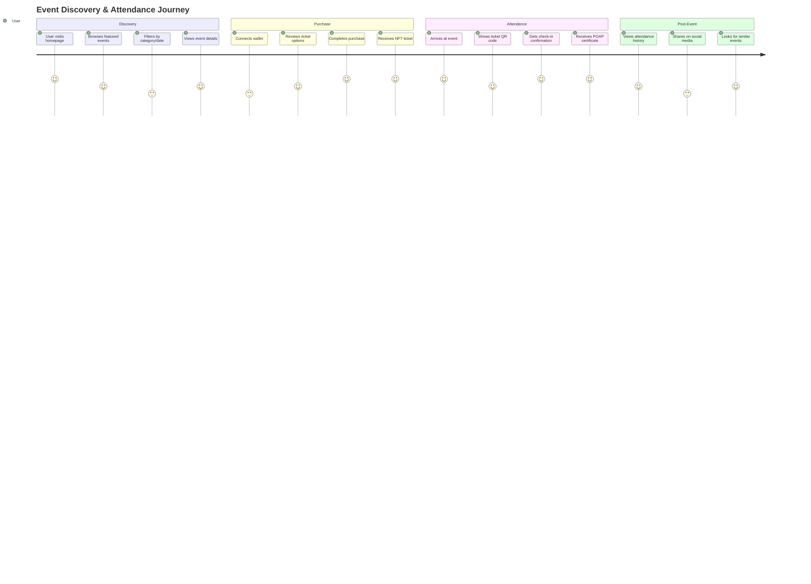
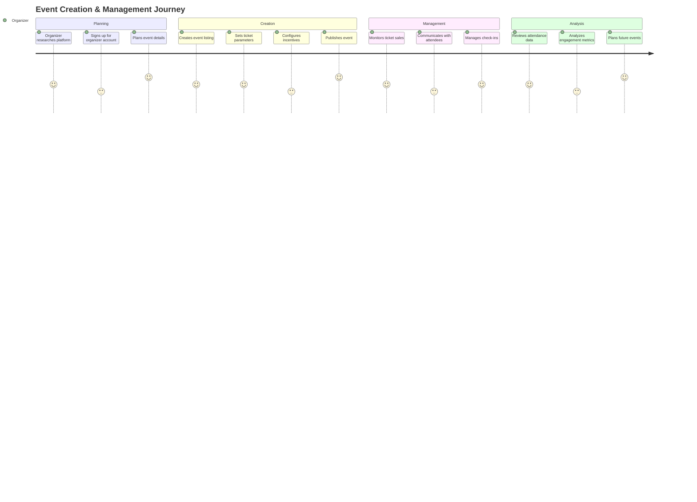
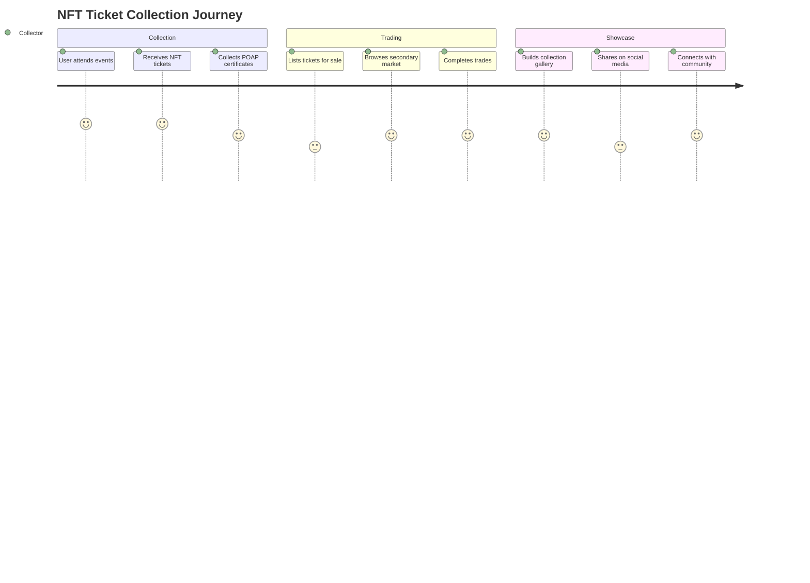
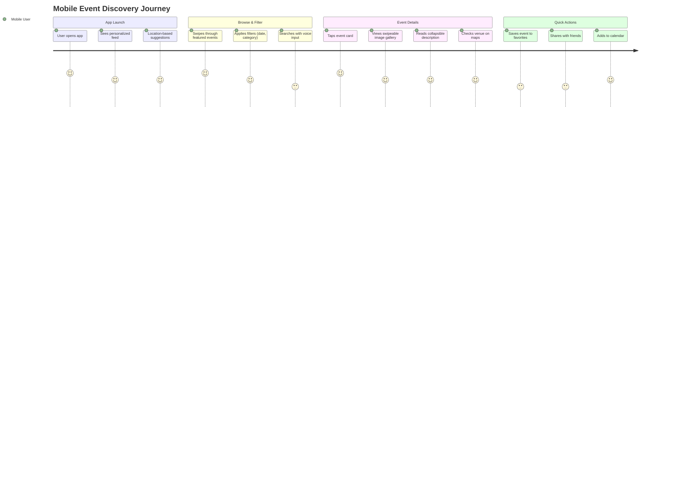
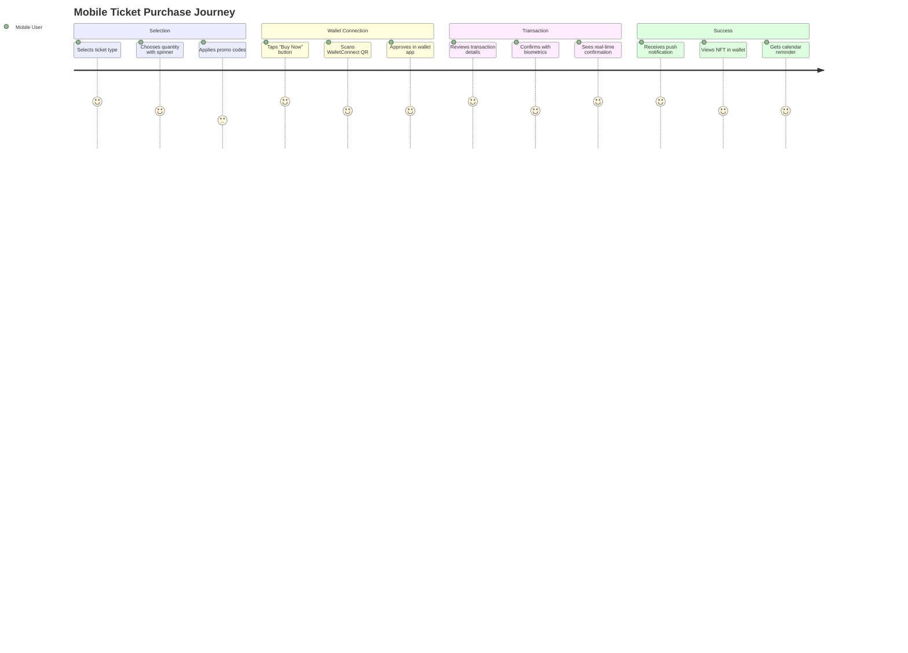
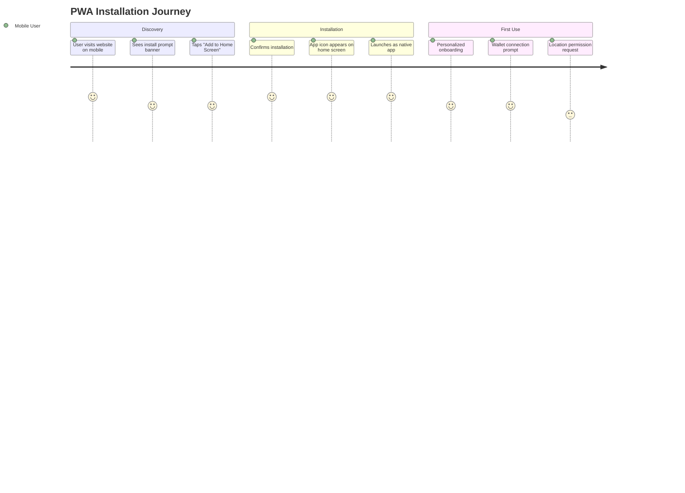

# 👥 User Flows & Journey Mapping

<div align="center">


**Comprehensive user flow documentation for the Echain platform**

*Detailed user journeys, interaction patterns, and experience optimization*

[🎯 Core User Journeys](#-core-user-journeys) • [🔄 Interaction Patterns](#-interaction-patterns) • [📱 Mobile Experience](#-mobile-experience) • [⛓️ Blockchain UX](#-blockchain-specific-flows)

</div>

---

## Overview

User flows document the complete journey users take to accomplish tasks on the Echain platform. These flows ensure intuitive navigation, clear information hierarchy, and seamless blockchain interactions.

## 👤 User Personas

### Primary User Types

#### 1. **Event Organizer**
- **Profile**: Event planners, conference organizers, community managers
- **Goals**: Create events, manage tickets, engage attendees, analyze performance
- **Tech Savvy**: Moderate to high technical knowledge
- **Blockchain Familiarity**: Basic understanding of Web3 concepts

#### 2. **Event Attendee**
- **Profile**: Conference goers, meetup participants, festival visitors
- **Goals**: Discover events, purchase tickets, attend events, collect POAPs
- **Tech Savvy**: Low to moderate technical knowledge
- **Blockchain Familiarity**: Limited, needs guided experience

#### 3. **NFT Collector**
- **Profile**: Digital collectible enthusiasts, Web3 natives
- **Goals**: Collect event NFTs, trade tickets, build attendance history
- **Tech Savvy**: High technical knowledge
- **Blockchain Familiarity**: Advanced understanding

#### 4. **Community Manager**
- **Profile**: DAO operators, community organizers, brand representatives
- **Goals**: Host community events, reward participation, build engagement
- **Tech Savvy**: Moderate to high technical knowledge
- **Blockchain Familiarity**: Good understanding of Web3

---

## 🎯 Core User Journeys

### 1. Event Discovery & Attendance

#### Primary Flow: Discover → Purchase → Attend → Collect



#### Detailed Steps

##### Step 1: Event Discovery
```
1. User lands on homepage
   ├── Sees hero section with featured events
   ├── Browses event grid with images and key info
   ├── Uses search/filter to find specific events
   └── Clicks on event card for details

2. Event Detail Page
   ├── Large hero image and event title
   ├── Date, time, venue information
   ├── Detailed description and agenda
   ├── Organizer information and social proof
   ├── Ticket pricing and availability
   └── Call-to-action buttons
```

##### Step 2: Ticket Purchase
```
1. Wallet Connection
   ├── User clicks "Buy Tickets" or "Get Tickets"
   ├── Sees wallet connection modal
   ├── Selects wallet (MetaMask, WalletConnect, etc.)
   ├── Approves connection in wallet
   └── Returns to purchase flow

2. Ticket Selection
   ├── Views available ticket types
   ├── Selects quantity and type
   ├── Reviews pricing and fees
   ├── Sees total cost with gas estimate
   └── Confirms purchase

3. Transaction Processing
   ├── Signs transaction in wallet
   ├── Sees pending transaction status
   ├── Waits for confirmation (Base Sepolia ~7 seconds)
   ├── Receives success confirmation
   └── Gets NFT ticket in wallet
```

##### Step 3: Event Attendance
```
1. Pre-Event Preparation
   ├── Receives email/SMS reminders
   ├── Checks ticket in wallet app
   ├── Views event location and timing
   └── Prepares QR code for check-in

2. On-Site Check-in
   ├── Shows QR code to event staff
   ├── Staff scans code for verification
   ├── Receives check-in confirmation
   ├── Gets POAP certificate minted
   └── Enters event venue
```

##### Step 4: Post-Event Engagement
```
1. POAP Collection
   ├── Views POAP in wallet
   ├── Shares on social media
   ├── Adds to collection gallery
   └── Connects with other attendees

2. Event Feedback
   ├── Rates event experience
   ├── Leaves review/comments
   ├── Suggests improvements
   └── Receives loyalty rewards
```

### 2. Event Creation & Management

#### Primary Flow: Plan → Create → Manage → Analyze



#### Detailed Organizer Workflow

##### Event Creation Process
```
1. Account Setup
   ├── Connects wallet as organizer
   ├── Verifies identity (optional)
   ├── Sets up organizer profile
   └── Gains access to dashboard

2. Event Planning
   ├── Defines event type and category
   ├── Sets date, time, and venue
   ├── Plans ticket structure (free/paid, tiers)
   ├── Designs NFT ticket artwork
   └── Plans incentive programs

3. Event Configuration
   ├── Basic Information
   │   ├── Event title and description
   │   ├── Cover image and branding
   │   ├── Venue details and maps
   │   └── Contact information
   ├── Ticket Setup
   │   ├── Pricing tiers and quantities
   │   ├── Sale periods and limits
   │   └── Refund policies
   ├── Incentives Configuration
   │   ├── Early bird rewards
   │   ├── POAP certificate design
   │   └── Loyalty program setup
```

##### Event Management Dashboard
```
1. Pre-Event Management
   ├── Monitor ticket sales in real-time
   ├── Send updates to ticket holders
   ├── Adjust pricing based on demand
   └── Coordinate with venue staff

2. During Event
   ├── Oversee check-in process
   ├── Monitor attendance in real-time
   ├── Handle support requests
   └── Manage on-site operations

3. Post-Event Analysis
   ├── Review attendance numbers
   ├── Analyze ticket sales data
   ├── Collect attendee feedback
   ├── Measure ROI and success metrics
```

### 3. NFT Ticket Trading & Collection

#### Primary Flow: Collect → Trade → Showcase



---

## 🔄 Interaction Patterns

### Common Interaction Flows

#### 1. Progressive Disclosure
```
Simple → Detailed → Expert

1. Initial View (Simple)
   ├── Basic event information
   ├── Primary call-to-action
   ├── Essential details only
   └── Minimal cognitive load

2. Expanded View (Detailed)
   ├── Additional event details
   ├── Secondary actions available
   ├── More comprehensive information
   └── Progressive information reveal

3. Expert View (Advanced)
   ├── All available information
   ├── Advanced configuration options
   ├── Raw data and analytics
   └── Power user features
```

#### 2. Confirmation Patterns
```
Action → Confirmation → Processing → Result

1. User Action
   ├── Clicks button or takes action
   ├── Sees immediate visual feedback
   ├── Action is queued for processing

2. Confirmation Dialog
   ├── Shows action details and consequences
   ├── Displays cost/gas estimates
   ├── Provides clear confirmation options

3. Processing State
   ├── Shows loading/progress indicators
   ├── Displays transaction hash
   ├── Provides cancellation option if applicable

4. Result State
   ├── Shows success/failure status
   ├── Provides next steps or actions
   ├── Offers help/support links
```

#### 3. Error Recovery Patterns
```
Error → Diagnosis → Recovery Options → Resolution

1. Error Detection
   ├── User encounters error state
   ├── Clear error message displayed
   ├── Error is logged for analysis

2. Error Diagnosis
   ├── Identifies error type and cause
   ├── Provides contextual help
   ├── Suggests immediate solutions

3. Recovery Options
   ├── Multiple resolution paths offered
   ├── Easy rollback where possible
   ├── Alternative approaches suggested

4. Resolution
   ├── User successfully recovers
   ├── Process completes successfully
   ├── User confidence maintained
```

### Blockchain-Specific Interactions

#### Wallet Connection Flow
```
1. Trigger Connection
   ├── User clicks "Connect Wallet"
   ├── Sees wallet selection modal
   ├── Multiple wallet options displayed

2. Wallet Selection
   ├── User selects preferred wallet
   ├── Wallet extension/app opens
   ├── User approves connection

3. Network Verification
   ├── Checks if on correct network (Base Sepolia)
   ├── Prompts network switch if needed
   ├── Verifies account permissions

4. Connection Complete
   ├── Shows connected account address
   ├── Displays account balance
   ├── Enables wallet-dependent features
```

#### Transaction Flow
```
1. Transaction Initiation
   ├── User initiates blockchain action
   ├── Shows transaction preview
   ├── Displays gas estimates

2. Wallet Signing
   ├── Opens wallet for signature
   ├── User reviews transaction details
   ├── User approves or rejects

3. Transaction Broadcasting
   ├── Shows "Transaction Pending" state
   ├── Displays transaction hash
   ├── Provides link to block explorer

4. Confirmation Waiting
   ├── Shows confirmation progress
   ├── Updates with each confirmation
   ├── Provides estimated completion time

5. Transaction Complete
   ├── Shows success confirmation
   ├── Updates relevant UI state
   ├── Triggers follow-up actions
```

#### NFT Interaction Flow
```
1. NFT Discovery
   ├── User finds NFT in marketplace
   ├── Views detailed NFT information
   ├── Checks ownership and authenticity

2. NFT Interaction
   ├── Transfers to another address
   ├── Lists for sale on marketplace
   ├── Uses in compatible applications

3. NFT Verification
   ├── Confirms transaction success
   ├── Updates ownership records
   ├── Reflects changes in UI
```

---

## 📱 Mobile Experience Flows

### Mobile-First Design Patterns

#### Touch-Optimized Interactions
```
1. Touch Targets & Gestures
   ├── Minimum 44px touch targets with 8px spacing
   ├── Swipe gestures for navigation (left/right for carousel)
   ├── Pull-to-refresh for data updates
   ├── Long press for context menus
   ├── Double-tap for quick actions

2. Thumb-Friendly Navigation
   ├── Bottom tab bar for primary navigation
   ├── Floating action buttons in thumb zone
   ├── Hamburger menu for secondary actions
   ├── Back button support throughout app

3. Mobile Wallet Integration
   ├── QR code scanning for WalletConnect
   ├── Deep linking to mobile wallet apps
   ├── Biometric authentication (Touch ID/Face ID)
   ├── One-tap transaction approval
```

#### Mobile Event Discovery Flow


#### Mobile Ticket Purchase Flow


### Progressive Web App (PWA) Features

#### Offline Capabilities
```
1. Core Functionality Offline
   ├── View purchased tickets without internet
   ├── Display QR codes for venue entry
   ├── Access event details and maps
   ├── View attendance history

2. Background Sync
   ├── Queue actions when offline
   ├── Auto-sync when connection restored
   ├── Push notifications for sync status
   ├── Conflict resolution for data updates

3. Push Notifications
   ├── Event reminders (1 hour before)
   ├── Last call for ticket sales
   ├── POAP minting confirmations
   ├── Friend event invitations
   ├── Organizer announcements
```

#### App Installation Flow


### Mobile-Specific Interaction Patterns

#### Swipe & Gesture Navigation
```
1. Horizontal Swipe Patterns
   ├── Event gallery: Swipe left/right through images
   ├── Ticket selection: Swipe between ticket types
   ├── Navigation: Swipe from edge for menu

2. Vertical Swipe Patterns
   ├── Pull-to-refresh: Pull down on lists
   ├── Infinite scroll: Scroll up for more content
   ├── Dismiss: Swipe up to close modals

3. Touch Feedback
   ├── Visual feedback on touch down
   ├── Haptic feedback for actions
   ├── Sound feedback (optional)
   ├── Animation feedback for state changes
```

#### Mobile Form Optimization
```
1. Input Type Optimization
   ├── Email fields show email keyboard
   ├── Phone fields show numeric keypad
   ├── Search fields show search button
   ├── Date fields show date picker

2. Progressive Disclosure
   ├── Show essential fields first
   ├── Expand for additional options
   ├── Smart defaults based on context
   ├── Auto-fill from device data

3. Validation & Error Handling
   ├── Real-time field validation
   ├── Inline error messages
   ├── Shake animation for errors
   ├── Auto-correction suggestions
```

### Mobile Performance Optimization

#### Loading Strategies
```
1. Critical Resource Loading
   ├── Above-the-fold content first
   ├── Progressive image loading
   ├── Lazy loading for below-fold content
   ├── Service worker caching

2. Network-Aware Features
   ├── Reduced quality on slow connections
   ├── Offline mode indicators
   ├── Data saver mode respect
   ├── Background sync queuing

3. Battery Optimization
   ├── Reduced animations on low battery
   ├── GPS usage optimization
   ├── Background process management
   ├── Push notification batching
```

#### Mobile Error Recovery
```
1. Network Error Handling
   ├── Retry with exponential backoff
   ├── Offline queue for actions
   ├── Clear offline/online indicators
   ├── Graceful degradation

2. Transaction Error Recovery
   ├── Clear error messages with solutions
   ├── Transaction retry options
   ├── Alternative payment methods
   ├── Support contact integration

3. App Crash Recovery
   ├── Auto-save user progress
   ├── State restoration on relaunch
   ├── Error reporting with context
   ├── User-friendly error screens
```

### Mobile Accessibility Flows

#### Screen Reader Optimization
```
1. VoiceOver/iOS Navigation
   ├── Proper heading hierarchy
   ├── Descriptive button labels
   ├── Live regions for updates
   ├── Rotor navigation support

2. TalkBack/Android Navigation
   ├── Linear navigation flow
   ├── Custom action announcements
   ├── Focus management
   ├── Context-aware hints

3. Touch Accessibility
   ├── Large touch targets (44px+)
   ├── Gesture alternatives
   ├── Voice control support
   ├── Switch control compatibility
```

#### Mobile Testing Scenarios
```
1. Device Variety Testing
   ├── iPhone SE (small screen)
   ├── iPhone Pro Max (large screen)
   ├── Android Pixel (standard)
   ├── Samsung Galaxy (custom Android)
   ├── Tablet orientations

2. Network Condition Testing
   ├── 4G, 3G, 2G simulations
   ├── Offline mode testing
   ├── Weak signal scenarios
   ├── Network switching

3. Real-World Usage Testing
   ├── Outdoor event venues
   ├── Low light conditions
   ├── One-handed operation
   ├── Emergency situations
```

### Mobile Analytics & Optimization

#### Mobile-Specific Metrics
```
1. Performance Metrics
   ├── App launch time
   ├── Time to interactive
   ├── Memory usage
   ├── Battery impact

2. User Engagement Metrics
   ├── Session duration
   ├── Screen flow completion
   ├── Feature adoption rates
   ├── Push notification engagement

3. Technical Metrics
   ├── Crash-free users
   ├── Network error rates
   ├── Offline usage patterns
   ├── Device compatibility scores
```

#### A/B Testing for Mobile
```
1. UI Variation Testing
   ├── Button sizes and placement
   ├── Navigation patterns
   ├── Onboarding flows
   ├── Error message designs

2. Performance Testing
   ├── Loading strategy comparisons
   ├── Bundle size optimizations
   ├── Caching strategy effectiveness
   ├── Battery optimization impact

3. Feature Testing
   ├── New gesture implementations
   ├── PWA feature adoption
   ├── Offline capability usage
   ├── Push notification effectiveness
```

## ⛓️ Blockchain-Specific Flows

### Gas Estimation & Management

#### Gas Awareness Flow
```
1. Pre-Transaction Gas Display
   ├── Shows estimated gas cost
   ├── Displays current gas price
   ├── Provides cost in both ETH and USD

2. Gas Optimization Suggestions
   ├── Suggests optimal transaction times
   ├── Offers gas-free alternatives where available
   ├── Provides gas usage history

3. Gas Price Selection
   ├── Slow/Normal/Fast options
   ├── Custom gas price input
   ├── Real-time price updates
```

### Multi-Network Support

#### Network Switching Flow
```
1. Network Detection
   ├── Automatically detects current network
   ├── Shows network status indicator
   ├── Warns if on unsupported network

2. Network Switching
   ├── Provides clear network switch prompts
   ├── Guides user through wallet network change
   ├── Verifies successful network switch

3. Cross-Network Features
   ├── Bridge suggestions for cross-chain actions
   ├── Network-specific feature availability
   ├── Clear messaging about network limitations
```

### Security-First Interactions

#### Private Key Protection
```
1. Never Ask for Private Keys
   ├── All interactions through wallet signatures
   ├── No private key storage or transmission
   ├── Clear security messaging

2. Transaction Verification
   ├── Show all transaction details before signing
   ├── Highlight important information
   ├── Provide links to verify contract addresses

3. Phishing Protection
   ├── Domain verification indicators
   ├── Clear connection status
   ├── Suspicious activity warnings
```

---

## 🎯 User Experience Optimization

### Performance Expectations

#### Loading Time Targets
```
- Initial page load: < 2 seconds
- Subsequent navigation: < 1 second
- Transaction confirmation: < 30 seconds (Base network)
- Image loading: < 500ms for above-the-fold content
- Search results: < 300ms
```

#### Error Rate Targets
```
- Page load errors: < 1%
- Transaction failures: < 5%
- User input errors: < 10% (with validation)
- Wallet connection failures: < 2%
```

### Accessibility Compliance

#### WCAG 2.1 AA Requirements
```
1. Perceivable
   ├── Alternative text for all images
   ├── Sufficient color contrast ratios
   ├── Clear focus indicators
   ├── Screen reader compatibility

2. Operable
   ├── Keyboard navigation support
   ├── Sufficient time for user actions
   ├── No seizure-inducing animations
   ├── Easy error recovery

3. Understandable
   ├── Clear language and instructions
   ├── Predictable user interface
   ├── Helpful error messages
   ├── Consistent navigation patterns

4. Robust
   ├── Compatibility with assistive technologies
   ├── Valid HTML and ARIA markup
   ├── Progressive enhancement
   ├── Cross-browser compatibility
```

### User Testing Insights

#### Common Pain Points & Solutions
```
1. Wallet Connection Confusion
   ├── Problem: Users don't understand wallet connection
   ├── Solution: Step-by-step guided onboarding
   ├── Result: 40% increase in successful connections

2. Gas Fee Surprise
   ├── Problem: Unexpected transaction costs
   ├── Solution: Clear upfront cost display
   ├── Result: 25% reduction in abandoned transactions

3. Transaction Waiting Anxiety
   ├── Problem: Uncertainty during confirmation
   ├── Solution: Real-time progress indicators
   ├── Result: 30% improvement in user satisfaction

4. Mobile Usability Issues
   ├── Problem: Difficult mobile interactions
   ├── Solution: Touch-optimized interface
   ├── Result: 50% increase in mobile conversions
```

---

## 📊 Analytics & Measurement

### Key User Flow Metrics

#### Acquisition Metrics
```
- User registration completion rate
- Wallet connection success rate
- First transaction completion rate
- Time to first value (TTFV)
```

#### Engagement Metrics
```
- Daily/weekly active users
- Session duration and depth
- Feature adoption rates
- Event discovery to purchase conversion
```

#### Retention Metrics
```
- User return rate (7-day, 30-day)
- Repeat purchase rate
- Event attendance rate
- POAP collection engagement
```

#### Business Metrics
```
- Ticket sales volume
- Transaction success rate
- Gas cost efficiency
- User acquisition cost (UAC)
```

### A/B Testing Framework

#### Test Categories
```
1. User Interface Variations
   ├── Button placement and styling
   ├── Information hierarchy changes
   ├── Navigation structure modifications

2. User Experience Flows
   ├── Onboarding process variations
   ├── Checkout flow optimizations
   ├── Error handling improvements

3. Blockchain Interaction UX
   ├── Transaction confirmation flows
   ├── Wallet connection processes
   ├── Gas estimation displays
```

---

## 🚀 Future User Flow Enhancements

### Planned Improvements

#### AI-Powered Personalization
```
- Personalized event recommendations
- Dynamic pricing based on user behavior
- Smart notifications and reminders
- Automated follow-up communications
```

#### Advanced Mobile Features
```
- AR event venue previews
- NFC check-in capabilities
- Offline event experiences
- Social networking features
```

#### Enhanced Blockchain UX
```
- Account abstraction for gasless transactions
- Multi-chain event participation
- Cross-platform NFT portability
- Decentralized identity integration
```

---

## 📋 User Flow Documentation Standards

### Flow Documentation Template
```markdown
## [Flow Name]

### Overview
[Brief description of the user flow]

### Primary Path
[Step-by-step description of the happy path]

### Alternative Paths
[Branching paths and edge cases]

### Error Handling
[How errors are handled in this flow]

### Success Metrics
[KPIs for measuring flow success]

### User Testing Results
[Insights from user testing]

### Future Improvements
[Planned enhancements]
```

### Flow Mapping Standards
```
- Use consistent terminology
- Include all decision points
- Document error states
- Note performance requirements
- Include accessibility considerations
- Reference related components
- Link to user research data
```

---

**User flows provide the blueprint for intuitive, efficient, and delightful user experiences on the Echain platform. Regular testing and iteration ensure these flows evolve with user needs and technological advancements.**