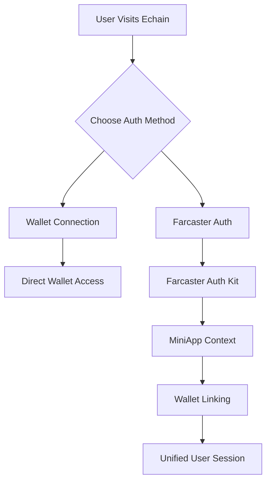
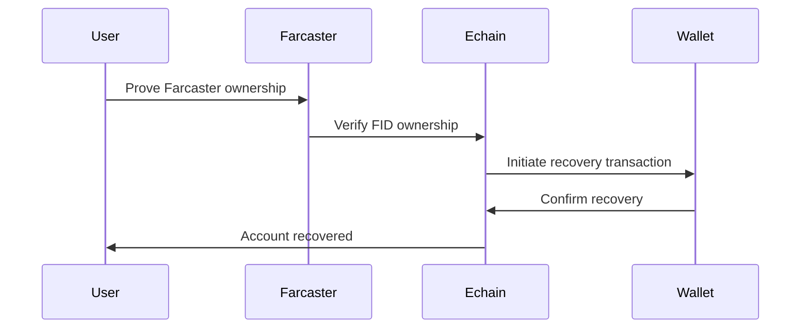

# 🎉 Farcaster Integration Guide

<div align="center">


**Complete Farcaster integration for social authentication and cross-platform Frames**

*Hybrid authentication, social recovery, and interactive event embeds*

[🔐 Authentication](#-authentication) • [🎭 Frames](#-frames) • [🔄 Social Recovery](#-social-recovery) • [🚀 Implementation](#-implementation)

</div>

---

## 🎯 Overview

Echain integrates Farcaster to provide:
- **Hybrid Authentication**: Optional social login alongside wallet connections
- **Social Recovery**: Account recovery via Farcaster verification
- **Interactive Frames**: Event embeds in Farcaster posts with MiniKit
- **Cross-Platform Reach**: Available on Farcaster clients and Base apps
- **Gasless Transactions**: Coinbase Paymaster integration on Base

---

## 🔐 Authentication

### Hybrid Auth Flow



### Implementation

#### Farcaster Auth Setup
```typescript
// lib/farcaster-connector.ts
import { AuthKitProvider } from '@farcaster/auth-kit';

export const FarcasterConfig = {
  relay: 'https://relay.farcaster.xyz',
  rpcUrl: 'https://mainnet.optimism.io',
  domain: 'echain.app',
  siweUri: 'https://echain.app/login',
};
```

#### Auth Modal Component
```tsx
// components/FarcasterAuthModal.tsx
import { AuthKitProvider, SignInButton } from '@farcaster/auth-kit';

export function FarcasterAuthModal() {
  return (
    <AuthKitProvider config={FarcasterConfig}>
      <SignInButton />
    </AuthKitProvider>
  );
}
```

#### Social Recovery
```typescript
// Social recovery implementation
export async function recoverAccount(farcasterUser: FarcasterUser) {
  // Verify Farcaster ownership
  const isVerified = await verifyFarcasterOwnership(farcasterUser);

  if (isVerified) {
    // Link Farcaster account to wallet
    await linkSocialAccount(farcasterUser.fid, walletAddress);

    // Enable social recovery
    await enableSocialRecovery(farcasterUser.fid);
  }
}
```

---

## 🎭 Frames

### MiniKit Integration

#### Frame Creation
```typescript
// app/api/frames/rsvp/[id]/route.ts
import { MiniKit } from '@farcaster/miniapp-core';

export async function POST(request: Request, { params }: { params: { id: string } }) {
  const { eventId } = params;

  const frame = MiniKit.createFrame({
    title: 'RSVP to Event',
    description: 'Join this blockchain event',
    image: `https://echain.app/api/frames/${eventId}/image`,
    buttons: [
      {
        label: 'RSVP',
        action: 'post',
        target: `https://echain.app/api/frames/rsvp/${eventId}`
      }
    ]
  });

  return Response.json(frame);
}
```

#### Interactive RSVP
```typescript
// Handle frame interactions
export async function handleFrameAction(action: FrameAction) {
  const { buttonIndex, inputText, fid } = action;

  switch (buttonIndex) {
    case 1: // RSVP
      await rsvpToEvent(fid, eventId);
      return createSuccessFrame();

    case 2: // View Details
      return createDetailsFrame(eventId);

    default:
      return createErrorFrame('Invalid action');
  }
}
```

### Frame Types

#### Event Discovery Frame
```json
{
  "title": "Upcoming Events",
  "description": "Discover blockchain events",
  "image": "https://echain.app/frames/events.jpg",
  "buttons": [
    {"label": "Browse Events", "action": "post", "target": "/api/frames/browse"},
    {"label": "Create Event", "action": "post", "target": "/api/frames/create"}
  ]
}
```

#### Ticket Purchase Frame
```json
{
  "title": "Purchase Tickets",
  "description": "Get NFT tickets for this event",
  "image": "https://echain.app/frames/ticket.jpg",
  "input": {"text": "Number of tickets"},
  "buttons": [
    {"label": "Purchase", "action": "tx", "target": "/api/frames/purchase", "postUrl": "/api/frames/success"}
  ]
}
```

---

## 🔄 Social Recovery

### Recovery Flow



### Implementation

#### Recovery Verification
```typescript
// Verify Farcaster account ownership
export async function verifyFarcasterOwnership(fid: number, signature: string) {
  // Get user's Farcaster profile
  const profile = await getFarcasterProfile(fid);

  // Verify signature matches profile
  const isValid = await verifySignature(profile.address, signature);

  return isValid;
}
```

#### Account Linking
```typescript
// Link social account to wallet
export async function linkSocialAccount(fid: number, walletAddress: string) {
  // Store mapping in database
  await db.socialLinks.create({
    fid,
    walletAddress,
    linkedAt: new Date(),
    recoveryEnabled: true
  });

  // Update user profile
  await updateUserProfile(walletAddress, { farcasterId: fid });
}
```

---

## 🚀 Implementation Details

### Provider Setup

#### MiniKit Provider
```tsx
// providers/MiniKitProvider.tsx
import { MiniKitProvider as Provider } from '@farcaster/miniapp-core';

export function MiniKitProvider({ children }: { children: React.ReactNode }) {
  return (
    <Provider
      config={{
        appId: process.env.NEXT_PUBLIC_FARCASTER_APP_ID,
        baseUrl: process.env.NEXT_PUBLIC_BASE_URL,
      }}
    >
      {children}
    </Provider>
  );
}
```

#### Auth Kit Provider
```tsx
// providers/FarcasterAuthProvider.tsx
import { AuthKitProvider } from '@farcaster/auth-kit';

export function FarcasterAuthProvider({ children }: { children: React.ReactNode }) {
  return (
    <AuthKitProvider config={FarcasterConfig}>
      {children}
    </AuthKitProvider>
  );
}
```

### Component Integration

#### Unified Connect Button
```tsx
// components/UnifiedConnectButton.tsx
export function UnifiedConnectButton() {
  const [authMethod, setAuthMethod] = useState<'wallet' | 'farcaster'>('wallet');

  return (
    <div className="flex gap-4">
      <button
        onClick={() => setAuthMethod('wallet')}
        className={authMethod === 'wallet' ? 'active' : ''}
      >
        Connect Wallet
      </button>
      <button
        onClick={() => setAuthMethod('farcaster')}
        className={authMethod === 'farcaster' ? 'active' : ''}
      >
        Sign in with Farcaster
      </button>
    </div>
  );
}
```

### Error Handling

#### Fallback Mechanisms
```typescript
// Graceful degradation for Farcaster failures
export function FarcasterFallback({ children }: { children: React.ReactNode }) {
  const [farcasterError, setFarcasterError] = useState(false);

  if (farcasterError) {
    return (
      <div className="fallback-notice">
        <p>Farcaster integration unavailable. Please use wallet connection.</p>
        <WalletConnectButton />
      </div>
    );
  }

  return <>{children}</>;
}
```

---

## 🔧 Configuration

### Environment Variables
```bash
# Farcaster Configuration
NEXT_PUBLIC_FARCASTER_APP_ID=your_app_id
NEXT_PUBLIC_FARCASTER_CLIENT_ID=your_client_id
FARCASTER_CLIENT_SECRET=your_client_secret

# MiniKit Configuration
NEXT_PUBLIC_MINIKIT_APP_ID=your_minikit_app_id
MINIKIT_APP_SECRET=your_minikit_secret
```

### Domain Verification
```json
// farcaster.config.json
{
  "name": "Echain",
  "description": "Blockchain Events Platform",
  "icon": "https://echain.app/icon.png",
  "url": "https://echain.app",
  "frames": {
    "url": "https://echain.app/api/frames"
  }
}
```

---

## 📊 Analytics & Monitoring

### Usage Tracking
```typescript
// Track Farcaster auth events
export function trackFarcasterAuth(success: boolean, method: string) {
  analytics.track('farcaster_auth', {
    success,
    method, // 'signin' | 'recovery' | 'linking'
    timestamp: Date.now(),
    userAgent: navigator.userAgent
  });
}
```

### Frame Performance
```typescript
// Monitor frame load times
export function trackFrameLoad(frameId: string, loadTime: number) {
  analytics.track('frame_load', {
    frameId,
    loadTime,
    success: loadTime < 3000, // 3 second threshold
    timestamp: Date.now()
  });
}
```

---

## 🔒 Security Considerations

### Authentication Security
- **Signature Verification**: All Farcaster signatures verified on-chain
- **FID Validation**: Farcaster IDs validated against official registry
- **Rate Limiting**: API endpoints protected against abuse
- **Session Management**: Secure session handling with expiration

### Frame Security
- **Input Validation**: All frame inputs sanitized and validated
- **CSRF Protection**: Cross-site request forgery prevention
- **Content Security Policy**: Strict CSP for frame content
- **Origin Verification**: Frame origins validated against allowlist

---

## 🚀 Deployment

### Production Setup
```bash
# Deploy with Farcaster configuration
vercel --prod --yes

# Verify frame URLs
curl https://echain.app/api/frames/events

# Test MiniKit integration
curl https://echain.app/api/minikit/status
```

### Monitoring
```typescript
// Health checks for Farcaster services
export async function checkFarcasterHealth() {
  const checks = [
    checkAuthKitConnectivity(),
    checkMiniKitAPI(),
    checkFrameGeneration(),
    checkSocialRecovery()
  ];

  const results = await Promise.all(checks);
  return results.every(result => result.ok);
}
```

---

## 📞 Support & Resources

### Farcaster Resources
- **[Farcaster Docs](https://docs.farcaster.xyz/)**: Official documentation
- **[MiniKit Guide](https://docs.farcaster.xyz/minikit/)**: Frame development
- **[Auth Kit](https://docs.farcaster.xyz/auth-kit/)**: Authentication library

### Echain Integration
- **[API Reference](../api/README.md)**: Frame endpoints
- **[Components](../wallet-enhancement/README.md)**: Auth components
- **[Deployment](../deployment/README.md)**: Production setup

---

<div align="center">

**🎉 Farcaster Integration Complete!**

*Social authentication and cross-platform Frames now live*

*Last Updated: October 2025*

</div></content>
<parameter name="filePath">e:/Polymath Universata/Projects/Echain/docs/farcaster-integration-guide.md