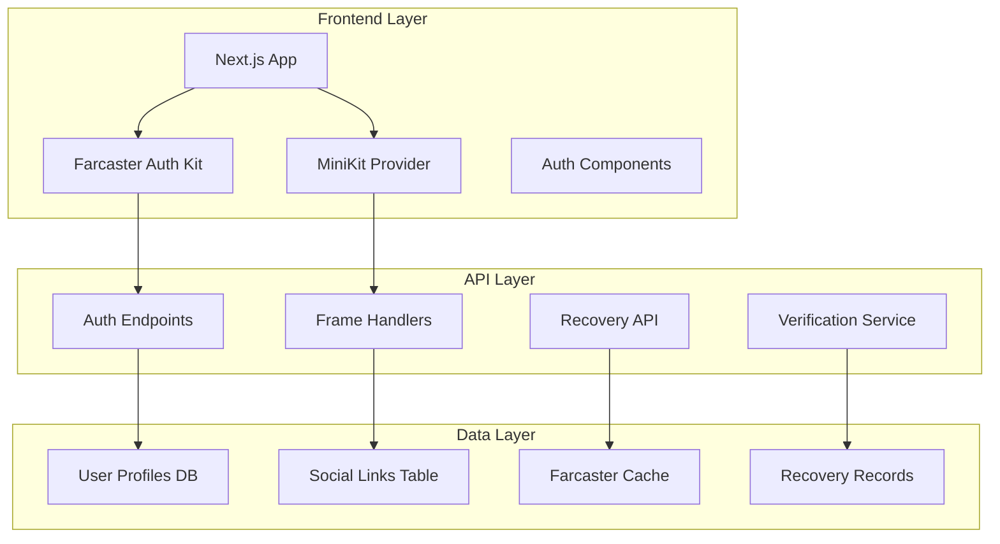

# 📋 Farcaster Integration Plan

<div align="center">


**Strategic plan for Farcaster social authentication and Frames integration**

*Hybrid auth, social recovery, and cross-platform event sharing*

[🎯 Objectives](#-objectives) • [📅 Timeline](#-timeline) • [🛠️ Implementation](#-implementation) • [🔒 Security](#-security)

</div>

---

## 🎯 Objectives

### Primary Goals
- **Hybrid Authentication**: Seamless social login alongside wallet connections
- **Social Recovery**: Account recovery via Farcaster verification
- **Cross-Platform Frames**: Interactive event embeds in Farcaster posts
- **Enhanced UX**: Reduced friction for new Web3 users
- **Community Building**: Social features for event networking

### Success Metrics
- **Auth Conversion**: 40%+ users choose Farcaster auth
- **Recovery Usage**: 25% of recoveries use social method
- **Frame Engagement**: 30% of events shared via Frames
- **User Retention**: 15% improvement in user retention

---

## 📅 Timeline

### Phase 1: Foundation (Week 1-2)
- **Auth Kit Integration**: Basic Farcaster sign-in
- **User Profile Linking**: Connect Farcaster to wallet accounts
- **Basic UI Components**: Auth modals and buttons

### Phase 2: Social Recovery (Week 3-4)
- **Recovery Flow**: Implement social recovery mechanism
- **Verification System**: FID ownership verification
- **Security Audits**: Initial security review

### Phase 3: Frames Development (Week 5-6)
- **MiniKit Setup**: Frame creation and interaction
- **Event Frames**: RSVP and ticket purchase frames
- **Cross-Platform Testing**: Test on different Farcaster clients

### Phase 4: Production Launch (Week 7-8)
- **Beta Testing**: Limited user testing
- **Performance Optimization**: Load testing and optimization
- **Production Deployment**: Full launch with monitoring

---

## 🛠️ Implementation

### Technical Architecture



### Component Breakdown

#### Authentication Components
```typescript
// Core auth components needed
- FarcasterAuthModal
- SocialRecoveryForm
- UnifiedConnectButton
- AuthStatusDisplay
- RecoverySetupWizard
```

#### Frame Components
```typescript
// Frame-related components
- EventShareFrame
- RSVPSuccessFrame
- TicketPurchaseFrame
- EventDetailsFrame
- ErrorHandlingFrame
```

### API Endpoints

#### Authentication APIs
```typescript
POST /api/auth/farcaster/verify
POST /api/auth/farcaster/link
POST /api/recovery/farcaster/initiate
POST /api/recovery/farcaster/verify
```

#### Frame APIs
```typescript
GET /api/frames/event/:id
POST /api/frames/rsvp/:id
POST /api/frames/purchase/:id
GET /api/frames/success/:tx
```

---

## 🔒 Security Considerations

### Authentication Security
- **Signature Verification**: ECDSA signature validation
- **FID Verification**: Against Farcaster registry
- **Rate Limiting**: Prevent brute force attacks
- **Session Security**: Secure session management

### Recovery Security
- **Multi-Factor**: Require additional verification
- **Time Windows**: Limited recovery windows
- **Audit Logging**: All recovery attempts logged
- **Fraud Detection**: Pattern analysis for suspicious activity

### Frame Security
- **Input Validation**: Sanitize all frame inputs
- **CSRF Protection**: Prevent cross-site attacks
- **Origin Validation**: Verify frame origins
- **Content Security**: Strict CSP policies

---

## 📊 Risk Assessment

### High Risk Items
- **Auth Bypass**: Critical - could compromise user accounts
- **Recovery Exploitation**: High - social engineering attacks
- **Frame Injection**: Medium - malicious frame content

### Mitigation Strategies
- **Security Audit**: Third-party security review
- **Penetration Testing**: External security testing
- **Gradual Rollout**: Feature flags for controlled deployment
- **Monitoring**: Real-time security monitoring

---

## 🚀 Success Criteria

### Functional Requirements
- [ ] Farcaster sign-in works on all major clients
- [ ] Social recovery successfully recovers accounts
- [ ] Frames load and interact properly
- [ ] No breaking changes to existing wallet auth

### Performance Requirements
- [ ] Auth flow completes in <3 seconds
- [ ] Frame load time <2 seconds
- [ ] Recovery process <5 minutes
- [ ] 99.9% uptime for auth services

### Security Requirements
- [ ] Zero critical vulnerabilities
- [ ] All auth attempts logged and monitored
- [ ] Recovery requires multi-factor verification
- [ ] Frame content properly sanitized

---

## 📈 Monitoring & Analytics

### Key Metrics to Track
- **Auth Success Rate**: Percentage of successful Farcaster auths
- **Recovery Usage**: Number of social recoveries performed
- **Frame Engagement**: Click-through rates on frames
- **Error Rates**: Authentication and frame errors

### Alert Conditions
- Auth success rate drops below 95%
- Recovery failures exceed 5%
- Frame load time exceeds 5 seconds
- Security events detected

---

## 📞 Dependencies

### External Dependencies
- **Farcaster Auth Kit**: For authentication
- **MiniKit**: For frame development
- **Farcaster API**: For user verification
- **Coinbase Paymaster**: For gasless transactions

### Internal Dependencies
- **Wallet Integration**: Existing wallet system
- **User Management**: User profile system
- **Event System**: Event data and APIs
- **Notification System**: For recovery notifications

---

## 🔄 Rollback Plan

### Rollback Triggers
- Critical security vulnerability discovered
- Auth success rate below 90% for 1 hour
- User data breach or exposure
- Major Farcaster API outage

### Rollback Procedure
1. **Feature Flag Disable**: Turn off Farcaster features
2. **User Communication**: Notify users of temporary disable
3. **Investigation**: Determine root cause
4. **Fix Deployment**: Deploy fix or rollback code
5. **Gradual Re-enable**: Test and re-enable features

---

## 📚 Resources Needed

### Development Resources
- **Frontend Developer**: 2 weeks for component development
- **Backend Developer**: 1 week for API development
- **DevOps Engineer**: 3 days for deployment and monitoring
- **Security Engineer**: 1 week for audit and testing

### External Resources
- **Farcaster Documentation**: Official docs and guides
- **MiniKit Examples**: Sample implementations
- **Security Auditor**: Third-party security review
- **Testing Users**: Beta testers for Farcaster features

---

<div align="center">

**📋 Farcaster Integration Plan - Sprint 5**

*Social authentication and Frames for enhanced user experience*

*Planning Complete: October 2025*

</div></content>
<parameter name="filePath">e:/Polymath Universata/Projects/Echain/docs/farcaster-integration-plan.md