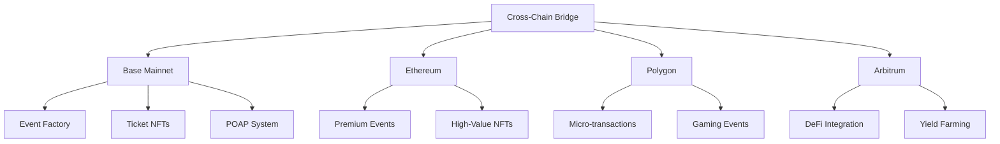

# Cross-Chain Integration Guide

## Overview

Echain is designed as a multi-chain event management platform that leverages the strengths of different blockchain networks. This guide covers the architecture, patterns, and best practices for cross-chain integration.

## Table of Contents

1. [Architecture Overview](#architecture-overview)
2. [Supported Networks](#supported-networks)
3. [Cross-Chain Patterns](#cross-chain-patterns)
4. [Smart Contract Integration](#smart-contract-integration)
5. [Frontend Integration](#frontend-integration)
6. [Best Practices](#best-practices)
7. [Security Considerations](#security-considerations)
8. [Troubleshooting](#troubleshooting)

## Architecture Overview

### Multi-Chain Design Philosophy

Echain adopts a **hub-and-spoke** model where:
- **Primary Chain (Base)**: Hosts core event contracts and primary logic
- **Secondary Chains**: Provide specialized functionality or cost optimization
- **Cross-Chain Bridge**: Enables asset and data transfer between chains



### Core Components

1. **Chain Abstraction Layer**: Unified interface for all blockchain interactions
2. **Bridge Contracts**: Secure cross-chain communication
3. **State Synchronization**: Consistent data across chains
4. **Gas Optimization**: Dynamic chain selection based on costs

## Supported Networks

### Primary Networks

| Network | Chain ID | Purpose | Status |
|---------|----------|---------|--------|
| Base Mainnet | 8453 | Primary event hosting | ✅ Active |
| Base Sepolia | 84532 | Development/Testing | ✅ Active |
| Ethereum | 1 | Premium events, high-value NFTs | 🚧 Planned |
| Polygon | 137 | Low-cost transactions | 🚧 Planned |
| Arbitrum | 42161 | DeFi integration | 🚧 Planned |

### Network Selection Criteria

```typescript
interface NetworkConfig {
  chainId: number;
  name: string;
  rpcUrl: string;
  gasPrice: string;
  blockTime: number;
  features: string[];
  contracts: {
    eventFactory?: string;
    ticketNFT?: string;
    poap?: string;
    bridge?: string;
  };
}

const NETWORK_CONFIGS: Record<number, NetworkConfig> = {
  8453: {
    chainId: 8453,
    name: 'Base',
    rpcUrl: 'https://mainnet.base.org',
    gasPrice: '0.001',
    blockTime: 2,
    features: ['events', 'tickets', 'poap', 'bridge'],
    contracts: {
      eventFactory: '0xA97cB40548905B05A67fCD4765438aFBEA4030fc',
      ticketNFT: '0xc8cd32F0b2a6EE43f465a3f88BC52955A805043C',
      poap: '0x08344CfBfB3afB2e114A0dbABbaF40e7eB62FD33'
    }
  }
  // Additional networks...
};
```

## Cross-Chain Patterns

### 1. Event Mirroring Pattern

Events created on one chain can be mirrored to other chains for broader accessibility.

```solidity
// EventMirror.sol
contract EventMirror {
    struct MirroredEvent {
        uint256 originalChainId;
        address originalContract;
        uint256 originalEventId;
        bool isActive;
    }
    
    mapping(uint256 => MirroredEvent) public mirroredEvents;
    
    function mirrorEvent(
        uint256 _originalChainId,
        address _originalContract,
        uint256 _originalEventId,
        EventData calldata _eventData
    ) external onlyBridge {
        uint256 newEventId = _createLocalEvent(_eventData);
        
        mirroredEvents[newEventId] = MirroredEvent({
            originalChainId: _originalChainId,
            originalContract: _originalContract,
            originalEventId: _originalEventId,
            isActive: true
        });
        
        emit EventMirrored(newEventId, _originalChainId, _originalEventId);
    }
}
```

### 2. Cross-Chain Ticket Validation

Tickets purchased on one chain can be validated on another chain.

```solidity
// CrossChainValidator.sol
contract CrossChainValidator {
    struct TicketProof {
        uint256 chainId;
        address ticketContract;
        uint256 tokenId;
        address owner;
        bytes32 merkleRoot;
    }
    
    mapping(bytes32 => bool) public validatedTickets;
    
    function validateCrossChainTicket(
        TicketProof calldata _proof,
        bytes32[] calldata _merkleProof
    ) external returns (bool) {
        bytes32 ticketHash = keccak256(abi.encode(_proof));
        
        require(!validatedTickets[ticketHash], "Ticket already validated");
        require(_verifyMerkleProof(_proof, _merkleProof), "Invalid proof");
        
        validatedTickets[ticketHash] = true;
        
        emit TicketValidated(ticketHash, _proof.chainId, _proof.tokenId);
        return true;
    }
}
```

### 3. Asset Bridge Pattern

Secure transfer of tokens and NFTs between chains.

```solidity
// AssetBridge.sol
contract AssetBridge {
    struct BridgeRequest {
        address token;
        uint256 amount;
        uint256 targetChainId;
        address recipient;
        uint256 nonce;
    }
    
    mapping(bytes32 => bool) public processedRequests;
    
    function bridgeAsset(BridgeRequest calldata _request) external payable {
        require(_request.amount > 0, "Invalid amount");
        require(_request.targetChainId != block.chainid, "Same chain");
        
        bytes32 requestHash = keccak256(abi.encode(_request));
        require(!processedRequests[requestHash], "Already processed");
        
        // Lock assets on source chain
        IERC20(_request.token).transferFrom(
            msg.sender, 
            address(this), 
            _request.amount
        );
        
        emit BridgeInitiated(requestHash, _request);
    }
    
    function completeBridge(
        BridgeRequest calldata _request,
        bytes[] calldata _signatures
    ) external {
        bytes32 requestHash = keccak256(abi.encode(_request));
        require(_verifySignatures(requestHash, _signatures), "Invalid signatures");
        
        // Mint or unlock assets on target chain
        _mintOrUnlock(_request.token, _request.recipient, _request.amount);
        
        processedRequests[requestHash] = true;
        emit BridgeCompleted(requestHash, _request);
    }
}
```

## Smart Contract Integration

### Chain Abstraction Layer

```typescript
// chains/ChainManager.ts
export class ChainManager {
  private providers: Map<number, ethers.Provider> = new Map();
  private contracts: Map<string, ethers.Contract> = new Map();
  
  constructor(private config: NetworkConfig[]) {
    this.initializeProviders();
  }
  
  async getOptimalChain(operation: OperationType): Promise<number> {
    const candidates = this.config.filter(chain => 
      chain.features.includes(operation)
    );
    
    // Consider gas prices, network congestion, and feature availability
    const scores = await Promise.all(
      candidates.map(chain => this.calculateChainScore(chain, operation))
    );
    
    const bestChain = candidates[scores.indexOf(Math.max(...scores))];
    return bestChain.chainId;
  }
  
  async executeOnChain<T>(
    chainId: number,
    contractName: string,
    method: string,
    params: any[]
  ): Promise<T> {
    const contract = this.getContract(chainId, contractName);
    const tx = await contract[method](...params);
    return await tx.wait();
  }
  
  private async calculateChainScore(
    chain: NetworkConfig,
    operation: OperationType
  ): Promise<number> {
    const gasPrice = await this.getGasPrice(chain.chainId);
    const congestion = await this.getNetworkCongestion(chain.chainId);
    
    // Scoring algorithm based on cost, speed, and reliability
    return (1 / gasPrice) * (1 / congestion) * chain.reliabilityScore;
  }
}
```

### Event Factory with Cross-Chain Support

```solidity
// EventFactoryCrossChain.sol
contract EventFactoryCrossChain is EventFactory {
    struct CrossChainConfig {
        uint256[] supportedChains;
        mapping(uint256 => address) bridgeContracts;
        mapping(uint256 => bool) mirroringEnabled;
    }
    
    CrossChainConfig public crossChainConfig;
    
    function createEventWithMirroring(
        EventData calldata _eventData,
        uint256[] calldata _targetChains
    ) external returns (uint256 eventId) {
        eventId = createEvent(_eventData);
        
        for (uint256 i = 0; i < _targetChains.length; i++) {
            if (crossChainConfig.mirroringEnabled[_targetChains[i]]) {
                _initiateMirroring(eventId, _targetChains[i], _eventData);
            }
        }
    }
    
    function _initiateMirroring(
        uint256 _eventId,
        uint256 _targetChain,
        EventData calldata _eventData
    ) internal {
        address bridge = crossChainConfig.bridgeContracts[_targetChain];
        require(bridge != address(0), "Bridge not configured");
        
        IBridge(bridge).sendMessage(
            _targetChain,
            abi.encodeWithSignature(
                "mirrorEvent(uint256,address,uint256,bytes)",
                block.chainid,
                address(this),
                _eventId,
                abi.encode(_eventData)
            )
        );
    }
}
```

## Frontend Integration

### Multi-Chain Wallet Connection

```typescript
// hooks/useMultiChainWallet.ts
export function useMultiChainWallet() {
  const [activeChain, setActiveChain] = useState<number>(8453);
  const [connectedChains, setConnectedChains] = useState<Set<number>>(new Set());
  
  const switchChain = async (chainId: number) => {
    try {
      await window.ethereum.request({
        method: 'wallet_switchEthereumChain',
        params: [{ chainId: `0x${chainId.toString(16)}` }],
      });
      setActiveChain(chainId);
    } catch (error) {
      if (error.code === 4902) {
        await addChain(chainId);
      }
    }
  };
  
  const addChain = async (chainId: number) => {
    const config = NETWORK_CONFIGS[chainId];
    await window.ethereum.request({
      method: 'wallet_addEthereumChain',
      params: [{
        chainId: `0x${chainId.toString(16)}`,
        chainName: config.name,
        rpcUrls: [config.rpcUrl],
        nativeCurrency: config.nativeCurrency,
        blockExplorerUrls: [config.blockExplorer]
      }]
    });
  };
  
  return {
    activeChain,
    connectedChains,
    switchChain,
    addChain
  };
}
```

### Cross-Chain Event Display

```typescript
// components/CrossChainEventCard.tsx
interface CrossChainEventCardProps {
  event: Event;
  availableChains: number[];
}

export function CrossChainEventCard({ event, availableChains }: CrossChainEventCardProps) {
  const { activeChain, switchChain } = useMultiChainWallet();
  const [selectedChain, setSelectedChain] = useState(activeChain);
  
  const handleChainSelect = async (chainId: number) => {
    setSelectedChain(chainId);
    if (chainId !== activeChain) {
      await switchChain(chainId);
    }
  };
  
  const getChainSpecificPrice = (chainId: number) => {
    // Calculate price based on chain-specific factors
    const basePrice = parseFloat(event.price);
    const chainMultiplier = CHAIN_PRICE_MULTIPLIERS[chainId] || 1;
    return (basePrice * chainMultiplier).toFixed(4);
  };
  
  return (
    <Card className="cross-chain-event-card">
      <CardHeader>
        <h3>{event.name}</h3>
        <div className="chain-selector">
          {availableChains.map(chainId => (
            <ChainButton
              key={chainId}
              chainId={chainId}
              isSelected={selectedChain === chainId}
              onClick={() => handleChainSelect(chainId)}
              price={getChainSpecificPrice(chainId)}
            />
          ))}
        </div>
      </CardHeader>
      
      <CardContent>
        <p>{event.description}</p>
        <div className="chain-info">
          <span>Network: {NETWORK_CONFIGS[selectedChain].name}</span>
          <span>Price: {getChainSpecificPrice(selectedChain)} ETH</span>
          <span>Gas: ~{estimateGas(selectedChain)} ETH</span>
        </div>
      </CardContent>
      
      <CardFooter>
        <PurchaseButton
          eventId={event.id}
          chainId={selectedChain}
          price={getChainSpecificPrice(selectedChain)}
        />
      </CardFooter>
    </Card>
  );
}
```

## Best Practices

### 1. Chain Selection Strategy

```typescript
// utils/chainSelection.ts
export class ChainSelectionStrategy {
  static async selectOptimalChain(
    operation: OperationType,
    userPreferences: UserPreferences,
    eventRequirements: EventRequirements
  ): Promise<number> {
    const candidates = this.getEligibleChains(operation, eventRequirements);
    
    const scores = await Promise.all(
      candidates.map(async (chainId) => {
        const gasPrice = await this.getGasPrice(chainId);
        const speed = await this.getTransactionSpeed(chainId);
        const reliability = this.getReliabilityScore(chainId);
        
        return this.calculateScore({
          gasPrice,
          speed,
          reliability,
          userPreferences,
          chainId
        });
      })
    );
    
    return candidates[scores.indexOf(Math.max(...scores))];
  }
  
  private static calculateScore(params: ScoreParams): number {
    const {
      gasPrice,
      speed,
      reliability,
      userPreferences,
      chainId
    } = params;
    
    // Weighted scoring based on user preferences
    const gasCostWeight = userPreferences.prioritizeCost ? 0.4 : 0.2;
    const speedWeight = userPreferences.prioritizeSpeed ? 0.4 : 0.2;
    const reliabilityWeight = 0.3;
    const preferenceWeight = userPreferences.preferredChains.includes(chainId) ? 0.1 : 0;
    
    return (
      (1 / gasPrice) * gasCostWeight +
      speed * speedWeight +
      reliability * reliabilityWeight +
      preferenceWeight
    );
  }
}
```

### 2. State Synchronization

```typescript
// sync/StateSynchronizer.ts
export class StateSynchronizer {
  private eventBus: EventBus;
  private stateCache: Map<string, any> = new Map();
  
  async synchronizeEventState(eventId: string, sourceChain: number) {
    const event = await this.fetchEventFromChain(eventId, sourceChain);
    const targetChains = await this.getEventMirrorChains(eventId);
    
    for (const chainId of targetChains) {
      try {
        await this.updateEventOnChain(eventId, chainId, event);
        this.eventBus.emit('eventSynced', { eventId, chainId });
      } catch (error) {
        console.error(`Failed to sync event ${eventId} to chain ${chainId}:`, error);
        this.eventBus.emit('syncFailed', { eventId, chainId, error });
      }
    }
  }
  
  async handleCrossChainMessage(message: CrossChainMessage) {
    const { sourceChain, targetChain, payload, signature } = message;
    
    // Verify message authenticity
    if (!await this.verifyMessage(message)) {
      throw new Error('Invalid cross-chain message signature');
    }
    
    // Process based on message type
    switch (payload.type) {
      case 'EVENT_UPDATE':
        await this.handleEventUpdate(payload.data);
        break;
      case 'TICKET_TRANSFER':
        await this.handleTicketTransfer(payload.data);
        break;
      case 'POAP_CLAIM':
        await this.handlePOAPClaim(payload.data);
        break;
      default:
        throw new Error(`Unknown message type: ${payload.type}`);
    }
  }
}
```

### 3. Gas Optimization

```typescript
// optimization/GasOptimizer.ts
export class GasOptimizer {
  static async optimizeTransaction(
    transaction: Transaction,
    availableChains: number[]
  ): Promise<OptimizedTransaction> {
    const estimates = await Promise.all(
      availableChains.map(async (chainId) => {
        const gasPrice = await this.getGasPrice(chainId);
        const gasLimit = await this.estimateGas(transaction, chainId);
        const totalCost = gasPrice * gasLimit;
        
        return {
          chainId,
          gasPrice,
          gasLimit,
          totalCost,
          estimatedTime: await this.getConfirmationTime(chainId)
        };
      })
    );
    
    // Sort by total cost (ascending)
    estimates.sort((a, b) => a.totalCost - b.totalCost);
    
    return {
      recommendedChain: estimates[0].chainId,
      estimates,
      savings: estimates[estimates.length - 1].totalCost - estimates[0].totalCost
    };
  }
  
  static async batchTransactions(
    transactions: Transaction[],
    chainId: number
  ): Promise<BatchTransaction> {
    // Group compatible transactions
    const batches = this.groupTransactions(transactions);
    
    return {
      batches,
      totalGasSavings: this.calculateBatchSavings(batches),
      executionOrder: this.optimizeExecutionOrder(batches)
    };
  }
}
```

## Security Considerations

### 1. Bridge Security

```solidity
// security/BridgeSecurity.sol
contract BridgeSecurity {
    uint256 public constant MIN_VALIDATORS = 5;
    uint256 public constant SIGNATURE_THRESHOLD = 3; // 3 of 5 multisig
    
    mapping(address => bool) public validators;
    mapping(bytes32 => uint256) public messageNonces;
    
    modifier onlyValidators() {
        require(validators[msg.sender], "Not a validator");
        _;
    }
    
    function verifyMessage(
        bytes32 _messageHash,
        bytes[] calldata _signatures
    ) external view returns (bool) {
        require(_signatures.length >= SIGNATURE_THRESHOLD, "Insufficient signatures");
        
        address[] memory signers = new address[](_signatures.length);
        
        for (uint256 i = 0; i < _signatures.length; i++) {
            address signer = _recoverSigner(_messageHash, _signatures[i]);
            require(validators[signer], "Invalid validator signature");
            
            // Check for duplicate signers
            for (uint256 j = 0; j < i; j++) {
                require(signers[j] != signer, "Duplicate signature");
            }
            
            signers[i] = signer;
        }
        
        return true;
    }
    
    function _recoverSigner(
        bytes32 _hash,
        bytes calldata _signature
    ) internal pure returns (address) {
        bytes32 ethSignedHash = keccak256(
            abi.encodePacked("\x19Ethereum Signed Message:\n32", _hash)
        );
        
        (bytes32 r, bytes32 s, uint8 v) = _splitSignature(_signature);
        return ecrecover(ethSignedHash, v, r, s);
    }
}
```

### 2. Replay Attack Prevention

```solidity
// security/ReplayProtection.sol
contract ReplayProtection {
    mapping(bytes32 => bool) public usedNonces;
    mapping(address => uint256) public userNonces;
    
    function executeWithNonce(
        bytes calldata _data,
        uint256 _nonce,
        bytes calldata _signature
    ) external {
        bytes32 messageHash = keccak256(
            abi.encodePacked(
                address(this),
                msg.sender,
                _data,
                _nonce,
                block.chainid
            )
        );
        
        require(!usedNonces[messageHash], "Nonce already used");
        require(_nonce > userNonces[msg.sender], "Invalid nonce");
        
        address signer = _recoverSigner(messageHash, _signature);
        require(signer == msg.sender, "Invalid signature");
        
        usedNonces[messageHash] = true;
        userNonces[msg.sender] = _nonce;
        
        // Execute the transaction
        (bool success,) = address(this).call(_data);
        require(success, "Transaction failed");
    }
}
```

### 3. Rate Limiting

```typescript
// security/RateLimiter.ts
export class CrossChainRateLimiter {
  private limits: Map<string, RateLimit> = new Map();
  
  async checkRateLimit(
    user: string,
    operation: string,
    chainId: number
  ): Promise<boolean> {
    const key = `${user}:${operation}:${chainId}`;
    const limit = this.limits.get(key);
    
    if (!limit) {
      this.limits.set(key, {
        count: 1,
        resetTime: Date.now() + this.getWindowSize(operation)
      });
      return true;
    }
    
    if (Date.now() > limit.resetTime) {
      limit.count = 1;
      limit.resetTime = Date.now() + this.getWindowSize(operation);
      return true;
    }
    
    if (limit.count >= this.getMaxRequests(operation)) {
      return false;
    }
    
    limit.count++;
    return true;
  }
  
  private getMaxRequests(operation: string): number {
    const limits = {
      'bridge': 5,
      'ticket_purchase': 10,
      'event_creation': 3,
      'poap_claim': 20
    };
    
    return limits[operation] || 100;
  }
  
  private getWindowSize(operation: string): number {
    // Window size in milliseconds
    const windows = {
      'bridge': 60000, // 1 minute
      'ticket_purchase': 300000, // 5 minutes
      'event_creation': 3600000, // 1 hour
      'poap_claim': 60000 // 1 minute
    };
    
    return windows[operation] || 60000;
  }
}
```

## Troubleshooting

### Common Issues

#### 1. Chain Connection Problems

```typescript
// troubleshooting/ChainDiagnostics.ts
export class ChainDiagnostics {
  static async diagnoseConnection(chainId: number): Promise<DiagnosticResult> {
    const config = NETWORK_CONFIGS[chainId];
    const results: DiagnosticCheck[] = [];
    
    // Check RPC connectivity
    try {
      const provider = new ethers.JsonRpcProvider(config.rpcUrl);
      const blockNumber = await provider.getBlockNumber();
      results.push({
        check: 'RPC Connectivity',
        status: 'PASS',
        details: `Connected to block ${blockNumber}`
      });
    } catch (error) {
      results.push({
        check: 'RPC Connectivity',
        status: 'FAIL',
        details: error.message
      });
    }
    
    // Check contract deployment
    for (const [name, address] of Object.entries(config.contracts)) {
      try {
        const code = await provider.getCode(address);
        results.push({
          check: `Contract ${name}`,
          status: code !== '0x' ? 'PASS' : 'FAIL',
          details: `Address: ${address}`
        });
      } catch (error) {
        results.push({
          check: `Contract ${name}`,
          status: 'FAIL',
          details: error.message
        });
      }
    }
    
    return {
      chainId,
      chainName: config.name,
      overallStatus: results.every(r => r.status === 'PASS') ? 'HEALTHY' : 'UNHEALTHY',
      checks: results,
      timestamp: new Date().toISOString()
    };
  }
}
```

#### 2. Bridge Transaction Monitoring

```typescript
// monitoring/BridgeMonitor.ts
export class BridgeMonitor {
  private pendingTransactions: Map<string, BridgeTransaction> = new Map();
  
  async monitorBridgeTransaction(txHash: string, sourceChain: number, targetChain: number) {
    const transaction: BridgeTransaction = {
      txHash,
      sourceChain,
      targetChain,
      status: 'PENDING',
      createdAt: Date.now(),
      checkpoints: []
    };
    
    this.pendingTransactions.set(txHash, transaction);
    
    // Monitor source chain confirmation
    await this.waitForConfirmation(txHash, sourceChain);
    transaction.checkpoints.push({
      stage: 'SOURCE_CONFIRMED',
      timestamp: Date.now()
    });
    
    // Monitor validator signatures
    await this.waitForValidatorSignatures(txHash);
    transaction.checkpoints.push({
      stage: 'VALIDATORS_SIGNED',
      timestamp: Date.now()
    });
    
    // Monitor target chain execution
    const targetTxHash = await this.waitForTargetExecution(txHash, targetChain);
    transaction.checkpoints.push({
      stage: 'TARGET_EXECUTED',
      timestamp: Date.now(),
      targetTxHash
    });
    
    transaction.status = 'COMPLETED';
    this.pendingTransactions.delete(txHash);
    
    return transaction;
  }
  
  async getTransactionStatus(txHash: string): Promise<BridgeTransaction | null> {
    return this.pendingTransactions.get(txHash) || null;
  }
}
```

### Error Recovery

```typescript
// recovery/ErrorRecovery.ts
export class CrossChainErrorRecovery {
  static async recoverFailedBridge(
    txHash: string,
    sourceChain: number,
    targetChain: number
  ): Promise<RecoveryResult> {
    // Analyze the failure
    const failure = await this.analyzeFailure(txHash, sourceChain, targetChain);
    
    switch (failure.type) {
      case 'INSUFFICIENT_SIGNATURES':
        return await this.requestAdditionalSignatures(txHash);
        
      case 'TARGET_CHAIN_CONGESTION':
        return await this.retryWithHigherGas(txHash, targetChain);
        
      case 'INVALID_PROOF':
        return await this.regenerateProof(txHash, sourceChain);
        
      case 'CONTRACT_PAUSED':
        return await this.waitForUnpause(targetChain);
        
      default:
        return {
          success: false,
          error: `Unknown failure type: ${failure.type}`,
          recommendedAction: 'Contact support'
        };
    }
  }
  
  private static async analyzeFailure(
    txHash: string,
    sourceChain: number,
    targetChain: number
  ): Promise<FailureAnalysis> {
    // Implementation details for failure analysis
    // Check transaction logs, validator responses, target chain state, etc.
  }
}
```

## Performance Optimization

### Caching Strategy

```typescript
// cache/CrossChainCache.ts
export class CrossChainCache {
  private cache: Map<string, CacheEntry> = new Map();
  private readonly TTL = 300000; // 5 minutes
  
  async getEventData(eventId: string, chainId: number): Promise<Event | null> {
    const key = `event:${eventId}:${chainId}`;
    const cached = this.cache.get(key);
    
    if (cached && Date.now() - cached.timestamp < this.TTL) {
      return cached.data;
    }
    
    const event = await this.fetchEventFromChain(eventId, chainId);
    
    this.cache.set(key, {
      data: event,
      timestamp: Date.now()
    });
    
    return event;
  }
  
  invalidateEventCache(eventId: string) {
    const keysToDelete = Array.from(this.cache.keys())
      .filter(key => key.startsWith(`event:${eventId}:`));
    
    keysToDelete.forEach(key => this.cache.delete(key));
  }
}
```

This comprehensive cross-chain integration guide provides the foundation for building robust multi-chain functionality in the Echain platform. Regular updates and testing across all supported networks are essential for maintaining reliability and security.