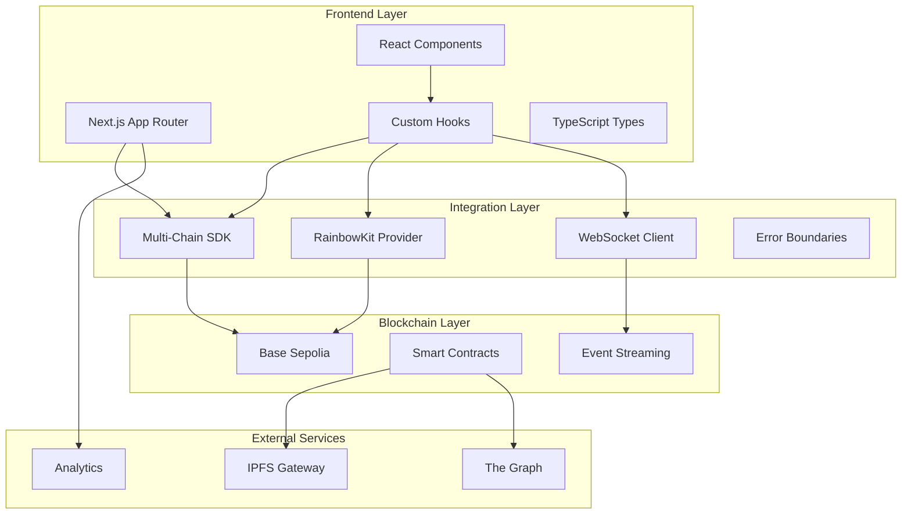
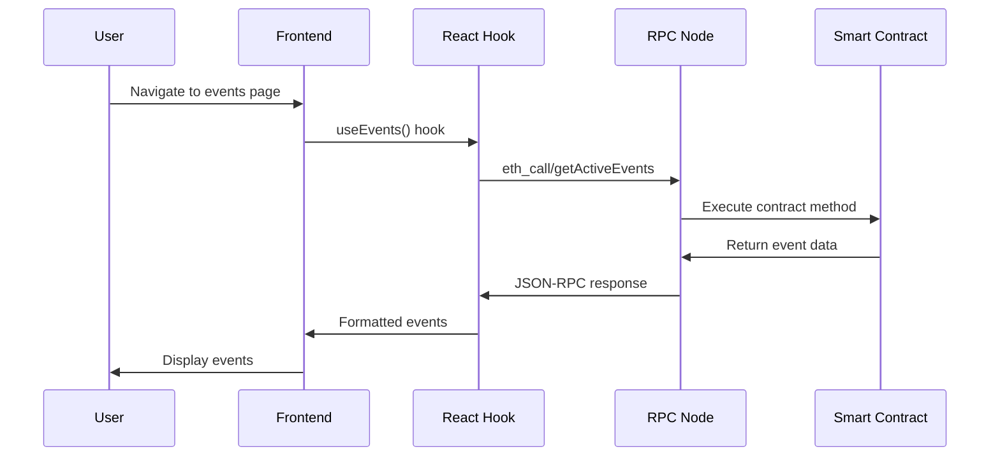
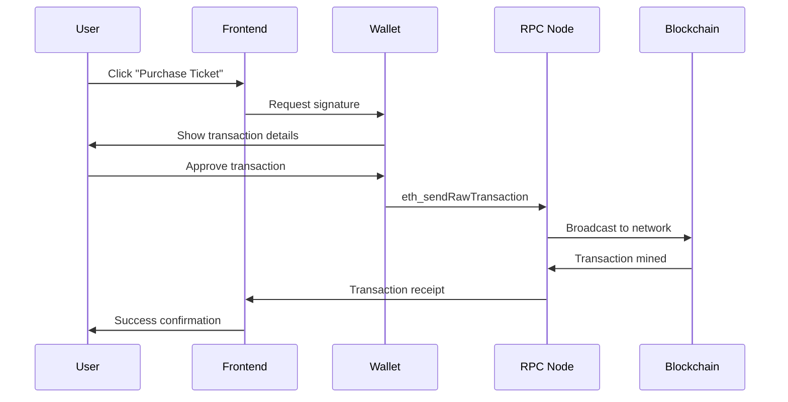
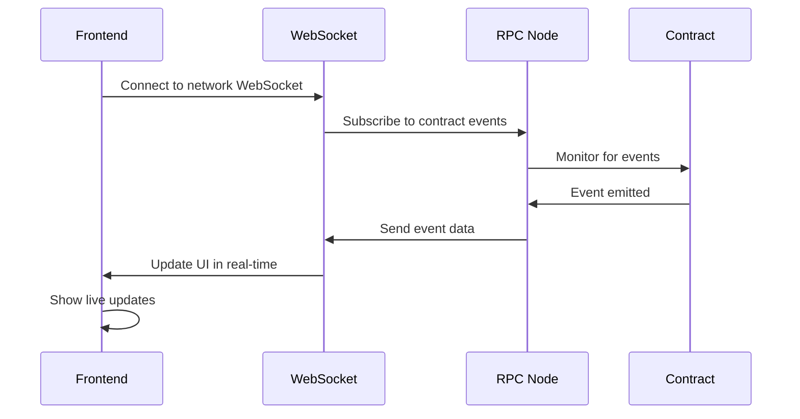

# 🔗 Multi-Chain Integration Documentation

<div align="center">


**Complete integration guide for Echain multi-chain platform components**

*Direct RPC Integration • Multi-Chain Wallet Support • Cross-Chain Bridge • Real-time Events • External Services*

[🏗️ Architecture](#-architecture-overview) • [🔧 Setup](#-setup--configuration) • [📚 SDK Integration](#-sdk-integration) • [🎣 React Hooks](#-react-hooks) • [🔄 Real-time Events](#-real-time-events) • [🧪 Testing](#-testing-strategy)

</div>

---

## 🎯 Integration Overview

### Current Implementation Status
- **✅ Multi-Chain RPC**: Direct integration with Base, Polkadot, and Cardano networks
- **✅ Wallet Integration**: RainbowKit + Reown for seamless multi-chain wallet connections
- **✅ Cross-Chain Bridge**: Asset transfers between networks
- **✅ Real-time Events**: WebSocket streaming for live updates across chains
- **✅ Type Safety**: Complete TypeScript integration with contract ABIs
- **✅ Error Handling**: Comprehensive fallback mechanisms and error recovery
- **✅ Production Ready**: Deployed across testnets with monitoring

## 🎯 Integration Overview

### Current Implementation Status
- **✅ Multi-Chain RPC**: Direct integration with Base, Polkadot, and Cardano networks
- **✅ Wallet Integration**: RainbowKit + Reown for seamless multi-chain wallet connections
- **✅ Cross-Chain Bridge**: Asset transfers between networks
- **✅ Real-time Events**: WebSocket streaming for live updates across chains
- **✅ Type Safety**: Complete TypeScript integration with contract ABIs
- **✅ Error Handling**: Comprehensive fallback mechanisms and error recovery
- **✅ Production Ready**: Deployed across testnets with monitoring

### Advanced Integration Patterns

#### Circuit Breaker Pattern
```typescript
// lib/circuit-breaker.ts - Advanced error handling
export class CircuitBreaker {
  private failures = 0;
  private lastFailureTime = 0;
  private state: 'CLOSED' | 'OPEN' | 'HALF_OPEN' = 'CLOSED';

  constructor(
    private failureThreshold = 5,

### Advanced Integration Patterns

#### Circuit Breaker Pattern
```typescript
// lib/circuit-breaker.ts - Advanced error handling
export class CircuitBreaker {
  private failures = 0;
  private lastFailureTime = 0;
  private state: 'CLOSED' | 'OPEN' | 'HALF_OPEN' = 'CLOSED';

  constructor(
    private failureThreshold = 5,
    private recoveryTimeout = 60000,
    private monitoringPeriod = 300000
  ) {}

  async execute<T>(operation: () => Promise<T>): Promise<T> {
    if (this.state === 'OPEN') {
      if (Date.now() - this.lastFailureTime > this.recoveryTimeout) {
        this.state = 'HALF_OPEN';
      } else {
        throw new Error('Circuit breaker is OPEN');
      }
    }

    try {
      const result = await operation();
      this.onSuccess();
      return result;
    } catch (error) {
      this.onFailure();
      throw error;
    }
  }

  private onSuccess() {
    this.failures = 0;
    this.state = 'CLOSED';
  }

  private onFailure() {
    this.failures++;
    this.lastFailureTime = Date.now();

    if (this.failures >= this.failureThreshold) {
      this.state = 'OPEN';
    }
  }

  getState() {
    return this.state;
  }
}
```

#### Request Batching Strategy
```typescript
// lib/batch-requests.ts - Optimize multiple contract calls
export class ContractBatchProcessor {
  private queue: Array<{
    id: string;
    contract: string;
    method: string;
    args: any[];
    resolve: (value: any) => void;
    reject: (error: any) => void;
  }> = [];

  private processing = false;
  private batchSize = 10;
  private batchTimeout = 100; // ms

  async addToBatch(
    contract: string,
    method: string,
    args: any[] = []
  ): Promise<any> {
    return new Promise((resolve, reject) => {
      const id = `${Date.now()}-${Math.random()}`;

      this.queue.push({
        id,
        contract,
        method,
        args,
        resolve,
        reject,
      });

      this.scheduleProcessing();
    });
  }

  private scheduleProcessing() {
    if (this.processing) return;

    if (this.queue.length >= this.batchSize) {
      this.processBatch();
    } else {
      setTimeout(() => {
        if (this.queue.length > 0) {
          this.processBatch();
        }
      }, this.batchTimeout);
    }
  }

  private async processBatch() {
    if (this.processing || this.queue.length === 0) return;

    this.processing = true;
    const batch = this.queue.splice(0, this.batchSize);

    try {
      // Execute batch of contract calls
      const results = await Promise.allSettled(
        batch.map(async (item) => {
          try {
            const result = await multichainClient.readContract(
              CONTRACT_ADDRESSES[item.contract as keyof typeof CONTRACT_ADDRESSES],
              item.contract,
              item.method,
              item.args
            );
            return { id: item.id, result };
          } catch (error) {
            return { id: item.id, error };
          }
        })
      );

      // Resolve/reject individual promises
      results.forEach((result, index) => {
        const item = batch[index];
        if (result.status === 'fulfilled') {
          if ('error' in result.value) {
            item.reject(result.value.error);
          } else {
            item.resolve(result.value.result);
          }
        } else {
          item.reject(result.reason);
        }
      });
    } finally {
      this.processing = false;

      // Process remaining items if any
      if (this.queue.length > 0) {
        setTimeout(() => this.processBatch(), 0);
      }
    }
  }
}
```

#### Connection Pooling for WebSockets
```typescript
// lib/websocket/pool.ts - WebSocket connection management
export class WebSocketPool {
  private connections: Map<string, WebSocket> = new Map();
  private maxConnections = 5;
  private connectionQueue: Array<{
    url: string;
    resolve: (ws: WebSocket) => void;
    reject: (error: any) => void;
  }> = [];

  async getConnection(url: string): Promise<WebSocket> {
    // Return existing connection if available
    if (this.connections.has(url)) {
      const ws = this.connections.get(url)!;
      if (ws.readyState === WebSocket.OPEN) {
        return ws;
      } else {
        this.connections.delete(url);
      }
    }

    // Check connection limit
    if (this.connections.size >= this.maxConnections) {
      return new Promise((resolve, reject) => {
        this.connectionQueue.push({ url, resolve, reject });
      });
    }

    // Create new connection
    return this.createConnection(url);
  }

  private async createConnection(url: string): Promise<WebSocket> {
    return new Promise((resolve, reject) => {
      const ws = new WebSocket(url);

      ws.onopen = () => {
        this.connections.set(url, ws);
        resolve(ws);

        // Process queued connections
        this.processQueue();
      };

      ws.onerror = (error) => {
        reject(error);
      };

      ws.onclose = () => {
        this.connections.delete(url);
        this.processQueue();
      };
    });
  }

  private processQueue() {
    if (this.connectionQueue.length === 0) return;

    const { url, resolve, reject } = this.connectionQueue.shift()!;

    if (this.connections.size < this.maxConnections) {
      this.createConnection(url).then(resolve).catch(reject);
    } else {
      // Re-queue if still at limit
      this.connectionQueue.unshift({ url, resolve, reject });
    }
  }

  closeAll() {
    for (const ws of this.connections.values()) {
      ws.close();
    }
    this.connections.clear();

    // Reject all queued connections
    for (const { reject } of this.connectionQueue) {
      reject(new Error('Connection pool closed'));
    }
    this.connectionQueue.length = 0;
  }
}
```

### Advanced React Hooks

#### Optimistic Updates Hook
```typescript
// lib/hooks/useOptimisticUpdate.ts - Optimistic UI updates
export function useOptimisticUpdate<T>(
  queryKey: string[],
  updateFn: (currentData: T, newData: Partial<T>) => T
) {
  const queryClient = useQueryClient();

  const optimisticUpdate = useCallback(
    (newData: Partial<T>, rollbackData?: T) => {
      // Cancel any outgoing refetches
      queryClient.cancelQueries({ queryKey });

      // Snapshot previous value
      const previousData = queryClient.getQueryData<T>(queryKey);

      // Optimistically update
      queryClient.setQueryData<T>(queryKey, (currentData) => {
        if (!currentData) return currentData;
        return updateFn(currentData, newData);
      });

      // Return rollback function
      return () => {
        queryClient.setQueryData(queryKey, rollbackData || previousData);
      };
    },
    [queryClient, queryKey, updateFn]
  );

  return optimisticUpdate;
}
```

#### Advanced Event Hook with Caching
```typescript
// lib/hooks/useEventWithCache.ts - Cached event management
export function useEventWithCache(eventId: number) {
  const queryClient = useQueryClient();
  const optimisticUpdate = useOptimisticUpdate(
    ['event', eventId],
    (current, updates) => ({ ...current, ...updates })
  );

  const { data: event, ...queryState } = useQuery({
    queryKey: ['event', eventId],
    queryFn: () => multichainClient.readContract(
      CONTRACT_ADDRESSES.EventFactory,
      'EventFactory',
      'getEvent',
      [eventId]
    ),
    staleTime: 5 * 60 * 1000, // 5 minutes
    cacheTime: 30 * 60 * 1000, // 30 minutes
    refetchOnWindowFocus: false,
    refetchOnReconnect: true,
  });

  const updateEvent = useMutation({
    mutationFn: async (updates: Partial<Event>) => {
      // Optimistically update UI
      const rollback = optimisticUpdate(updates);

      try {
        // Make actual contract call
        const result = await multichainClient.writeContract(
          CONTRACT_ADDRESSES.EventFactory,
          'EventFactory',
          'updateEvent',
          [eventId, updates]
        );

        // Update cache with server response
        queryClient.setQueryData(['event', eventId], result);

        return result;
      } catch (error) {
        // Rollback on error
        rollback();
        throw error;
      }
    },
  });

  return {
    event,
    ...queryState,
    updateEvent: updateEvent.mutate,
    isUpdating: updateEvent.isPending,
  };
}
```

#### Infinite Scroll Hook for Events
```typescript
// lib/hooks/useInfiniteEvents.ts - Infinite scroll events
export function useInfiniteEvents(options?: {
  organizer?: string;
  category?: string;
  limit?: number;
}) {
  return useInfiniteQuery({
    queryKey: ['events', 'infinite', options],
    queryFn: async ({ pageParam = 0 }) => {
      const result = await multichainClient.readContract(
        CONTRACT_ADDRESSES.EventFactory,
        'EventFactory',
        'getEvents',
        [
          pageParam,
          options?.limit || 20,
          options?.organizer || ethers.constants.AddressZero,
          options?.category || ''
        ]
      );

      return {
        events: result.events,
        nextCursor: result.hasMore ? pageParam + (options?.limit || 20) : undefined,
      };
    },
    getNextPageParam: (lastPage) => lastPage.nextCursor,
    staleTime: 2 * 60 * 1000, // 2 minutes
  });
}
```

### Advanced Error Handling

#### Retry Strategies
```typescript
// lib/retry.ts - Advanced retry logic
export class RetryManager {
  static async withRetry<T>(
    operation: () => Promise<T>,
    options: {
      maxAttempts?: number;
      baseDelay?: number;
      maxDelay?: number;
      backoffFactor?: number;
      retryCondition?: (error: any) => boolean;
    } = {}
  ): Promise<T> {
    const {
      maxAttempts = 3,
      baseDelay = 1000,
      maxDelay = 30000,
      backoffFactor = 2,
      retryCondition = () => true,
    } = options;

    let lastError: any;

    for (let attempt = 1; attempt <= maxAttempts; attempt++) {
      try {
        return await operation();
      } catch (error) {
        lastError = error;

        // Don't retry if condition fails
        if (!retryCondition(error)) {
          throw error;
        }

        // Don't delay on last attempt
        if (attempt === maxAttempts) {
          throw error;
        }

        // Calculate delay with exponential backoff
        const delay = Math.min(
          baseDelay * Math.pow(backoffFactor, attempt - 1),
          maxDelay
        );

        // Add jitter to prevent thundering herd
        const jitteredDelay = delay * (0.5 + Math.random() * 0.5);

        await new Promise(resolve => setTimeout(resolve, jitteredDelay));
      }
    }

    throw lastError;
  }

  static isRetryableError(error: any): boolean {
    // Retry on network errors
    if (error.code === 'NETWORK_ERROR') return true;

    // Retry on 5xx server errors
    if (error.response?.status >= 500) return true;

    // Retry on rate limiting
    if (error.response?.status === 429) return true;

    // Don't retry on client errors
    if (error.response?.status >= 400 && error.response?.status < 500) {
      return false;
    }

    // Retry on timeout
    if (error.code === 'TIMEOUT') return true;

    return false;
  }
}
```

#### Fallback Mechanisms
```typescript
// lib/fallback.ts - Multi-level fallback system
export class FallbackManager {
  private fallbacks: Array<{
    name: string;
    condition: (error: any) => boolean;
    handler: () => Promise<any>;
  }> = [];

  addFallback(
    name: string,
    condition: (error: any) => boolean,
    handler: () => Promise<any>
  ) {
    this.fallbacks.push({ name, condition, handler });
  }

  async executeWithFallback<T>(
    primaryOperation: () => Promise<T>,
    context?: string
  ): Promise<T> {
    try {
      return await primaryOperation();
    } catch (error) {
      console.warn(`Primary operation failed${context ? ` for ${context}` : ''}:`, error);

      for (const fallback of this.fallbacks) {
        if (fallback.condition(error)) {
          try {
            console.log(`Attempting fallback: ${fallback.name}`);
            return await fallback.handler();
          } catch (fallbackError) {
            console.warn(`Fallback ${fallback.name} also failed:`, fallbackError);
            continue;
          }
        }
      }

      throw error;
    }
  }
}

// Usage example
const eventFallbacks = new FallbackManager();

// Fallback to cached data
eventFallbacks.addFallback(
  'cached-data',
  (error) => error.code === 'NETWORK_ERROR',
  async () => {
    const cached = localStorage.getItem('events-cache');
    return cached ? JSON.parse(cached) : [];
  }
);

// Fallback to mock data
eventFallbacks.addFallback(
  'mock-data',
  () => true, // Always try as last resort
  async () => {
    return [
      {
        id: 1,
        name: 'Service Temporarily Unavailable',
        ticketPrice: '0',
        maxTickets: 0,
        isActive: false,
      },
    ];
  }
);
```

### Performance Optimization

#### Query Batching and Deduplication
```typescript
// lib/query-batcher.ts - Batch multiple queries
export class QueryBatcher {
  private queryQueue: Map<string, {
    query: () => Promise<any>;
    resolve: (value: any) => void;
    reject: (error: any) => void;
  }> = new Map();

  private batchTimeout: NodeJS.Timeout | null = null;
  private readonly batchDelay = 50; // ms

  async batchQuery<T>(
    key: string,
    queryFn: () => Promise<T>
  ): Promise<T> {
    return new Promise((resolve, reject) => {
      // If query already in progress, wait for it
      if (this.queryQueue.has(key)) {
        this.queryQueue.get(key)!.resolve = resolve;
        this.queryQueue.get(key)!.reject = reject;
        return;
      }

      // Add to queue
      this.queryQueue.set(key, {
        query: queryFn,
        resolve,
        reject,
      });

      // Schedule batch execution
      this.scheduleBatch();
    });
  }

  private scheduleBatch() {
    if (this.batchTimeout) return;

    this.batchTimeout = setTimeout(() => {
      this.executeBatch();
    }, this.batchDelay);
  }

  private async executeBatch() {
    const queries = Array.from(this.queryQueue.entries());
    this.queryQueue.clear();
    this.batchTimeout = null;

    // Execute all queries in parallel
    const results = await Promise.allSettled(
      queries.map(([key, { query }]) => query())
    );

    // Resolve/reject promises
    results.forEach((result, index) => {
      const [key, { resolve, reject }] = queries[index];

      if (result.status === 'fulfilled') {
        resolve(result.value);
      } else {
        reject(result.reason);
      }
    });
  }
}
```

#### Memory Management and Cleanup
```typescript
// lib/memory-manager.ts - Memory optimization
export class MemoryManager {
  private static instance: MemoryManager;
  private cache = new Map<string, {
    data: any;
    timestamp: number;
    ttl: number;
  }>();

  private cleanupInterval: NodeJS.Timeout | null = null;

  static getInstance(): MemoryManager {
    if (!MemoryManager.instance) {
      MemoryManager.instance = new MemoryManager();
    }
    return MemoryManager.instance;
  }

  set(key: string, data: any, ttl = 5 * 60 * 1000) { // 5 minutes default
    this.cache.set(key, {
      data,
      timestamp: Date.now(),
      ttl,
    });

    this.scheduleCleanup();
  }

  get<T>(key: string): T | null {
    const item = this.cache.get(key);

    if (!item) return null;

    if (Date.now() - item.timestamp > item.ttl) {
      this.cache.delete(key);
      return null;
    }

    return item.data;
  }

  private scheduleCleanup() {
    if (this.cleanupInterval) return;

    this.cleanupInterval = setInterval(() => {
      const now = Date.now();

      for (const [key, item] of this.cache.entries()) {
        if (now - item.timestamp > item.ttl) {
          this.cache.delete(key);
        }
      }

      // Clear interval if cache is empty
      if (this.cache.size === 0) {
        if (this.cleanupInterval) {
          clearInterval(this.cleanupInterval);
          this.cleanupInterval = null;
        }
      }
    }, 60 * 1000); // Clean up every minute
  }

  clear() {
    this.cache.clear();
    if (this.cleanupInterval) {
      clearInterval(this.cleanupInterval);
      this.cleanupInterval = null;
    }
  }
}
```

### Integration Components


---

## 🏗️ Architecture Overview

### Multi-Layer Integration Architecture

#### Frontend Integration Layer
```typescript
// lib/providers.tsx - Main provider setup
export function Providers({ children }: { children: React.ReactNode }) {
  return (
    <WagmiProvider config={config}>
      <QueryClientProvider client={queryClient}>
        <RainbowKitProvider theme={rainbowTheme}>
          <ThemeProvider>
            <ErrorBoundary>
              {children}
            </ErrorBoundary>
          </ThemeProvider>
        </RainbowKitProvider>
      </QueryClientProvider>
    </WagmiProvider>
  );
}
```

#### API Abstraction Layer
```typescript
// lib/multichain/client.ts - Multi-chain client configuration
export const multichainClient = new MultiChainClient({
  baseRpcUrl: process.env.NEXT_PUBLIC_BASE_RPC_URL!,
  polkadotRpcUrl: process.env.NEXT_PUBLIC_POLKADOT_RPC_URL!,
  cardanoRpcUrl: process.env.NEXT_PUBLIC_CARDANO_RPC_URL!,
  bridgeApiUrl: process.env.NEXT_PUBLIC_BRIDGE_API_URL!,
});
```

#### Real-time Event Layer
```typescript
// lib/websocket/events.ts - WebSocket event handling
export class MultiChainEventWebSocketManager {
  private connections: Map<string, WebSocket> = new Map();

  connect(network: string, eventId?: string) {
    const wsUrl = this.getWebSocketUrl(network);
    if (eventId) {
      wsUrl.searchParams.set('eventId', eventId);
    }

    const ws = new WebSocket(wsUrl.toString());
    this.connections.set(network, ws);

    ws.onmessage = (event) => {
      const data = JSON.parse(event.data);
      data.network = network; // Add network context
      this.handleEventMessage(data);
    };
  }

  private getWebSocketUrl(network: string): URL {
    switch (network) {
      case 'base':
        return new URL(process.env.NEXT_PUBLIC_BASE_WS_URL!);
      case 'polkadot':
        return new URL(process.env.NEXT_PUBLIC_POLKADOT_WS_URL!);
      case 'cardano':
        return new URL(process.env.NEXT_PUBLIC_CARDANO_WS_URL!);
      default:
        throw new Error(`Unsupported network: ${network}`);
    }
  }
}
```

### Data Flow Patterns

#### Read Operations (Direct RPC)


#### Write Operations (Transaction)


#### Real-time Updates (WebSocket)


---

## 🔧 Setup & Configuration

### Environment Configuration

#### Required Environment Variables
```env
# ============================================================================
# MULTI-CHAIN RPC CONFIGURATION
# ============================================================================

# Base Network (Ethereum L2)
NEXT_PUBLIC_BASE_RPC_URL=https://sepolia.base.org
NEXT_PUBLIC_BASE_WS_URL=wss://sepolia.base.org/ws
NEXT_PUBLIC_BASE_CHAIN_ID=84532

# Polkadot Network (Substrate)
NEXT_PUBLIC_POLKADOT_RPC_URL=wss://rococo-rpc.polkadot.io
NEXT_PUBLIC_POLKADOT_WS_URL=wss://rococo-rpc.polkadot.io

# Cardano Network (eUTXO)
NEXT_PUBLIC_CARDANO_RPC_URL=https://preview-api.cardano.org
NEXT_PUBLIC_CARDANO_WS_URL=wss://preview-api.cardano.org/ws

# Cross-Chain Bridge
NEXT_PUBLIC_BRIDGE_API_URL=https://api.multichain.org

# ============================================================================
# WALLET CONFIGURATION
# ============================================================================

# Reown Project ID (get from https://cloud.reown.com/)
NEXT_PUBLIC_REOWN_PROJECT_ID=your-reown-project-id

# ============================================================================
# CONTRACT ADDRESSES (Multi-Chain)
# ============================================================================

# Base Sepolia
NEXT_PUBLIC_BASE_EVENT_FACTORY_ADDRESS=0xbE36039Bfe7f48604F73daD61411459B17fd2e85
NEXT_PUBLIC_BASE_INCENTIVE_MANAGER_ADDRESS=0x8290c12f874DF9D03FDadAbE10C7c6321B69Ded9

# Polkadot Rococo
NEXT_PUBLIC_POLKADOT_EVENT_FACTORY_ADDRESS=5FHneW46xGXgs5mUiveU4sbTyGBzmstUspZC92UhjJM694ty
NEXT_PUBLIC_POLKADOT_INCENTIVE_MANAGER_ADDRESS=5FLSigC9HGRKVhB9FiEo4Y3koPsNmBmLJbpXg2mp1hXcS7Hm

# Cardano Preview
NEXT_PUBLIC_CARDANO_EVENT_FACTORY_ADDRESS=addr1qxqs59lphg8g6qndelq8xwqn60ag3aeyfcp33c2kdp46a429mgz6rfs8r9e5v9y8zy3ky9q8z6j3z6j3z6j3z6j3z6j3z6j3z
NEXT_PUBLIC_CARDANO_INCENTIVE_MANAGER_ADDRESS=addr1qy2jt0qpqz2z2z2z2z2z2z2z2z2z2z2z2z2z2z2z2z2z2z2z2z2z2z2z2z2z2z2z2z2z2z2z2z2z2z2z2z2z2z2z2z

# ============================================================================
# NETWORK CONFIGURATION
# ============================================================================

NEXT_PUBLIC_DEFAULT_CHAIN_ID=84532
NEXT_PUBLIC_SUPPORTED_CHAINS=84532,rococo,preview
```

### Multi-Chain Setup Steps

#### 1. Configure Network RPC Endpoints
```bash
# Set up environment variables for all networks
export NEXT_PUBLIC_BASE_RPC_URL=https://sepolia.base.org
export NEXT_PUBLIC_POLKADOT_RPC_URL=wss://rococo-rpc.polkadot.io
export NEXT_PUBLIC_CARDANO_RPC_URL=https://preview-api.cardano.org
export NEXT_PUBLIC_BRIDGE_API_URL=https://api.multichain.org
```

#### 2. Deploy Contracts via Direct RPC
```typescript
// scripts/deploy-multichain.ts
import { createPublicClient, http } from 'viem';
import { baseSepolia } from 'viem/chains';

const client = createPublicClient({
  chain: baseSepolia,
  transport: http(process.env.BASE_RPC_URL)
});

async function deployContracts() {
  // Deploy EventFactory
  const factoryHash = await client.deployContract({
    abi: EventFactoryABI,
    bytecode: EventFactoryBytecode,
    args: []
  });

  console.log('EventFactory deployed:', factoryHash);

  // Deploy IncentiveManager
  const incentiveHash = await client.deployContract({
    abi: IncentiveManagerABI,
    bytecode: IncentiveManagerBytecode,
    args: [factoryAddress]
  });

  console.log('IncentiveManager deployed:', incentiveHash);
}
```

#### 3. Configure Multi-Chain Wallets
```typescript
// In wallet configuration: Support multiple networks
const supportedChains = [baseSepolia, rococoTestnet, cardanoPreview];
```

### Multi-Chain Wallet Integration Setup

#### RainbowKit Multi-Chain Configuration
```typescript
// lib/wagmi.ts
import { getDefaultConfig } from '@rainbow-me/rainbowkit';
import { baseSepolia } from 'wagmi/chains';
import { polkadotRococo, cardanoPreview } from './customChains';

export const config = getDefaultConfig({
  appName: 'Echain',
  projectId: process.env.NEXT_PUBLIC_REOWN_PROJECT_ID!,
  chains: [baseSepolia, polkadotRococo, cardanoPreview],
  ssr: true,
});
```

#### Cross-Chain Theme Integration
```typescript
// lib/rainbow-theme.ts
import { darkTheme, lightTheme } from '@rainbow-me/rainbowkit';

export const getRainbowTheme = (isDark: boolean, network: string) =>
  isDark
    ? darkTheme({
        accentColor: network === 'base' ? '#0052FF' :
                    network === 'polkadot' ? '#E6007A' : '#0033AD',
        accentColorForeground: 'white',
        borderRadius: 'medium',
      })
    : lightTheme({
        accentColor: network === 'base' ? '#0052FF' :
                    network === 'polkadot' ? '#E6007A' : '#0033AD',
        accentColorForeground: 'white',
        borderRadius: 'medium',
      });
```

---

## 📚 SDK Integration

### Multi-Chain SDK Installation
```bash
npm install viem @wagmi/core @wagmi/vue @polkadot/api @emurgo/cardano-serialization-lib
# or
yarn add viem @wagmi/core @wagmi/vue @polkadot/api @emurgo/cardano-serialization-lib
```

### Core Multi-Chain Client Setup
```typescript
// lib/multichain/client.ts
import { createPublicClient, createWalletClient, http } from 'viem';
import { baseSepolia } from 'viem/chains';
import { ApiPromise, WsProvider } from '@polkadot/api';
import { Blockfrost, Lucid } from 'lucid-cardano';

export class MultiChainClient {
  private baseClient: any;
  private polkadotClient: any;
  private cardanoClient: any;

  constructor(options: {
    baseRpcUrl: string;
    polkadotRpcUrl: string;
    cardanoRpcUrl: string;
  }) {
    // Base client (Ethereum L2)
    this.baseClient = createPublicClient({
      chain: baseSepolia,
      transport: http(options.baseRpcUrl)
    });

    // Polkadot client (Substrate)
    this.polkadotClient = new ApiPromise({
      provider: new WsProvider(options.polkadotRpcUrl)
    });

    // Cardano client (eUTXO)
    this.cardanoClient = await Lucid.new(
      new Blockfrost(options.cardanoRpcUrl, process.env.BLOCKFROST_API_KEY!),
      'Preview'
    );
  }

  // Unified contract read across networks
  async readContract(network: string, address: string, functionName: string, args: any[] = []) {
    switch (network) {
      case 'base':
        return this.baseClient.readContract({
          address,
          abi: this.getContractABI(network, address),
          functionName,
          args
        });

      case 'polkadot':
        // Polkadot contract call logic
        const contract = new ContractPromise(this.polkadotClient, this.getContractABI(network, address), address);
        return contract.query[functionName](...args);

      case 'cardano':
        // Cardano contract call logic
        const script = this.getContractABI(network, address);
        return this.cardanoClient.executeScript(script, args);

      default:
        throw new Error(`Unsupported network: ${network}`);
    }
  }

  // Unified contract write across networks
  async writeContract(network: string, address: string, functionName: string, args: any[] = []) {
    // Similar implementation for write operations
  }
}
```

### Contract Interaction Examples

#### Reading Contract Data Across Networks
```typescript
// Get active events from Base network
const baseEvents = await multichainClient.readContract(
  'base',
  CONTRACT_ADDRESSES.base.EventFactory,
  'getActiveEvents',
  [0, 50] // offset, limit
);

// Get active events from Polkadot network
const polkadotEvents = await multichainClient.readContract(
  'polkadot',
  CONTRACT_ADDRESSES.polkadot.EventFactory,
  'getActiveEvents',
  [0, 50]
);

// Get active events from Cardano network
const cardanoEvents = await multichainClient.readContract(
  'cardano',
  CONTRACT_ADDRESSES.cardano.EventFactory,
  'getActiveEvents',
  [0, 50]
);
```

#### Writing to Contracts Across Networks
```typescript
// Create new event on Base
const createEventTx = await multichainClient.writeContract(
  'base',
  CONTRACT_ADDRESSES.base.EventFactory,
  'createEvent',
  [
    'Summer Music Festival',
    'ipfs://Qm...',
    ethers.utils.parseEther('0.1'), // 0.1 ETH
    1000, // max tickets
    Math.floor(Date.now() / 1000) + 86400, // tomorrow
    Math.floor(Date.now() / 1000) + 86400 * 2 // day after
  ]
);

// Create new event on Polkadot
const polkadotTx = await multichainClient.writeContract(
  'polkadot',
  CONTRACT_ADDRESSES.polkadot.EventFactory,
  'createEvent',
  [eventData]
);

// Create new event on Cardano
const cardanoTx = await multichainClient.writeContract(
  'cardano',
  CONTRACT_ADDRESSES.cardano.EventFactory,
  'createEvent',
  [eventData]
);
```

#### Cross-Chain Bridge Transfers
```typescript
// Transfer assets between networks
const bridgeTransfer = await multichainClient.bridgeTransfer({
  fromNetwork: 'base',
  toNetwork: 'polkadot',
  asset: 'ETH',
  amount: '0.1',
  recipient: polkadotAddress
});
```

---

## 🎣 React Hooks

### Custom Multi-Chain Hook Architecture
```typescript
// lib/hooks/useContract.ts - Base contract hook
export function useContract<T>(
  network: string,
  address: string,
  functionName: string,
  args: any[] = [],
  options?: {
    enabled?: boolean;
    refetchInterval?: number;
    onSuccess?: (data: T) => void;
    onError?: (error: Error) => void;
  }
) {
  return useQuery({
    queryKey: ['contract', network, address, functionName, ...args],
    queryFn: () => multichainClient.readContract(network, address, functionName, args),
    enabled: options?.enabled ?? true,
    refetchInterval: options?.refetchInterval,
    onSuccess: options?.onSuccess,
    onError: options?.onError,
    retry: (failureCount, error) => {
      // Don't retry on user errors (4xx)
      if (error?.response?.status >= 400 && error?.response?.status < 500) {
        return false;
      }
      return failureCount < 3;
    },
  });
}
```

### Multi-Chain Event Management Hooks
```typescript
// app/hooks/useEvents.ts
export function useEvents(network: string, options?: {
  limit?: number;
  offset?: number;
  organizer?: string;
}) {
  return useContract(
    network,
    CONTRACT_ADDRESSES[network].EventFactory,
    'getActiveEvents',
    [options?.offset ?? 0, options?.limit ?? 20]
  );
}

export function useEvent(network: string, eventId: number) {
  return useContract(
    network,
    CONTRACT_ADDRESSES[network].EventFactory,
    'getEvent',
    [eventId],
    {
      enabled: !!eventId,
    }
  );
}

export function useCreateEvent(network: string) {
  const queryClient = useQueryClient();

  return useMutation({
    mutationFn: async (eventData: CreateEventParams) => {
      const result = await multichainClient.writeContract(
        network,
        CONTRACT_ADDRESSES[network].EventFactory,
        'createEvent',
        [
          eventData.name,
          eventData.metadataURI,
          eventData.ticketPrice,
          eventData.maxTickets,
          eventData.startTime,
          eventData.endTime,
        ]
      );

      return result;
    },
    onSuccess: () => {
      // Invalidate and refetch events for this network
      queryClient.invalidateQueries({ queryKey: ['contract', network] });
    },
  });
}
```

### Cross-Chain Ticket Management Hooks
```typescript
// app/hooks/useTickets.ts
export function useUserTickets(network: string, userAddress?: string) {
  const { address } = useAccount();

  return useContract(
    network,
    CONTRACT_ADDRESSES[network].EventFactory,
    'getUserTickets',
    [userAddress || address],
    {
      enabled: !!(userAddress || address),
    }
  );
}

export function usePurchaseTickets(network: string) {
  const queryClient = useQueryClient();

  return useMutation({
    mutationFn: async ({
      eventId,
      quantity,
      recipient
    }: PurchaseTicketsParams) => {
      // Get ticket price from event
      const event = await multichainClient.readContract(
        network,
        CONTRACT_ADDRESSES[network].EventFactory,
        'getEvent',
        [eventId]
      );

      const totalCost = this.calculateCost(network, event.ticketPrice, quantity);

      // Purchase tickets
      const result = await multichainClient.writeContract(
        network,
        CONTRACT_ADDRESSES[network].EventFactory,
        'purchaseTickets',
        [eventId, quantity, recipient],
        {
          value: totalCost.toString(),
        }
      );

      return result;
    },
    onSuccess: () => {
      queryClient.invalidateQueries({ queryKey: ['contract', network] });
    },
  });
}
```

### Cross-Chain Bridge Hooks
```typescript
// app/hooks/useBridge.ts
export function useBridgeTransfer() {
  return useMutation({
    mutationFn: async ({
      fromNetwork,
      toNetwork,
      asset,
      amount,
      recipient
    }: BridgeTransferParams) => {
      return multichainClient.bridgeTransfer({
        fromNetwork,
        toNetwork,
        asset,
        amount,
        recipient
      });
    },
  });
}

export function useBridgeStatus(transferId: string) {
  return useQuery({
    queryKey: ['bridge', 'status', transferId],
    queryFn: () => multichainClient.getBridgeStatus(transferId),
    enabled: !!transferId,
    refetchInterval: 10000, // Poll every 10 seconds
  });
}
```

---

## 🔄 Real-time Events

### Multi-Chain WebSocket Integration
```typescript
// lib/websocket/multichain-events.ts
export class MultiChainEventWebSocketManager {
  private connections: Map<string, WebSocket> = new Map();
  private reconnectAttempts = 0;
  private maxReconnectAttempts = 5;
  private listeners: Map<string, (data: any) => void> = new Map();

  connect(network: string, options?: { eventId?: string; contractAddress?: string }) {
    const wsUrl = this.getWebSocketUrl(network);

    if (options?.contractAddress) {
      wsUrl.searchParams.set('address', options.contractAddress);
    }

    const ws = new WebSocket(wsUrl.toString());
    this.connections.set(network, ws);

    ws.onopen = () => {
      console.log(`${network} WebSocket connected`);
      this.reconnectAttempts = 0;
    };

    ws.onmessage = (event) => {
      try {
        const data = JSON.parse(event.data);
        data.network = network; // Add network context
        this.handleEventMessage(data);
      } catch (error) {
        console.error(`Failed to parse ${network} WebSocket message:`, error);
      }
    };

    ws.onclose = () => {
      console.log(`${network} WebSocket disconnected`);
      this.handleReconnect(network);
    };

    ws.onerror = (error) => {
      console.error(`${network} WebSocket error:`, error);
    };
  }

  private getWebSocketUrl(network: string): URL {
    switch (network) {
      case 'base':
        return new URL(process.env.NEXT_PUBLIC_BASE_WS_URL!);
      case 'polkadot':
        return new URL(process.env.NEXT_PUBLIC_POLKADOT_WS_URL!);
      case 'cardano':
        return new URL(process.env.NEXT_PUBLIC_CARDANO_WS_URL!);
      default:
        throw new Error(`Unsupported network: ${network}`);
    }
  }

  private handleEventMessage(data: any) {
    const eventType = data.eventType;
    const listener = this.listeners.get(eventType);

    if (listener) {
      listener(data);
    }

    // Broadcast to all listeners for this event type
    this.listeners.forEach((callback, key) => {
      if (key === eventType || key === '*') {
        callback(data);
      }
    });
  }

  private handleReconnect(network: string) {
    if (this.reconnectAttempts < this.maxReconnectAttempts) {
      this.reconnectAttempts++;
      const delay = Math.min(1000 * Math.pow(2, this.reconnectAttempts), 30000);

      setTimeout(() => {
        console.log(`Attempting to reconnect ${network} (${this.reconnectAttempts}/${this.maxReconnectAttempts})`);
        this.connect(network);
      }, delay);
    }
  }

  subscribe(eventType: string, callback: (data: any) => void) {
    this.listeners.set(eventType, callback);
  }

  unsubscribe(eventType: string) {
    this.listeners.delete(eventType);
  }

  disconnect(network?: string) {
    if (network) {
      const ws = this.connections.get(network);
      if (ws) {
        ws.close();
        this.connections.delete(network);
      }
    } else {
      // Disconnect all
      this.connections.forEach(ws => ws.close());
      this.connections.clear();
    }
  }
}
```

### React Hook for Multi-Chain Real-time Updates
```typescript
// app/hooks/useWebSocket.ts
export function useWebSocketEvents(network: string, eventId?: string) {
  const [events, setEvents] = useState<any[]>([]);
  const [isConnected, setIsConnected] = useState(false);
  const wsManager = useRef<MultiChainEventWebSocketManager | null>(null);

  useEffect(() => {
    wsManager.current = new MultiChainEventWebSocketManager();

    const handleConnect = () => setIsConnected(true);
    const handleDisconnect = () => setIsConnected(false);
    const handleEvent = (data: any) => {
      // Only process events for the current network
      if (data.network === network) {
        setEvents(prev => [...prev, data]);
      }
    };

    wsManager.current.subscribe('connect', handleConnect);
    wsManager.current.subscribe('disconnect', handleDisconnect);
    wsManager.current.subscribe('TicketsPurchased', handleEvent);
    wsManager.current.subscribe('EventCreated', handleEvent);
    wsManager.current.subscribe('BridgeTransfer', handleEvent);

    wsManager.current.connect(network, { eventId });

    return () => {
      wsManager.current?.disconnect(network);
    };
  }, [network, eventId]);

  return { events, isConnected };
}
```

### Multi-Chain Event Types and Handling
```typescript
// types/events.ts
export interface MultiChainContractEvent {
  eventType: string;
  network: string;
  contractAddress: string;
  transactionHash: string;
  blockNumber: number;
  logIndex: number;
  timestamp: number;
  eventData: Record<string, any>;
}

export interface TicketsPurchasedEvent extends MultiChainContractEvent {
  eventType: 'TicketsPurchased';
  eventData: {
    buyer: string;
    eventId: number;
    quantity: number;
    totalCost: string;
    tokenIds: number[];
  };
}

export interface BridgeTransferEvent extends MultiChainContractEvent {
  eventType: 'BridgeTransfer';
  eventData: {
    fromNetwork: string;
    toNetwork: string;
    asset: string;
    amount: string;
    sender: string;
    recipient: string;
    transferId: string;
  };
}

// Event handler utilities
export const eventHandlers = {
  TicketsPurchased: (event: TicketsPurchasedEvent) => {
    console.log(`Tickets purchased on ${event.network}: ${event.eventData.quantity} for event ${event.eventData.eventId}`);
    // Update UI, show notifications, etc.
  },

  BridgeTransfer: (event: BridgeTransferEvent) => {
    console.log(`Bridge transfer: ${event.eventData.amount} ${event.eventData.asset} from ${event.eventData.fromNetwork} to ${event.eventData.toNetwork}`);
    // Update bridge status, show transfer notifications, etc.
  },
};
```

---

## 🧪 Testing Strategy

### Multi-Chain Unit Testing
```typescript
// __tests__/hooks/useEvents.test.ts
import { renderHook, waitFor } from '@testing-library/react';
import { QueryClient, QueryClientProvider } from '@tanstack/react-query';
import { useEvents } from '@/hooks/useEvents';

const createWrapper = (network: string) => {
  const queryClient = new QueryClient({
    defaultOptions: {
      queries: {
        retry: false,
      },
    },
  });

  return ({ children }: { children: React.ReactNode }) => (
    <QueryClientProvider client={queryClient}>
      <NetworkProvider network={network}>
        {children}
      </NetworkProvider>
    </QueryClientProvider>
  );
};

describe('useEvents', () => {
  it('should fetch Base events successfully', async () => {
    const { result } = renderHook(() => useEvents('base'), {
      wrapper: createWrapper('base'),
    });

    await waitFor(() => {
      expect(result.current.isSuccess).toBe(true);
    });

    expect(result.current.data).toBeDefined();
    expect(Array.isArray(result.current.data)).toBe(true);
  });

  it('should handle network switching', async () => {
    const { result, rerender } = renderHook(() => useEvents('base'), {
      wrapper: createWrapper('base'),
    });

    // Switch to Polkadot
    rerender(() => useEvents('polkadot'), {
      wrapper: createWrapper('polkadot'),
    });

    await waitFor(() => {
      expect(result.current.isSuccess).toBe(true);
    });
  });
});
```

### Multi-Chain Integration Testing
```typescript
// __tests__/integration/multichain.test.ts
describe('Multi-Chain Integration', () => {
  let client: MultiChainClient;

  beforeAll(() => {
    client = new MultiChainClient({
      baseRpcUrl: process.env.TEST_BASE_RPC_URL!,
      polkadotRpcUrl: process.env.TEST_POLKADOT_RPC_URL!,
      cardanoRpcUrl: process.env.TEST_CARDANO_RPC_URL!,
    });
  });

  it('should call Base contract read function', async () => {
    const result = await client.readContract(
      'base',
      TEST_BASE_CONTRACT_ADDRESS,
      'getValue'
    );

    expect(result).toBeDefined();
    expect(typeof result).toBe('string');
  });

  it('should call Polkadot contract read function', async () => {
    const result = await client.readContract(
      'polkadot',
      TEST_POLKADOT_CONTRACT_ADDRESS,
      'getValue'
    );

    expect(result).toBeDefined();
  });

  it('should handle contract write operations', async () => {
    const txResult = await client.writeContract(
      'base',
      TEST_BASE_CONTRACT_ADDRESS,
      'setValue',
      ['42']
    );

    expect(txResult).toHaveProperty('transactionHash');
  });
});
```

### Cross-Chain E2E Testing
```typescript
// e2e/multichain-events.spec.ts
import { test, expect } from '@playwright/test';

test('should create and display event across networks', async ({ page }) => {
  // Connect wallet and switch to Base
  await page.goto('/events/create');
  await page.click('[data-testid="network-selector"]');
  await page.click('[data-testid="base-network"]');
  await page.click('[data-testid="connect-wallet"]');
  await page.click('[data-testid="metamask-wallet"]');

  // Fill event form
  await page.fill('[data-testid="event-name"]', 'Multi-Chain Music Festival');
  await page.fill('[data-testid="ticket-price"]', '0.1');
  await page.fill('[data-testid="max-tickets"]', '100');

  // Submit form
  await page.click('[data-testid="create-event"]');

  // Verify event appears in list
  await page.goto('/events');
  await expect(page.locator('text=Multi-Chain Music Festival')).toBeVisible();

  // Switch to Polkadot and verify cross-chain display
  await page.click('[data-testid="network-selector"]');
  await page.click('[data-testid="polkadot-network"]');
  await expect(page.locator('text=Multi-Chain Music Festival')).toBeVisible();
});
```

### Mock Data for Multi-Chain Testing
```typescript
// lib/mocks/multichainData.ts
export const mockEvents = {
  base: [
    {
      id: 1,
      organizer: '0x1234...',
      name: 'Base Summer Festival',
      ticketPrice: '100000000000000000', // 0.1 ETH
      maxTickets: 1000,
      soldTickets: 150,
      startTime: Date.now() + 86400000,
      endTime: Date.now() + 172800000,
      isActive: true,
    },
  ],
  polkadot: [
    {
      id: 1,
      organizer: '5FHneW46xGXgs5mUiveU4sbTyGBzmstUspZC92UhjJM694ty',
      name: 'Polkadot Music Festival',
      ticketPrice: '10000000000', // 10 DOT
      maxTickets: 500,
      soldTickets: 75,
      startTime: Date.now() + 86400000,
      endTime: Date.now() + 172800000,
      isActive: true,
    },
  ],
  cardano: [
    {
      id: 1,
      organizer: 'addr1qxqs59lphg8g6qndelq8xwqn60ag3aeyfcp33c2kdp46a429mgz6rfs8r9e5v9y8zy3ky9q8z6j3z6j3z6j3z6j3z6j3z6j3z',
      name: 'Cardano Music Festival',
      ticketPrice: '10000000', // 10 ADA
      maxTickets: 200,
      soldTickets: 25,
      startTime: Date.now() + 86400000,
      endTime: Date.now() + 172800000,
      isActive: true,
    },
  ],
};

export const mockUserTickets = {
  base: [
    {
      tokenId: 1,
      eventId: 1,
      purchaseTime: Date.now(),
      checkedIn: false,
    },
  ],
  polkadot: [],
  cardano: [],
};
```

---

## 🔒 Security Considerations

### Multi-Chain API Key Security
```typescript
// Secure key management across networks
export const getSecureApiKey = (network: string) => {
  // Never expose keys in client-side code
  if (typeof window !== 'undefined') {
    throw new Error('API keys should not be accessed on client side');
  }

  switch (network) {
    case 'base':
      return process.env.BASE_RPC_API_KEY;
    case 'polkadot':
      return process.env.POLKADOT_RPC_API_KEY;
    case 'cardano':
      return process.env.CARDANO_RPC_API_KEY;
    default:
      throw new Error(`Unsupported network: ${network}`);
  }
};
```

### Cross-Chain Input Validation
```typescript
// Contract input validation across networks
export const validateEventCreation = (network: string, data: CreateEventParams) => {
  if (!data.name || data.name.length < 3) {
    throw new Error('Event name must be at least 3 characters');
  }

  if (data.ticketPrice <= 0) {
    throw new Error('Ticket price must be greater than 0');
  }

  if (data.maxTickets <= 0 || data.maxTickets > 10000) {
    throw new Error('Max tickets must be between 1 and 10,000');
  }

  if (data.startTime <= Date.now()) {
    throw new Error('Event start time must be in the future');
  }

  // Network-specific validations
  if (network === 'cardano' && data.ticketPrice < 1000000) {
    throw new Error('Cardano ticket price must be at least 1 ADA');
  }
};
```

### Cross-Chain Rate Limiting
```typescript
// Client-side rate limiting per network
export class MultiChainRateLimiter {
  private requests: Map<string, number[]> = new Map();
  private maxRequests = 10;
  private windowMs = 60000; // 1 minute

  canMakeRequest(network: string): boolean {
    const now = Date.now();
    const networkRequests = this.requests.get(network) || [];

    // Clean old requests
    const validRequests = networkRequests.filter(
      time => now - time < this.windowMs
    );

    if (validRequests.length >= this.maxRequests) {
      return false;
    }

    validRequests.push(now);
    this.requests.set(network, validRequests);
    return true;
  }
}
```

### Multi-Chain Error Handling
```typescript
// Comprehensive error handling across networks
export const handleContractError = (network: string, error: any) => {
  if (error?.code === 'NETWORK_ERROR') {
    throw new Error(`${network} network is currently unavailable. Please try again later.`);
  }

  if (error?.code === 'INSUFFICIENT_FUNDS') {
    throw new Error(`Insufficient funds on ${network} network.`);
  }

  if (error?.code === 'CONTRACT_ERROR') {
    throw new Error(`Contract error on ${network}: ${error.message}`);
  }

  throw new Error(`An unexpected error occurred on ${network}. Please try again.`);
};
```

---

## 📊 Monitoring & Analytics

### Multi-Chain Performance Monitoring
```typescript
// lib/monitoring.ts
export const monitorContractCall = async (
  network: string,
  contractName: string,
  methodName: string,
  callFn: () => Promise<any>
) => {
  const startTime = Date.now();

  try {
    const result = await callFn();
    const duration = Date.now() - startTime;

    // Log successful call
    console.log(`Contract call ${network}.${contractName}.${methodName} took ${duration}ms`);

    // Send to analytics
    if (typeof window !== 'undefined' && window.gtag) {
      window.gtag('event', 'contract_call', {
        network,
        contract: contractName,
        method: methodName,
        duration,
        success: true,
      });
    }

    return result;
  } catch (error) {
    const duration = Date.now() - startTime;

    // Log failed call
    console.error(`Contract call ${network}.${contractName}.${methodName} failed after ${duration}ms:`, error);

    // Send to analytics
    if (typeof window !== 'undefined' && window.gtag) {
      window.gtag('event', 'contract_call', {
        network,
        contract: contractName,
        method: methodName,
        duration,
        success: false,
        error: error.message,
      });
    }

    throw error;
  }
};
```

### Cross-Chain Bridge Monitoring
- **Transfer Success Rates**: Monitor bridge transfer completion rates
- **Network Performance**: Track latency and success rates per network
- **Cross-Chain Events**: Monitor event synchronization across networks
- **Gas Usage**: Track transaction costs across different networks

---

## 🚀 Deployment & Production

### Multi-Chain Environment Setup
```bash
# 1. Environment variables
cp .env.example .env.production
# Edit with production values for all networks

# 2. Build application
npm run build

# 3. Deploy to Vercel/Netlify
npm run deploy

# 4. Verify multi-chain integrations
npm run test:integration:multichain
```

### Multi-Chain Health Checks
```typescript
// lib/health.ts
export const healthChecks = {
  async base() {
    try {
      await multichainClient.readContract('base', CONTRACT_ADDRESSES.base.EventFactory, 'getActiveEvents', [0, 1]);
      return { status: 'healthy', latency: 0 };
    } catch (error) {
      return { status: 'unhealthy', error: error.message };
    }
  },

  async polkadot() {
    try {
      await multichainClient.readContract('polkadot', CONTRACT_ADDRESSES.polkadot.EventFactory, 'getActiveEvents', [0, 1]);
      return { status: 'healthy', latency: 0 };
    } catch (error) {
      return { status: 'unhealthy', error: error.message };
    }
  },

  async cardano() {
    try {
      await multichainClient.readContract('cardano', CONTRACT_ADDRESSES.cardano.EventFactory, 'getActiveEvents', [0, 1]);
      return { status: 'healthy', latency: 0 };
    } catch (error) {
      return { status: 'unhealthy', error: error.message };
    }
  },

  async bridge() {
    try {
      const status = await multichainClient.getBridgeStatus();
      return { status: status.isOperational ? 'healthy' : 'unhealthy' };
    } catch (error) {
      return { status: 'unhealthy', error: error.message };
    }
  },
};
```

### Troubleshooting Guide

#### Common Multi-Chain Issues

**Network Connection Issues**
```typescript
// Check network connectivity
const testNetworkConnection = async (network: string) => {
  try {
    const response = await fetch(getRPCUrl(network));
    return response.ok;
  } catch {
    return false;
  }
};
```

**Cross-Chain Bridge Issues**
```typescript
// Debug bridge transfers
const debugBridgeTransfer = async (
  transferId: string
) => {
  console.log('Debugging bridge transfer:', {
    transferId,
    timestamp: new Date().toISOString(),
  });

  try {
    const status = await multichainClient.getBridgeStatus(transferId);
    console.log('Bridge transfer status:', status);
    return status;
  } catch (error) {
    console.error('Bridge transfer failed:', {
      transferId,
      error: error.message,
    });
    throw error;
  }
};
```

**Contract Call Failures Across Networks**
```typescript
// Debug contract calls
const debugContractCall = async (
  network: string,
  address: string,
  method: string,
  args: any[]
) => {
  console.log('Calling contract:', {
    network,
    address,
    method,
    args,
    timestamp: new Date().toISOString(),
  });

  try {
    const result = await multichainClient.readContract(network, address, method, args);
    console.log('Contract call successful:', result);
    return result;
  } catch (error) {
    console.error('Contract call failed:', {
      network,
      address,
      method,
      args,
      error: error.message,
    });
    throw error;
  }
};
```

---

## 📞 Support & Resources

### Documentation Links
- **[Base Docs](https://docs.base.org/)**: Base network documentation
- **[Polkadot Docs](https://wiki.polkadot.network/)**: Polkadot network documentation
- **[Cardano Docs](https://docs.cardano.org/)**: Cardano network documentation
- **[RainbowKit Docs](https://www.rainbowkit.com/)**: Wallet integration guide
- **[Wagmi Docs](https://wagmi.sh/)**: React hooks for Ethereum
- **[Viem Docs](https://viem.sh/)**: TypeScript interface for Ethereum

### Development Resources
- **[Echain Contracts](../contracts/README.md)**: Multi-chain smart contract documentation
- **[API Reference](../api/README.md)**: REST API endpoints
- **[Testing Guide](../testing/README.md)**: Comprehensive testing strategies

### Community Support
- **Discord**: Join our developer community
- **GitHub Issues**: Report bugs and request features
- **Documentation PRs**: Contribute to our docs

---

**This multi-chain integration documentation provides the complete technical foundation for connecting all Echain platform components across Base, Polkadot, and Cardano networks, ensuring reliable, secure, and performant blockchain interactions.**

<div align="center">

[](https://docs.base.org/)
[](https://www.rainbowkit.com/)
[](https://sepolia.basescan.org/)
[](https://wiki.polkadot.network/)
[](https://docs.cardano.org/)
[](https://developer.mozilla.org/en-US/docs/Web/API/WebSocket)

</div></content>
<parameter name="filePath">e:\Polymath Universata\Projects\Echain\docs\integration\README.md